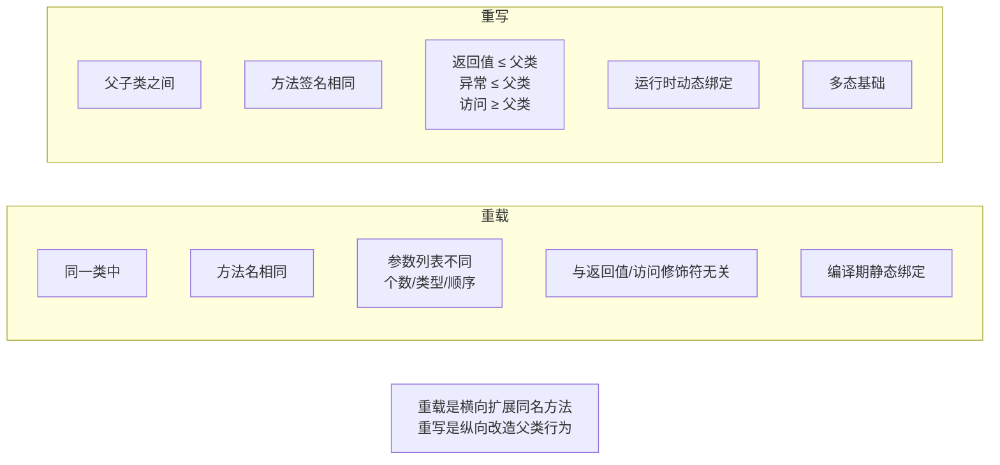
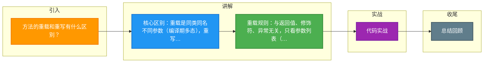

# 方法的重载和重写有什么区别？

方法的重载和重写是 Java 多态性的两种不同表现形式，区别如下：

### 1. 重载
*   **定义**：在同一个类中，定义了多个同名方法，但参数列表不同。
*   **核心规则**：
    *   **方法名必须相同**。
    *   **参数列表必须不同**（参数个数、参数类型、参数顺序至少有一项不同）。
    *   **与返回类型无关**：仅仅返回类型不同不能构成重载。
    *   **与访问修饰符无关**。
    *   **与抛出的异常无关**。
*   **机制**：**编译时多态**（静态绑定）。编译器根据参数的静态类型在编译期确定调用哪个方法。
*   **匹配规则**：
    1.  精确匹配。
    2.  自动类型转换（如 `char` -> `int` -> `long` -> `float` -> `double`）。
    3.  装箱/拆箱。
    4.  可变参数匹配（优先级低于精确匹配和装箱）。

### 2. 重写
*   **定义**：子类对父类允许访问的方法进行重新编写（实现过程specific），外壳不变。
*   **核心规则**：
    *   **方法名、参数列表必须与父类完全一致**。
    *   **返回类型**：必须与父类一致，或者是父类返回类型的子类（协变返回类型，JDK 5+）。
    *   **访问权限**：不能比父类更严格（public > protected > default > private）。如果父类是 public，子类必须是 public。
    *   **异常**：不能抛出新的或者更广的受检异常。可以抛出更少、更窄的异常，或者不抛出。
*   **机制**：**运行时多态**（动态绑定）。JVM 在运行时根据对象的实际类型来调用对应的方法。
*   **注解**：建议使用 `@Override` 注解，帮助编译器检查错误。

### 3. 实战深化与代码示例

#### 1. 实战案例
*   **重载歧义**：在 RPC 框架（如 Dubbo）或 REST 接口中，**方法重载往往会带来问题**。因为反射或 HTTP 参数映射通常只基于方法名，无法精准区分重载版本。因此在定义对外 API 接口时，应避免使用重载，改为使用不同名称的方法（如 `getUserById` 和 `getUserByName`）。
*   **重写与动态代理**：在 Spring AOP 中，如果对象内部方法自调用（`this.methodB()`），由于是通过 `this` 引用直接调用，而非代理对象调用，重写的方法（如事务、切面逻辑）将**不会生效**。必须通过 `AopContext.currentProxy()` 注入代理对象来调用才能触发重写逻辑。

#### 2. 代码示例 (Java)
```java
class Animal {
    // 父类方法
    public Animal eat() { 
        System.out.println("Animal eats food"); 
        return this; 
    }
}

class Dog extends Animal {
    // 1. 协变返回类型：重写方法返回 Animal 的子类 Dog
    @Override
    public Dog eat() {
        System.out.println("Dog eats meat");
        return this;
    }
    
    // 2. 重载：参数不同
    public void eat(String food) {
        System.out.println("Dog eats " + food);
    }
}
```

### 4. 对比总结表

| 特性 | 重载 | 重写 |
| :--- | :--- | :--- |
| 发生位置 | 同一个类中 | 子类与父类之间（或子类之间） |
| 方法签名 | 方法名相同，**参数必须不同** | 方法名、参数列表**必须相同** |
| 返回类型 | 无关 | 必须相同（或协变） |
| 访问修饰符 | 无关 | 不能比父类更严格 |
| 异常 | 无关 | 不能抛出更广的受检异常 |
| 多态类型 | 编译时多态（静态绑定） | 运行时多态（动态绑定） |

```text
        重写动态绑定示例

      Parent p = new Child();
      p.method();

      ┌─────────────┐
      │  Reference  │ (Type: Parent)
      │     p       │ ─────┐
      └─────────────┘      │
                           │ 指向
                           ▼
                    ┌─────────────┐
                    │   Object    │ (Actual Type: Child)
                    └─────────────┘
                           │
                           │ Invoke
                           ▼
                    ┌─────────────┐
                    │ Child.class │ ──> method() (Child's implementation)
                    └─────────────┘
```

## 常见考点
1. **重载的方法能根据返回类型区分吗？**（不能，编译器无法根据返回类型确定调用哪个方法）
2. **构造方法可以被重写吗？可以被重载吗？**（构造方法不能被重写（因为类名不同），但可以被重载）
3. **静态方法可以被重写吗？**（不可以。静态方法属于类，不依赖于实例。子类隐藏父类的静态方法，而非重写。如果通过父类引用调用，依然调用父类版本）


## 核心架构图



## 记忆要点

- 核心区别：重载是同类同名不同参数（编译期多态），重写是子类改写父类方法（运行期多态）。
- 重载规则：与返回值、修饰符、异常无关，只看参数列表（个数、类型、顺序）。
- 重写规则：外壳不能变，访问权限不能更严，受检异常不能更宽。
- 重写进阶：JDK 5+ 支持协变返回类型（子类返回值可为父类返回值的子类）。
- 实战避坑：RPC/AOP 场景中，重载难区分，内部方法自调用会导致重写失效。

## 结构化回答

**30 秒电梯演讲：** 重载是同名不同参，编译区分；重写是子类重写父类方法，运行时多态。打个比方，重载像是同一款手机的不同型号（参数不同），重写像是儿子继承了父亲的技能并改进（方法名相同但实现不同）。

**展开框架：**
1. **核心区别** — 重载是同类同名不同参数（编译期多态），重写是子类改写父类方法（运行期多态）。
2. **重载规则** — 与返回值、修饰符、异常无关，只看参数列表（个数、类型、顺序）。
3. **重写规则** — 外壳不能变，访问权限不能更严，受检异常不能更宽。

**收尾：** 我在项目里踩过坑——重载歧义：在 RPC 框架（如 Dubbo）或 REST 接口中，方法重载往往会带来问题。您想深入聊哪一段：原理、避坑还是对比选型？

## 视频脚本

> 预计时长：2 分钟 | 由浅入深

| 时间 | 画面/字幕 | 口播台词 | 讲解要点 |
|------|----------|----------|----------|
| 0:00 | 标题卡：方法的重载和重写有什么区别 | "方法的重载和重写有什么区别？一句话——重载像是同一款手机的不同型号（参数不同），重写像是儿子继承了父亲的技能并改进（方法名相同但实现不同）。" | 开场钩子 |
| 0:40 | 概念动画/示意图 | "重载是同名不同参，编译区分；重写是子类重写父类方法，运行时多态——重载像是同一款手机的不同型号（参数不同），重写像是儿子继承了父亲的技能并改进（方法名相同但实现不同）" | 核心定义 |
| 1:20 | 核心区别示意 | "重载是同类同名不同参数（编译期多态），重写是子类改写父类方法（运行期多态）。" | 要点1 |
| 2:00 | 总结卡 | "记住这几条，面试不慌。下期讲进阶追问。" | 收尾 |

### 视频流程图



