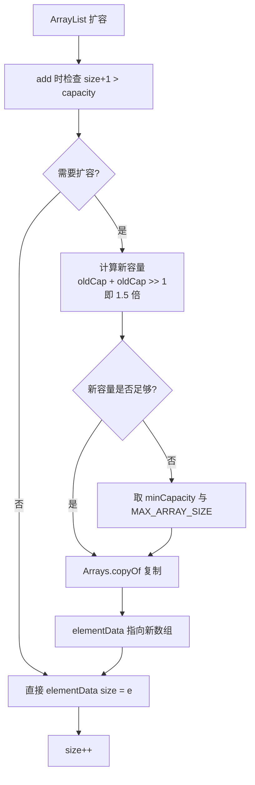

# 获取Class对象的3种方法是什么？

获取Class对象的3种方法：1. 调用对象的getClass()方法（如：obj.getClass()）；2. 调用类的class属性（如：Person.class）；3. 使用Class类的forName()静态方法（如：Class.forName("com.example.Person")）。

**## 实战案例**
在开发**通用反射工具类**或**依赖注入框架**（如Spring）时，通常只能使用字符串形式的类名配置，因此必须使用 `Class.forName()` 动态加载；而在编写需要高性能的类型判断代码（如 `ArrayList` 的 `toArray` 方法）时，应优先使用 `.class` 语法，因为它在编译期确定，不会抛出 ClassNotFoundException，且性能更高。

**## 代码示例 (Java)**
```java
// 方式3：动态加载，最常用但会抛出异常，常用于框架配置解析
try {
    String className = "java.util.ArrayList";
    Class<?> clazz = Class.forName(className); 
    Object instance = clazz.getDeclaredConstructor().newInstance();
} catch (Exception e) {
    e.printStackTrace();
}

// 方式2：类字面常量，编译期检查，性能最好，常用于泛型或反射传递
Class<?> listType = java.util.ArrayList.class;
```

**## 对比表格**
| 方式 | 语法示例 | 编译期检查 | 性能 | 适用场景 |
| :--- | :--- | :--- | :--- | :--- |
| **getClass()** | `obj.getClass()` | 有 | 高 | 已知对象实例，获取运行时类型（包含泛型信息擦除） |
| **.class 字面量** | `String.class` | 有 | 最高 | 传递 Class 对象参数，编译期已知类型 |
| **Class.forName()** | `Class.forName("pkg.Cls")` | 无 | 较低 | 动态配置、框架底层、SPI 机制 |

## 技术原理

三种获取 `Class` 对象的方式本质上对应三个不同的时机：编译期、对象实例期、字符串动态加载期：

- **类字面量（`.class`）为什么性能最高**：JVM 加载类时（每个类只会被加载一次），会为该类在方法区创建唯一的 `Class` 对象。`.class` 语法在编译期就被解析为对 `Class` 对象的符号引用，JVM 在类初始化阶段就完成链接。运行时只是一次常量池读取，不触发任何类加载动作，也不会抛 `ClassNotFoundException`。它**不触发类的静态块（`<clinit>`）初始化**——这是和 `forName` 最大的区别。
- **`getClass()` 返回运行时真实类型**：`obj.getClass()` 通过对象头里的类型指针（HotSpot 中是 `_klass` 字段）直接拿到 Class 对象，O(1) 操作。它的特殊性在于返回的是**运行时实际类型**而非声明类型——`List<String> list = new ArrayList<>(); list.getClass()` 返回的是 `ArrayList.class` 而不是 `List.class`，这是反射里做多态类型判断的关键。
- **`Class.forName()` 的两步动作**：①触发类加载（如果类还没被加载）：通过当前类加载器走双亲委派机制查找 `.class` 文件并加载到方法区；②默认执行 `initialize=true`，即触发静态变量赋值和静态块执行。这也是为什么 JDBC 驱动注册用 `Class.forName("com.mysql.cj.jdbc.Driver")` ——驱动类的静态块里会调用 `DriverManager.registerDriver()` 完成注册。可以用 `Class.forName(name, false, loader)` 跳过初始化。
- **三种方式的初始化时机对比**：`.class` 不触发初始化、`getClass()` 不触发初始化（因为对象已经存在说明类已初始化）、`forName()` 默认触发初始化。这是框架设计时的重要考量点。

## 代码示例

```java
public class ClassLoaderDemo {

    static class Config {
        static {
            System.out.println("Config 类被初始化了");  // 静态块
        }
        static String VERSION = "1.0";
    }

    public static void main(String[] args) throws Exception {
        // 方式1：对象实例.getClass() —— 返回运行时真实类型
        List<String> list = new ArrayList<>();
        Class<?> clazz1 = list.getClass();
        System.out.println(clazz1.getName());  // java.util.ArrayList（不是 List）

        // 方式2：类字面量 .class —— 不触发静态块初始化！
        Class<?> clazz2 = Config.class;
        System.out.println("使用 .class，此时静态块未执行");
        System.out.println(Config.VERSION);   // 这里才触发初始化

        // 方式3：Class.forName() —— 默认触发静态块
        Class<?> clazz3 = Class.forName("com.example.ClassLoaderDemo$Config");
        // 上面这行会立即打印 "Config 类被初始化了"

        // 方式3变体：跳过初始化（只加载不执行静态代码）
        Class<?> clazz4 = Class.forName(
            "com.example.ClassLoaderDemo$Config",
            false,                              // 不初始化
            ClassLoaderDemo.class.getClassLoader()
        );

        // 动态反射创建实例（Spring 的 ApplicationContext.getBean 就是这么做的）
        Object instance = clazz1.getDeclaredConstructor().newInstance();
        System.out.println(instance.getClass() == clazz1);  // true
    }
}
```

```java
// 框架底层典型用法：Spring 通过字符串配置加载 Bean 类
public class BeanFactory {
    private Map<String, Object> singletonCache = new HashMap<>();

    public Object getBean(String className) throws Exception {
        // 只能用 forName —— 因为配置文件里只有字符串形式的类名
        Class<?> beanClass = Class.forName(className);
        // 检查是否已缓存
        if (!singletonCache.containsKey(className)) {
            Object bean = beanClass.getDeclaredConstructor().newInstance();
            singletonCache.put(className, bean);
        }
        return singletonCache.get(className);
    }
}
```

## 注意事项

- **`forName` 必须处理 `ClassNotFoundException`**：因为是运行时动态加载，类名拼写错或类不在 classpath 都会抛检查异常。而 `.class` 和 `getClass()` 编译期就能确定，不会抛此异常。这就是为什么框架底层用 `forName`（灵活但要 catch），业务代码用 `.class`（安全）。
- **`forName` 使用的类加载器很关键**：默认用调用者的类加载器。在 OSGi、Tomcat 多 WebApp、热部署场景下，不同类加载器可能加载同名类的不同版本，导致 `Class.forName` 拿到的 Class 对象在跨模块传参时出现 `ClassCastException`（"两个 Class 对象不相等"）。这种坑在应用容器里很常见。
- **反射创建实例的性能成本**：`clazz.newInstance()`（已废弃）和 `clazz.getDeclaredConstructor().newInstance()` 都比直接 `new` 慢 10-50 倍（涉及安全检查、参数校验、JIT 难以内联）。框架（如 Spring）会缓存 `Constructor` 对象，并开启 `setAccessible(true)` 跳过访问检查来提速，但仍无法与直接 `new` 相比。
- **`getClass()` vs `.class` 在泛型擦除下的差异**：由于类型擦除，`List<String>.class` 编译不过（无法对泛型类型用 `.class`），只能用 `List.class`。但 `new ArrayList<String>().getClass()` 返回的是 `ArrayList.class`，可以拿到运行时实际类型。
- **模块化系统（JPMS）下的新限制**：Java 9+ 引入模块系统后，跨模块反射访问需要 `--add-opens` 或 `opens` 声明，否则即使拿到了 Class 对象，反射调用非 public 成员也会抛 `InaccessibleObjectException`。


## 核心架构图



## 记忆要点

- 口诀：对象getClass、类名.class、Class.forName
- 因为.forNme动态加载无编译期检查，所以常用于框架底层解析
- 因为.class字面量在编译期确定，所以性能最高且不抛异常
- 对比：已知实例用getClass，已知类用.class，仅知全限定名字符串用forName

## 结构化回答

**30 秒电梯演讲：** 运行时获取类的唯一身份证的三种途径。打个比方，就像想知道一个人的档案，可以看他出示的身份证（getClass()），直接看户口本上的类别名，或者通过名字去系统里查（forName）。

**展开框架：**
1. **口诀** — 对象getClass、类名.class、Class.forName
2. **常用于框架底层解析** — 因为.forNme动态加载无编译期检查，所以常用于框架底层解析。
3. **性能最高且不抛异常** — 因为.class字面量在编译期确定，所以性能最高且不抛异常。

**收尾：** 我在项目里踩过坑——在开发通用反射工具类或依赖注入框架（如Spring）时，通常只能使用字符串形式的类名配置，因此必须使用 `Class.forName()` 动态加载；而在编写需要高性能的类型判断代码（如 `ArrayList` 的 `toArray` 方法）时，应优先使用 `.class` 语法，因为它在编译期确定，不会抛出 ClassNotFoundException，且性能更高。您想深入聊哪一段：原理、避坑还是对比选型？

## 视频脚本

> 预计时长：2 分钟 | 由浅入深

| 时间 | 画面/字幕 | 口播台词 | 讲解要点 |
|------|----------|----------|----------|
| 0:00 | 标题卡：获取Class对象的3种方法是什么 | "获取Class对象的3种方法是什么？一句话——就像想知道一个人的档案，可以看他出示的身份证（getClass()），直接看户口本上的类别名，或者通过名字去系统里查（forName）。" | 开场钩子 |
| 0:40 | 概念动画/示意图 | "运行时获取类的唯一身份证的三种途径——就像想知道一个人的档案，可以看他出示的身份证（getClass()），直接看户口本上的类别名，或者通过名字去系统里查（forName）" | 核心定义 |
| 1:20 | 口诀示意 | "对象getClass、类名.class、Class.forName" | 要点1 |
| 2:00 | 总结卡 | "记住这几条，面试不慌。下期讲进阶追问。" | 收尾 |
