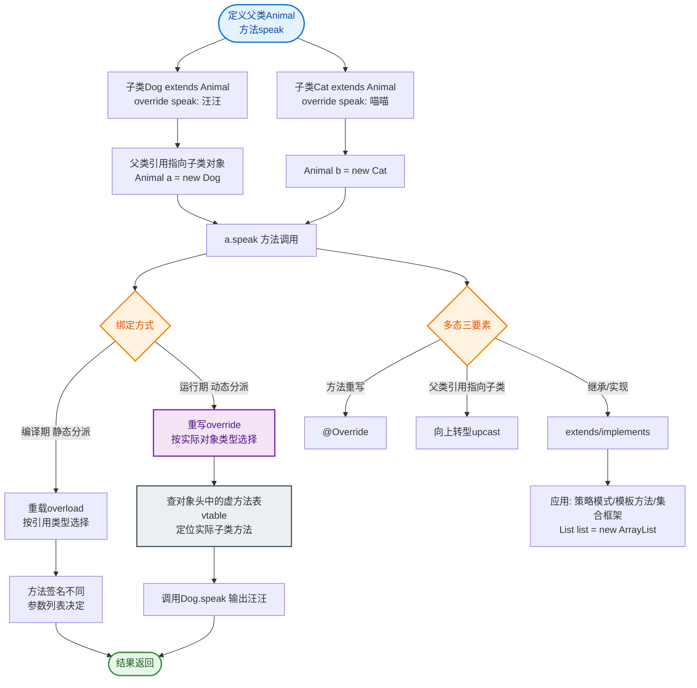

# 说一说你对多态的理解？

多态是指同一个方法在不同对象上产生不同行为，通过继承和方法重写实现。父类引用指向子类对象时，调用方法会执行子类的具体实现，而非父类的。

**## 补充细节**
1.  **多态的三个必要条件**：
    *   **继承**：必须存在父类和子类的关系。
    *   **重写**：子类必须重写父类的方法。
    *   **向上转型**：父类引用指向子类对象（`Parent p = new Child();`）。
2.  **运行时绑定**：Java 的多态是**动态绑定**（或晚期绑定）。方法调用的具体版本不是在编译阶段确定的，而是在程序运行时，根据对象的实际类型来确定。
3.  **不支持多态的场景**：
    *   成员变量：不具备多态性，访问的是父类的变量。
    *   静态方法：属于类，不属于对象，调用的是父类的静态方法。
    *   final 方法：不可被重写，也就不支持多态。

**## 调用流程图**
```text
    代码层面          JVM 运行时数据区            方法区
┌─────────────────┐   ┌─────────────────────┐   ┌─────────────────────┐
│ Parent p =      │   │ ┌───────┐             │   │ Parent Class:       │
│   new Child();  │   │ │   p   │────────────>│──>│   method()         │
│ p.method();     │   │ └───────┘             │   └─────────────────────┘
└─────────────────┘   │  (引用) 实际对象      │            ▲
                      │ ┌───────────────┐     │            │
                      │ │ Child Object  │     │            │ 继承/重写关系
                      │ └───────┬───────┘     │            │
                      │         │             │   ┌────────▼─────────────┐
                      └─────────┼─────────────>──>│ Child Class:        │
                                │ 实际类型查找   │ │   method() @Override│
                                └─────────────────┘ └─────────────────────┘
```

**## 常见考点**
1.  多态的底层实现原理是什么？（虚方法表 vtable，C++ 中是虚函数表，JVM 中类似）
2.  为什么静态方法和成员变量不具备多态性？（静态绑定在编译期确定，成员变量不覆盖）
3.  多态的优点是什么？（解耦、代码扩展性强，符合开闭原则）

**## 实战案例**
在设计**策略模式**的支付系统时，定义 `PaymentService` 接口和 `AliPay`、`WeChatPay` 实现类。业务代码只需依赖 `PaymentService` 引用调用 `pay()`，运行时根据配置动态注入具体实现。如果不使用多态，代码中将充斥着 `if (type == "ali") ... else if ...`，导致新增支付方式时必须修改主流程代码，极易出错且难以维护。

**## 代码示例 (Java)**
```java
abstract class Animal {
    abstract void shout(); // 重写目标
}

class Dog extends Animal {
    @Override
    void shout() { System.out.println("Woof"); }
}

public void demo() {
    // 向上转型：父类引用指向子类对象
    Animal a = new Dog(); 
    a.shout(); // 动态绑定，输出 "Woof"，而非编译时的 Animal 类型
}
```


## 核心流程图


## 记忆要点

- 因为需要继承、重写和向上转型，所以多态能在运行时执行子类的具体实现。
- 多态属于运行时动态绑定，子类重写父类方法时，实际调用取决于对象的实际类型。
- 静态方法、final方法及成员变量不具备多态性，因为它们在编译期就确定了。
- 底层依赖虚方法表（vtable）实现；实战中常配合策略模式消除冗长的if-else。

## 结构化回答

**30 秒电梯演讲：** 同一种操作在不同对象上表现出不同行为。打个比方，就像按‘播放’按钮，CD播放器播放CD，MP3播放器播放MP3，但操作都是‘播放’。

**展开框架：**
1. **多态能在运行时执行子类的具体实现** — 因为需要继承、重写和向上转型，所以多态能在运行时执行子类的具体实现。
2. **多态属于运行时动态绑定** — 子类重写父类方法时，实际调用取决于对象的实际类型。
3. **静态方法、final方法及成员变量不具备多态性** — 因为它们在编译期就确定了。

**收尾：** 我在项目里踩过坑——abstract class Animal {。您想深入聊哪一段：原理、避坑还是对比选型？

## 视频脚本

> 预计时长：2 分钟 | 由浅入深

| 时间 | 画面/字幕 | 口播台词 | 讲解要点 |
|------|----------|----------|----------|
| 0:00 | 标题卡：说一说你对多态的理解 | "说一说你对多态的理解？一句话——就像按‘播放’按钮，CD播放器播放CD，MP3播放器播放MP3，但操作都是‘播放’。" | 开场钩子 |
| 0:40 | 概念动画/示意图 | "同一种操作在不同对象上表现出不同行为——就像按‘播放’按钮，CD播放器播放CD，MP3播放器播放MP3，但操作都是‘播放’" | 核心定义 |
| 1:20 | 要点1图解示意 | "因为需要继承、重写和向上转型，所以多态能在运行时执行子类的具体实现。" | 要点1 |
| 2:00 | 总结卡 | "记住这几条，面试不慌。下期讲进阶追问。" | 收尾 |
