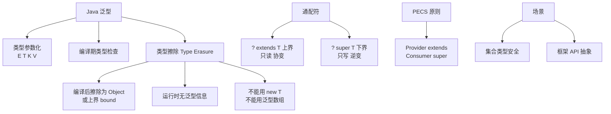

# 说一说你对泛型的理解？

Java泛型是编译时提供类型安全检查的机制，确保集合只能存储指定类型的对象，避免运行时类型转换错误。它通过类型参数实现代码复用，同时保持类型安全。

### 补充细节：原理与实现
1. **类型擦除**：Java泛型是伪泛型，仅在编译期有效。编译器在编译时会将泛型类型擦除，替换为具体的上限类型（通常是 Object 或具体的边界）。例如 `List<String>` 在编译后变为 `List`，并在插入/读取处自动添加类型转换代码。
2. **通配符与限定**：
   - `<? extends T>`（上界）：用于读取数据，生产者模式，保证类型安全，无法写入具体类型。
   - `<? super T>`（下界）：用于写入数据，消费者模式。
   - PECS 原则：Producer Extends, Consumer Super。
3. **不能使用基本类型**：泛型参数必须是引用类型，不能直接使用 `int`、`double` 等，需使用 `Integer`、`Double` 包装类，因为类型擦除后编译器需要进行 Object 类型的转换。
4. **静态上下文限制**：泛型类的静态变量或静态方法不能使用类的泛型类型参数，因为静态成员属于类本身，在类加载时泛型类型尚未确定。

## 常见考点
1. 泛型是如何实现的？什么是类型擦除？
2. `List<String>` 和 `List<Object>` 之间有继承关系吗？（没有，不可协变）
3. 什么是桥接方法？

**## 实战案例**
在使用 **JSON 库（如 Jackson/Gson）** 反序列化复杂嵌套对象时，直接传入 `List.class` 会导致 `LinkedHashMap` 类型丢失。必须利用 `TypeReference` 匿名内部类来捕获泛型签名 `new TypeReference<List<User>>() {}`，从而绕过类型擦除机制，精准还原泛型集合内的对象类型。

**## 代码示例 (Java: PECS 原则)**
```java
// 泛型通配符实战：PECS (Producer Extends, Consumer Super)

public static void main(String[] args) {
    List<Integer> src = Arrays.asList(1, 2, 3);
    List<Number> dest = new ArrayList<>();

    // src 是生产者（读取），使用 extends
    // dest 是消费者（写入），使用 super
    copyElements(src, dest); 
}

// PECS 原则应用：从 src 读取，写入 dest
public static <T> void copyElements(List<? extends T> src, 
                                    List<? super T> dest) {
    for (T n : src) {
        dest.add(n); // 安全写入
    }
}
```

**## 对比表格**
| 特性 | Java 泛型 | C++ 泛型 |
| :--- | :--- | :--- |
| **实现机制** | **类型擦除**（Type Erasure），编译后消失 | **模板具现化**（Template Instantiation），编译时为每种类型生成代码 |
| **运行时支持** | 不支持（无法在运行时获取泛型类型 `T`，需用 Signature） | 支持（RTTI，运行时类型信息完整） |
| **性能** | 无额外开销（引用类型相同） | 代码膨胀风险，但内联优化后可能性能更高 |
| **基本类型** | 不支持（必须用 `Integer`） | 直接支持（`List<int>`） |


## 核心架构图



## 记忆要点

- 因为Java泛型存在类型擦除，所以仅在编译期检查类型，运行时被替换成Object。
- 因为类型擦除，泛型参数必须是引用类型而不能是基本类型（如用Integer不用int）。
- PECS原则：频繁读取用Producer Extends，频繁写入用Consumer Super。
- List<String>和List<Object>无继承关系不可协变；反序列化复杂对象需用TypeReference。

## 结构化回答

**30 秒电梯演讲：** 编译时类型安全检查，避免运行时转换错误。打个比方，就像给箱子贴上标签，规定只能放苹果，别人就不会误放香蕉，取出来时也不用担心拿到错的水果。

**展开框架：**
1. **仅在编译期检查类型** — 因为Java泛型存在类型擦除，所以仅在编译期检查类型，运行时被替换成Object。
2. **因为类型擦除** — 泛型参数必须是引用类型而不能是基本类型（如用Integer不用int）。
3. **PECS原则** — 频繁读取用Producer Extends，频繁写入用Consumer Super。

**收尾：** 我在项目里踩过坑——在使用 JSON 库（如 Jackson/Gson） 反序列化复杂嵌套对象时，直接传入 `List.class` 会导致 `LinkedHashMap` 类型丢失。您想深入聊哪一段：原理、避坑还是对比选型？

## 视频脚本

> 预计时长：2 分钟 | 由浅入深

| 时间 | 画面/字幕 | 口播台词 | 讲解要点 |
|------|----------|----------|----------|
| 0:00 | 标题卡：说一说你对泛型的理解 | "说一说你对泛型的理解？一句话——就像给箱子贴上标签，规定只能放苹果，别人就不会误放香蕉，取出来时也不用担心拿到错的水果。" | 开场钩子 |
| 0:40 | 概念动画/示意图 | "编译时类型安全检查，避免运行时转换错误——就像给箱子贴上标签，规定只能放苹果，别人就不会误放香蕉，取出来时也不用担心拿到错的水果" | 核心定义 |
| 1:20 | 仅在编译期检查类型示意 | "因为Java泛型存在类型擦除，所以仅在编译期检查类型，运行时被替换成Object。" | 要点1 |
| 2:00 | 总结卡 | "记住这几条，面试不慌。下期讲进阶追问。" | 收尾 |
