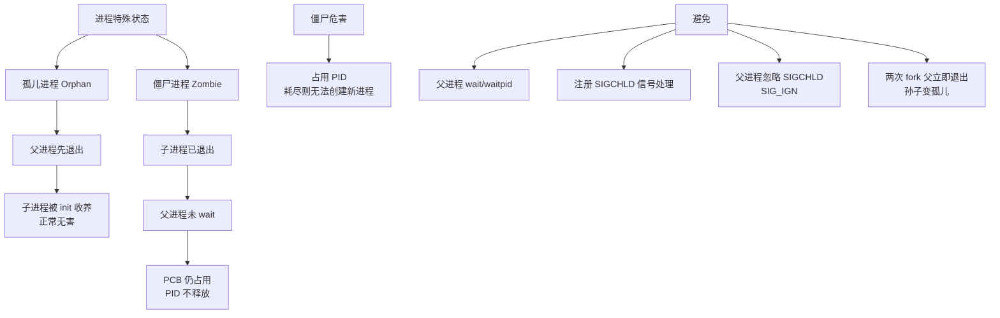

# 说一说僵尸进程和孤儿进程？

1. **孤儿进程**：父进程退出，但子进程仍在运行，子进程成为孤儿进程，被init进程（PID为1，现代Linux中通常是Systemd）收养并负责回收状态。2. **僵尸进程**：子进程已结束，但父进程未读取其退出状态（未调用 `wait()` 或 `waitpid()`），子进程的进程描述符（PCB）仍保留在进程表中，成为僵尸进程。僵尸进程需父进程处理，否则会占用系统资源（PID），导致系统无法启动新进程。

### 实战案例
在高并发服务器（如Nginx+PHP-FPM）中，如果Master进程意外退出而未正确回收Worker，或者父进程出现Bug死循环无法调用wait，会导致系统中堆积大量僵尸进程，消耗PID资源，最终导致新的服务无法启动（`Cannot allocate memory` 报错）。

### 代码示例（Linux C - 避免僵尸进程）
```c
// 方法：捕获 SIGCHLD 信号并在处理函数中调用 waitpid
void sigchld_handler(int sig) {
    int status;
    // WNOHANG: 非阻塞，如果没有退出的子进程则立即返回
    while (waitpid(-1, &status, WNOHANG) > 0);
}

int main() {
    signal(SIGCHLD, sigchld_handler); // 注册信号处理
    if (fork() == 0) exit(0); // 子进程
    sleep(1); // 父进程继续做事
    return 0;
}
```

### 进程状态流转图

```text
      父进程              子进程
    ┌─────────┐         ┌──────────┐
    │ Running │─fork──> │ Running  │
    └────┬────┘         └────┬─────┘
         │                   │ exit()
         │                   ▼
         │             ┌──────────┐
         │             │  Zombie  │<──┐
         │             │ (等待wait)│  │ (父进程未wait)
         │             └──────────┘  │
         │                   │       │
         │                   │       │
    exit()│                   │       │
         ▼                   ▼       │
    ┌─────────┐         ┌──────────┐  │
    │  Exit   │         │          │  │
    └─────────┘         │  Reaped  │──┘
                        │ (释放资源)│
                        └──────────┘

    场景：孤儿进程
    ┌─────────┐         ┌──────────┐
    │ Parent  │─exit──> │ Child    │
    │  Exit   │         │ Running  │
    └─────────┘         └────┬─────┘
                              │
                              ▼
                        ┌──────────┐
                        │ Init/PPID│ (被收养)
                        │  = 1     │
                        └──────────┘
```

## 常见考点
1. 如何查看和杀掉僵尸进程？（`ps -ef | grep defunct`，无法直接 kill，需杀掉父进程或让父进程调用 wait）
2. 孤儿进程会被谁收养？有什么危害？（通常无害，由 init 托管）
3. 守护进程与孤儿进程的区别？


## 核心架构图


## 记忆要点

- 孤儿进程：父进程先退出，子进程被init（PID为1）收养，通常无害。
- 僵尸进程：子进程已退出，但父进程未调用wait()回收，导致PCB残留占用PID。
- 僵尸进程无法直接kill，必须杀掉其父进程或让父进程调用wait/waitpid处理。
- 高并发服务器常见僵尸进程堆积，最终会导致系统Cannot allocate memory报错。

## 结构化回答

**30 秒电梯演讲：** 孤儿进程无父收养，僵尸进程死后未清理。打个比方，孤儿进程像父母去世后孩子被福利院收养，僵尸进程像人死后无人处理遗体。

**展开框架：**
1. **孤儿进程** — 父进程先退出，子进程被init（PID为1）收养，通常无害。
2. **僵尸进程** — 子进程已退出，但父进程未调用wait()回收，导致PCB残留占用PID。
3. **僵尸进程无法直接kill** — 必须杀掉其父进程或让父进程调用wait/waitpid处理。

**收尾：** 我在项目里踩过坑——在高并发服务器（如Nginx+PHP-FPM）中，如果Master进程意外退出而未正确回收Worker，或者父进程出现Bug死循环无法调用wait，会导致系统中堆积大量僵尸进程，消耗PID资源，最终导致新的服务无法启动（`Cannot allocate memory` 报错）。您想深入聊哪一段：原理、避坑还是对比选型？

## 视频脚本

> 预计时长：2 分钟 | 由浅入深

| 时间 | 画面/字幕 | 口播台词 | 讲解要点 |
|------|----------|----------|----------|
| 0:00 | 标题卡：说一说僵尸进程和孤儿进程 | "说一说僵尸进程和孤儿进程？一句话——孤儿进程像父母去世后孩子被福利院收养，僵尸进程像人死后无人处理遗体。" | 开场钩子 |
| 0:40 | 概念动画/示意图 | "孤儿进程无父收养，僵尸进程死后未清理——孤儿进程像父母去世后孩子被福利院收养，僵尸进程像人死后无人处理遗体" | 核心定义 |
| 1:20 | 孤儿进程示意 | "父进程先退出，子进程被init（PID为1）收养，通常无害。" | 要点1 |
| 2:00 | 总结卡 | "记住这几条，面试不慌。下期讲进阶追问。" | 收尾 |
