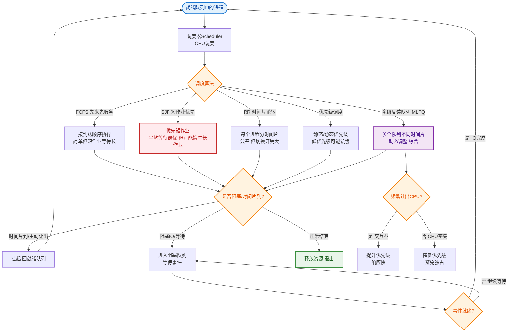

# 进程的调度算法有哪些？

1. **批处理系统调度**：(1) 先来先服务（FCFS）：非抢占，按顺序调度，短作业等待时间长。(2) 最短作业优先（SJF）：非抢占，按估计运行时间最短调度，长作业可能饿死。(3) 最短剩余时间优先（SRTF）：SJF的抢占式版本，按剩余时间调度，新作业更短时抢占当前进程。2. **交互式系统调度**：(1) 时间片轮转：FCFS+时间片，轮换执行，公平但频繁切换。(2) 优先级调度：按优先级调度，动态调整防止低优先级饿死。(3) 多级队列：多队列不同时间片（1,2,4,8...），进程逐级下移，减少切换次数。

### 实战案例
在Linux服务器运维中，如果发现某个单线程CPU密集型计算任务（如Python脚本）占用了100% CPU导致SSH登录卡顿，可以使用 `nice` 或 `renice` 命令调整其优先级（降低NI值），或者在启动时使用 `nohup ./script.sh &` 让其在后台运行，利用操作系统的优先级调度机制保障系统交互流畅。

### 算法对比表格
| 算法 | 模式 | 优点 | 缺点 | 适用场景 |
| :--- | :--- | :--- | :--- | :--- |
| **FCFS** | 非抢占 | 简单，无饥饿 | "护航效应"，平均周转时间长 | 批处理系统，不常用 |
| **SJF** | 非抢占 | 平均等待时间最短 | 难以预测运行时间，长作业饥饿 | 批处理作业调度 |
| **SRTF** | 抢占 | 最短平均周转时间 | 上下文切换频繁，饥饿 | 交互很少的批处理 |
| **RR** | 抢占 | 公平，响应快 | 时间片切换开销大 | 分时系统（交互式） |
| **MLFQ** | 抢占 | 兼顾响应时间与吞吐量 | 参数配置复杂 | **现代通用OS（如Linux）** |

### 多级反馈队列（MLFQ）架构图
多级反馈队列是现代操作系统调度算法的集大成者，结合了时间片轮转、优先级调度和SJF的优点。

```text
      ┌─────────────────────────────────────────────┐
      │             多级反馈队列调度器              │
      ├─────────────────────────────────────────────┤
      │  队列1 (Q1) [高优先级, 时间片 8ms] ──────┐   │
      │  (FCFS/RR)                            │   │
      │                                        ▼   │
      │  队列2 (Q2) [中优先级, 时间片 16ms] ────┐│   │
      │  (FCFS/RR)                            ││   │
      │                                        ▼│   │
      │  队列3 (Q3) [低优先级, 时间片 32ms] ────┐││   │
      │  (FCFS/RR)                            │││   │
      │                                        ▼││   │
      │  ...                                   │││   │
      │  队列N (QN) [批处理, FCFS] <───────────┘││   │
      │                                        ││   │
      └────────────────────────────────────────┘│   │
                          ▲                     │   │
                          │ 时间片用完且未完成   │   │
                          └─────────────────────┘   │
                      (降级到下一级队列)            │
                                                  │
                 ┌─────────────────────────────────┘
                 │
                 ▼
         只有高优先级队列为空时，
         才调度低优先级队列。
```

### 补充细节
- **抢占式 vs 非抢占式**：SJF 可以是抢占式（SRTF）也可以是非抢占式；FCFS 通常是非抢占式。
- **高响应比优先调度（HRRN）**：为了解决 SJF 中长作业饿死的问题，HRRN 综合考虑等待时间和运行时间。`响应比 = (等待时间 + 要求服务时间) / 要求服务时间`。等待时间越长，响应比越高，从而获得调度机会。

## 常见考点
1. 操作系统里最常用的调度算法是哪个？（通常是MLFQ的变种，如CFS完全公平调度器）
2. 什么是饥饿？如何解决？（老化技术，即随着等待时间增加动态提升优先级）
3. 时间片轮转中，时间片太大或太小会有什么影响？


## 核心流程图


## 记忆要点

- 口诀：先来先服务、短作业优先、时间片轮转、优先级、多级队列
- 对比：FCFS简单易护航，SJF最优但易饿死，RR公平但切换频繁
- 现代OS集大成者是多级反馈队列(MLFQ)，兼顾响应与吞吐量
- 因为低优先级会饥饿，所以需用老化技术动态提升优先级

## 结构化回答


**30 秒电梯演讲：** 像老师安排课堂作业，长作业（批处理）按顺序或优先级，短作业（交互式）轮流回答。

**展开框架：**
1. **批处理** — FCFS/SJF/SRTF，非抢占或抢占式
2. **交互式** — 时间片轮转/优先级/多级队列
3. **目标** — 减少等待时间，提高CPU利用率

**收尾：** 这是我实战中的理解，您想深入哪一段？


## 视频脚本

> 预计时长：2 分钟 | 由浅入深

| 时间 | 画面/字幕 | 口播台词 | 讲解要点 |
|------|----------|----------|----------|
| 0:00 | 标题卡：进程的调度算法有哪些 | "进程的调度算法有哪些？一句话——像老师安排课堂作业，长作业（批处理）按顺序或优先级，短作业（交互式）轮流回答。" | 开场钩子 |
| 0:40 | 概念动画/示意图 | "按不同场景分配CPU时间，平衡效率与公平——像老师安排课堂作业，长作业（批处理）按顺序或优先级，短作业（交互式）轮流回答" | 核心定义 |
| 1:20 | 口诀示意 | "先来先服务、短作业优先、时间片轮转、优先级、多级队列" | 要点1 |
| 2:00 | 总结卡 | "记住这几条，面试不慌。下期讲进阶追问。" | 收尾 |

---

## 延伸：进程调度算法你了解多少？

> 合并自 `core-142`（相似度 76%）

进程调度算法主要包括：1. 先来先服务（FCFS）：按请求顺序执行，简单但可能导致“护航效应”。2. 短作业优先（SJF）：优先执行短任务，平均等待时间最短，但难以准确预测作业长度。3. 时间片轮转（RR）：将CPU时间分成片段，轮流分配给各进程，公平性好但上下文切换频繁。4. 优先级调度：根据优先级分配CPU，可能导致低优先级进程“饥饿”。5. 多级反馈队列：结合时间片轮转和优先级调度，动态调整优先级，平衡响应时间和吞吐量。

## 记忆要点

- 核心五剑客：FCFS、SJF、RR、优先级、多级反馈队列(MLFQ)
- 因为SJF长任务会饿死，所以引入HRRN高响应比优先权衡等待与服务时间
- 时间片轮转的缺点是时间片太小会导致频繁上下文切换开销过大

## 结构化回答


**30 秒电梯演讲：** 像老师安排学生回答问题，可以按举手顺序（先来先服务）、优先叫回答快的（短作业优先）、轮流叫（时间片轮转）或按成绩优先级叫。

**展开框架：**
1. **FCFS** — 简单但可能不高效
2. **SJF** — 短任务优先，平均等待时间短
3. **时间片轮转** — 公平但切换开销大

**收尾：** 这是我实战中的理解，您想深入哪一段？


## 视频脚本

> 预计时长：2 分钟 | 由浅入深

| 时间 | 画面/字幕 | 口播台词 | 讲解要点 |
|------|----------|----------|----------|
| 0:00 | 标题卡：进程调度算法你了解多少 | "进程调度算法你了解多少？一句话——像老师安排学生回答问题，可以按举手顺序（先来先服务）、优先叫回答快的（短作业优先）、轮流叫（时间片轮转）或按成绩优先级叫。" | 开场钩子 |
| 0:40 | 概念动画/示意图 | "按规则分配CPU时间，平衡效率与公平——像老师安排学生回答问题，可以按举手顺序（先来先服务）、优先叫回答快的（短作业优先）、轮流叫（时间片轮转）或按成绩优先级叫" | 核心定义 |
| 1:20 | 核心五剑客示意 | "FCFS、SJF、RR、优先级、多级反馈队列(MLFQ)" | 要点1 |
| 2:00 | 总结卡 | "记住这几条，面试不慌。下期讲进阶追问。" | 收尾 |
