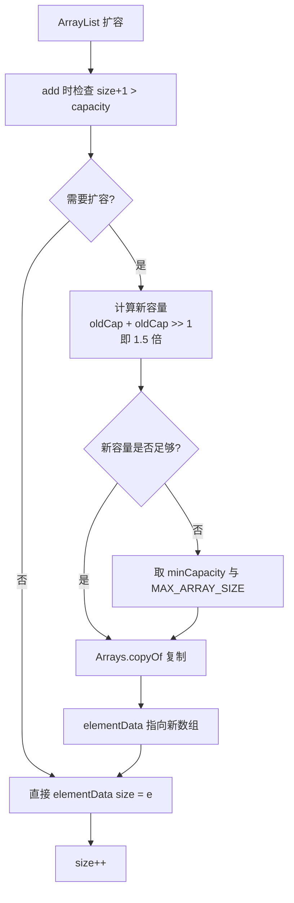

# ArrayList的扩容机制是什么？

ArrayList 的扩容机制本质是创建一个新数组并将原数组数据复制过去。

### 核心机制
1. **触发时机**：当添加元素时，发现元素个数 >= 容量（size >= capacity）。
2. **新容量计算**：
   - 默认扩容为原容量的 **1.5 倍**（`newCapacity = oldCapacity + (oldCapacity >> 1)`）。
   - 如果新容量小于最小所需容量，则扩容至最小所需容量。
   - 如果新容量超过 `MAX_ARRAY_SIZE`（Integer.MAX_VALUE - 8），则调整为 `Integer.MAX_VALUE`。
3. **数据迁移**：调用 `Arrays.copyOf()` 方法，将原数组内容拷贝到新数组中。

### 实战案例
在处理大数据量导入（如Excel读取百万行数据）时，若直接使用 `ArrayList` 无参构造（默认容量10），会导致频繁扩容，产生大量数组和GC开销。建议在预知数据量时，使用 `new ArrayList<>(预估大小)` 构造函数初始化，避免中间扩容带来的性能抖动。

### 代码示例（Java 扩容关键源码）
```java
// JDK 8 ArrayList.grow(int minCapacity)
private void grow(int minCapacity) {
    int oldCapacity = elementData.length;
    // 1.5倍扩容：位运算比乘法更快
    int newCapacity = oldCapacity + (oldCapacity >> 1);
    if (newCapacity - minCapacity < 0)
        newCapacity = minCapacity; // 满足最小需求
    if (newCapacity - MAX_ARRAY_SIZE > 0)
        newCapacity = hugeCapacity(minCapacity);
    // 核心耗能操作：内存分配与数组拷贝
    elementData = Arrays.copyOf(elementData, newCapacity);
}
```

### 与 Array 的区别
| 特性 | Array (数组) | ArrayList (动态数组) |
| :--- | :--- | :--- |
| **大小** | 固定 (`length`) | 动态扩容 (`size`) |
| **性能** | 访问极快，无扩容开销 | 扩容时有拷贝开销，日常访问接近数组 |
| **泛型** | 协变（`String[]` 是 `Object[]`），不安全 | 支持泛型，类型安全 |
| **存储** | 基本类型 & 对象 | 仅对象（基本类型需装箱） |
| **操作** | 简单索引访问 | 丰富API (`remove`, `indexOf` 等) |

### 扩容流程图

```text
    add(e)
       │
       ▼
┌──────────────┐    是
│ size+1 > cap?├───────────────┐
└──────┬───────┘               │
       │否                    ▼
       │            ┌──────────────────┐
       │            │ 计算新容量       │
       │            │ newCap = old*1.5 │
       │            └────────┬─────────┘
       │                     │
       │                     ▼
       │            ┌──────────────────┐
       │            │ newCap < 需求量? │
       │            └────────┬─────────┘
       │                     │
       │                     ▼
       │            ┌──────────────────┐
       │            │ newCap > MAX?    │
       │            └────────┬─────────┘
       │                     │
       ▼                     ▼
┌──────────────┐    ┌──────────────────┐
│ elementData[]│◄───┤ Arrays.copyOf()  │
│ [size] = e   │    │ (开辟新数组+拷贝)│
└──────────────┘    └──────────────────┘
```

## 常见考点
1. 为什么扩容是 1.5 倍而不是 2 倍？（1.5 倍通过位运算实现，且能减少内存浪费，避免 2 倍扩容导致的指数级内存增长；通过数学推导，1.5 倍扩容能使得新数组内存刚好填满原数组释放后的内存 holes，提高内存利用率）
2. `add` 和 `addAll` 扩容的区别？（`addAll` 批量插入时，会优先计算所需最小容量，可能一次性扩容到位，避免多次扩容）
3. ArrayList 为什么线程不安全？如何替代？（Vector, Collections.synchronizedList, CopyOnWriteArrayList）


## 核心架构图


## 记忆要点

- 触发时机：因为添加元素时size达到容量上限，所以触发扩容
- 核心数字：默认每次扩容为原容量的1.5倍（oldCap + oldCap>>1）
- 底层动作：本质是创建新长数组，并通过Arrays.copyOf迁移旧数据
- 实战避坑：预知大容量时务必初始化指定容量，避免频繁扩容和GC

## 结构化回答

**30 秒电梯演讲：** 基于数组的动态列表，空间不足时自动扩容（1.5倍）并迁移数据。打个比方，像搬家，房子住满了（满员），就租个更大的（1.5倍）房子把东西搬过去。

**展开框架：**
1. **触发时机** — 因为添加元素时size达到容量上限，所以触发扩容
2. **核心数字** — 默认每次扩容为原容量的1.5倍（oldCap + oldCap>>1）
3. **底层动作** — 本质是创建新长数组，并通过Arrays.copyOf迁移旧数据

**收尾：** 我在项目里踩过坑——在处理大数据量导入（如Excel读取百万行数据）时，若直接使用 `ArrayList` 无参构造（默认容量10），会导致频繁扩容，产生大量数组和GC开销。您想深入聊哪一段：原理、避坑还是对比选型？

## 视频脚本

> 预计时长：3 分钟 | 由浅入深

| 时间 | 画面/字幕 | 口播台词 | 讲解要点 |
|------|----------|----------|----------|
| 0:00 | 标题卡：ArrayList的扩容机制是什么 | "ArrayList的扩容机制是什么？一句话——像搬家，房子住满了（满员），就租个更大的（1.5倍）房子把东西搬过去。" | 开场钩子 |
| 0:45 | 概念动画/示意图 | "基于数组的动态列表，空间不足时自动扩容（1.5倍）并迁移数据——像搬家，房子住满了（满员），就租个更大的（1.5倍）房子把东西搬过去" | 核心定义 |
| 1:30 | 触发时机示意 | "因为添加元素时size达到容量上限，所以触发扩容" | 要点1 |
| 2:15 | 核心数字示意 | "默认每次扩容为原容量的1.5倍（oldCap + oldCap>>1）" | 要点2 |
| 3:00 | 总结卡 | "记住这几条，面试不慌。下期讲进阶追问。" | 收尾 |
