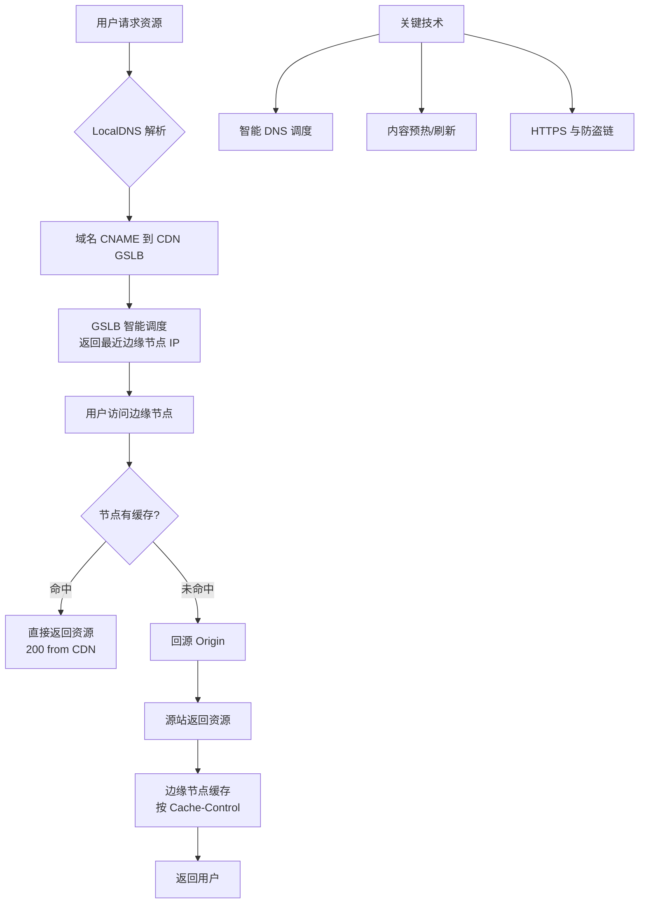

# CDN 原理是什么？

**CDN 的工作原理**涉及 DNS 解析、缓存机制、回源策略三个核心环节：

## DNS 智能解析

```
1. 用户请求 www.example.com
2. 本地DNS解析 → 得到CNAME: www.example.com.cdn.cloudflare.net
3. CDN智能DNS根据用户IP → 返回最近的边缘节点IP
4. 用户直连边缘节点
```

**智能DNS的调度策略**：
- 地理位置调度：按用户IP归属地选节点
- 运营商调度：电信用户走电信节点
- 负载调度：选择负载较低的节点

### 实战案例
在大型电商“双11”活动中，静态资源（如CSS、JS、图片）通过CDN预热提前推送到边缘节点，流量峰值期间即使源站带宽被打满，用户依然能秒开页面，因为90%的流量直接由边缘节点承载。如果遇到源站配置变更（如HTML引用了新图片），必须使用CDN的“目录刷新”功能，否则用户访问旧图片会报404。

### 代码示例（Nginx 缓存配置模拟边缘节点）
```nginx
# 模拟边缘节点缓存配置
proxy_cache_path /path/to/cache levels=1:2 keys_zone=my_cache:10m;

server {
    location / {
        proxy_cache my_cache;
        proxy_cache_valid 200 10m;  # 200状态码缓存10分钟
        proxy_pass http://origin_server; # 回源地址
        # 忽略参数缓存，避免相同资源重复缓存
        proxy_cache_key "$scheme$request_method$host$request_uri";
    }
}
```

## 缓存机制

```
请求到达边缘节点 →
  ├── 命中缓存(Cache Hit) → 直接返回（90%+命中率）
  └── 未命中(Cache Miss) → 回源拉取 → 缓存 → 返回
```

**缓存更新策略**：
- 过期刷新：`Cache-Control: max-age=3600`
- 主动刷新：源站更新后通知CDN刷新
- LRU淘汰：缓存空间满时淘汰最久未访问的

**补充细节**：
- **分层缓存**：CDN通常包含边缘节点（POP）和二级节点（Regional Cache）。边缘节点未命中时，会先请求二级节点，二级节点也未命中才回源，减少回源流量。
- **Range 回源**：对于大文件（视频），如果客户端只请求部分内容（Range请求），且边缘节点未完全缓存，CDN会向源站发起分片请求，避免拉取整个大文件。
- **查询参数过滤**：配置 `ignore query string` 可忽略 URL 中 `?` 后的参数进行缓存，防止相同资源因参数不同被重复缓存。

## 回源策略
| 策略 | 说明 |
| :--- | :--- |
| **协议跟随** | 客户端HTTP则HTTP回源，HTTPS则HTTPS回源 |
| **协议回源** | 强制HTTP或HTTPS回源（常用于源站无证书） |
| **回源Host** | 指定回源时的Host头（源站多站点共享IP时关键） |
| **Range回源** | 分片回源，减少大文件回源带宽 |

**补充细节**：
- **回源鉴权**：为了防止恶意盗链，CDN与源站之间可以配置私有密钥鉴权，仅允许合法的CDN节点回源拉取数据。

## CDN 架构图

```
              ┌─ 源站(Origin) ─┐
              │   广州/上海     │
              └───────┬────────┘
                      │ 回源
        ┌─────────────┼─────────────┐
        │             │             │
   ┌────┴───┐   ┌────┴───┐   ┌────┴───┐
   │ 北京   │   │ 上海   │   │ 广州   │
   │ 边缘   │   │ 边缘   │   │ 边缘   │
   └────┬───┘   └────┬───┘   └────┬───┘
        │             │             │
    用户A          用户B          用户C
```

## 常见考点
1.  **预热 vs 刷新**：预热是主动将资源推送到CDN节点（适合发布新活动），刷新是删除CDN节点上的旧缓存强制回源（适合更新文件）。
2.  **HTTPS 加速**：CDN如何处理 HTTPS 证书？（通常在 CDN 节点配置证书，客户端与 CDN 建 SSL 连接，CDN 与源站可配置 HTTP 或私有证书回源）。
3.  **动态加速**：对于动态内容（API请求），CDN 如何工作？（通过路由优化、协议栈优化建立最佳链路，回源获取动态数据）。


## 核心架构图



## 记忆要点

- 核心三步：DNS智能解析就近分配节点、边缘节点缓存命中、未命中则回源
- 调度策略：基于用户IP归属地和运营商网络选择最优边缘节点
- 大文件优化：利用Range分片回源机制，大幅减少大文件回源带宽
- 对比操作：预热是活动前主动推送，刷新是更新后强制删除旧缓存

## 结构化回答

**30 秒电梯演讲：** 通过边缘节点缓存和智能调度，让用户就近获取资源，降低延迟。打个比方，像开连锁店，各地开分店（边缘节点），用户直接去楼下买，不用总去总厂（源站）拿。

**展开框架：**
1. **核心三步** — DNS智能解析就近分配节点、边缘节点缓存命中、未命中则回源
2. **调度策略** — 基于用户IP归属地和运营商网络选择最优边缘节点
3. **大文件优化** — 利用Range分片回源机制，大幅减少大文件回源带宽

**收尾：** 我在项目里踩过坑——在大型电商“双11”活动中，静态资源（如CSS、JS、图片）通过CDN预热提前推送到边缘节点，流量峰值期间即使源站带宽被打满，用户依然能秒开页面，因为90%的流量直接由边缘节点承载。您想深入聊哪一段：原理、避坑还是对比选型？

## 视频脚本

> 预计时长：3 分钟 | 由浅入深

| 时间 | 画面/字幕 | 口播台词 | 讲解要点 |
|------|----------|----------|----------|
| 0:00 | 标题卡：CDN 原理是什么 | "CDN 原理是什么？一句话——像开连锁店，各地开分店（边缘节点），用户直接去楼下买，不用总去总厂（源站）拿。" | 开场钩子 |
| 0:45 | 概念动画/示意图 | "通过边缘节点缓存和智能调度，让用户就近获取资源，降低延迟——像开连锁店，各地开分店（边缘节点），用户直接去楼下买，不用总去总厂（源站）拿" | 核心定义 |
| 1:30 | 核心三步示意 | "DNS智能解析就近分配节点、边缘节点缓存命中、未命中则回源" | 要点1 |
| 2:15 | 调度策略示意 | "基于用户IP归属地和运营商网络选择最优边缘节点" | 要点2 |
| 3:00 | 总结卡 | "记住这几条，面试不慌。下期讲进阶追问。" | 收尾 |

---

## 延伸：什么是CDN？

> 合并自 `core-057`（相似度 66%）

**CDN（Content Delivery Network，内容分发网络）**是一组分布在不同地理位置的服务器群，通过将静态资源缓存到离用户最近的边缘节点，加速内容访问。

## 核心原理

```text
没有CDN:
  用户(北京) ──→ 源站(广州)  延迟高

有CDN:
  用户(北京) ──→ CDN边缘节点(北京) ✅ 延迟低（命中缓存）
                    │ miss
                    ▼
                 源站(广州)  回源拉取
```

## 工作流程

1.  **DNS 解析**：用户请求资源 `img.example.com/photo.jpg`，本地 DNS 请求授权 DNS。
2.  **CNAME 指向**：授权 DNS 返回 CDN 厂商的 CNAME 域名（如 `example.com.cdn.com`）。
3.  **GSLB 调度**：本地 DNS 请求 CDN 的 GSLB (Global Server Load Balance) 系统。
4.  **返回最优 IP**：GSLB 根据用户 IP、运营商、节点负载等，返回离用户最近且健康的边缘节点 IP。
5.  **请求内容**：用户向边缘节点发起 HTTP/HTTPS 请求。
6.  **缓存处理**：
    *   **命中缓存**：边缘节点直接返回资源（状态码 200），根据 Cache-Control 决定是否回源校验。
    *   **未命中**：边缘节点向源站发起请求（回源），获取内容后缓存并返回给用户。

## CDN 的核心能力

| 能力 | 说明 |
|------|------|
| **就近访问** | 边缘节点离用户近，减少网络传输延迟和抖动 |
| **负载均衡** | GSLB 智能调度，多节点分担流量，防止单点过载 |
| **缓存加速** | 静态资源（图片/JS/CSS）缓存，大幅减少回源带宽压力 |
| **安全防护** | 隐藏源站IP，提供 WAF、防 DDoS、防 CC 攻击 |
| **跨域/共享** | 处理跨域资源共享（CORS）配置，多用户共享缓存 |

## 适用场景

-   **静态资源加速**：图片、CSS、JS、字体文件。
-   **全站加速**：动态+静态混合加速（涉及动态路由优化）。
-   **直播/点播流媒体**：利用边缘节点推拉流，降低卡顿。
-   **大文件下载加速**：安装包、补丁包分发。

## CDN vs 缓存

| 对比 | CDN | 浏览器缓存 |
|------|-----|-----------|
| **位置** | 多地边缘服务器 | 用户本地浏览器/磁盘 |
| **共享** | 多用户共享，节省回源流量 | 单用户独享，节省网络请求 |
| **控制** | 服务端配置（缓存过期时间、刷新） | HTTP 头控制，优先级高于 CDN |
| **更新** | 需手动预热或刷新缓存 | 用户刷新或强制刷新可清除 |

## 架构图

```text
用户请求资源:
┌──────┐   1.DNS Query    ┌──────────┐
│Client│ ────────────────> │ Local DNS│
└───┬──┘ <─────────────── └────┬─────┘
    │        2.CNAME           │ 3. GSLB IP
    │                          │
    │ ─────────────────────────┘
    │ 4. Request (to CDN IP)
    ▼
┌────────────┐
│  CDN Edge  │ <────── 5. Back to Origin (if miss)
│   Node     │ ───────> ┌─────────────┐
│ (Cache Hit)│          │  Origin Srv │
└────────────┘          └─────────────┘
```

## 常见考点
1.  **回源策略**：什么情况下会回源？（Cache 过期、强制刷新、HEAD 请求校验）。
2.  **预热与刷新**：预热是指主动 push 资源到 CDN 节点；刷新是指删除 CDN 节点上的缓存强制回源。
3.  **带宽与流量计费**：CDN 通常按下行流量峰值或总流量计费，如何利用 CDN 节省成本？（配置合理的缓存过期时间）。
4.  **HTTPS 支持**：CDN 如何处理 HTTPS？（需要在 CDN 上配置证书，用户->CDN 是 HTTPS，CDN->源站可以是 HTTP 或 HTTPS）。

## 记忆要点

- 一句话定义：将静态资源缓存到离用户最近的边缘节点，加速访问的网络。
- 核心调度：DNS解析返回CNAME，GSLB智能分配距离最近、负载最优的节点IP。
- 缓存机制：命中缓存直接极速响应，未命中则向源站回源拉取并缓存。
- 对比浏览器：CDN是多用户共享的边缘缓存，浏览器是单用户独享的本地缓存。
- 附加价值：隐藏源站真实IP，提供基础的防DDoS和WAF安全防护。

## 结构化回答

**30 秒电梯演讲：** 通过边缘节点缓存静态资源，实现就近访问。打个比方，就像在小区开分店，不用去总店排队，楼下就能买到。

**展开框架：**
1. **一句话定义** — 将静态资源缓存到离用户最近的边缘节点，加速访问的网络。
2. **核心调度** — DNS解析返回CNAME，GSLB智能分配距离最近、负载最优的节点IP。
3. **缓存机制** — 命中缓存直接极速响应，未命中则向源站回源拉取并缓存。

**收尾：** 这三点都能配合实战聊。您想深入聊原理、对比还是避坑？

## 视频脚本

> 预计时长：2 分钟 | 由浅入深

| 时间 | 画面/字幕 | 口播台词 | 讲解要点 |
|------|----------|----------|----------|
| 0:00 | 标题卡：什么是CDN | "什么是CDN？一句话——就像在小区开分店，不用去总店排队，楼下就能买到。" | 开场钩子 |
| 0:40 | 概念动画/示意图 | "通过边缘节点缓存静态资源，实现就近访问——就像在小区开分店，不用去总店排队，楼下就能买到" | 核心定义 |
| 1:20 | 一句话定义示意 | "将静态资源缓存到离用户最近的边缘节点，加速访问的网络。" | 要点1 |
| 2:00 | 总结卡 | "记住这几条，面试不慌。下期讲进阶追问。" | 收尾 |
