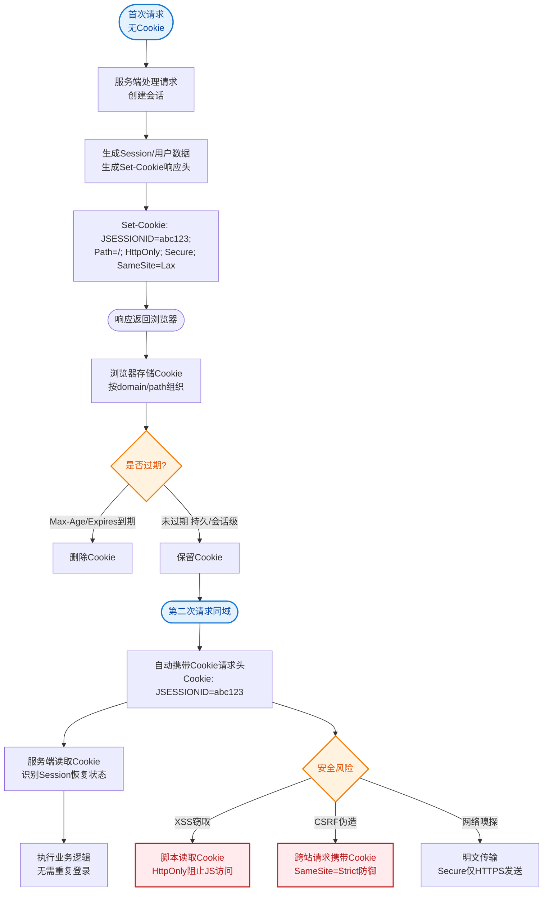

# Cookie的工作原理是什么？

Cookie 是服务器发送给浏览器并保存在本地的一小段文本，用于在客户端记录状态。

### 工作流程
1.  **发送 Cookie**：服务器在 HTTP 响应头中添加 `Set-Cookie` 字段（包含键值对、过期时间、Domain、Path 等）。
2.  **存储 Cookie**：浏览器自动将 Cookie 保存到本地文件或内存中。
3.  **携带 Cookie**：之后浏览器每次向该域名发送请求时，都会在 HTTP 请求头中自动携带对应的 Cookie 信息。
4.  **读取 Cookie**：服务器读取请求头中的 Cookie，识别用户身份或状态。

### 流程架构图
```
┌──────────┐                 ┌──────────────┐
│ Browser  │                 │   Server     │
└────┬─────┘                 └──────┬───────┘
     │ 1. Request (Login)           │
     │ ───────────────────────────▶│
     │                              │ Process Login
     │ 2. Response + Set-Cookie     │
     │◀─────────────────────────── │
     │ Save Cookie Locally          │
     │                              │
     │ 3. Request (Header: Cookie)  │
     │ ───────────────────────────▶│ Verify User
     │ 4. Response (Data)           │
     │◀─────────────────────────── │
```

### 补充关键细节
- **属性详解**：
    - `Domain=example.com`：指定哪些域名可以接收该 Cookie。如果未指定，默认为当前文档主机名（不包含子域名）。
    - `Path=/docs`：指定请求路径中必须包含该路径才会发送 Cookie。
    - `Secure`：仅通过 HTTPS 协议传输。
    - `HttpOnly`：禁止 JavaScript 通过 `document.cookie` 访问，有效防御 XSS 攻击窃取 Cookie。
    - `SameSite`：控制跨站请求发送 Cookie 的策略（Strict/Lax/None），用于防御 CSRF 攻击。
- **Cookie 分类**：
    - **Session Cookie**：内存中存储，浏览器关闭后失效。
    - **Persistent Cookie**：设置了 `Expires` 或 `Max-Age`，存储在硬盘，直到过期。
- **大小限制**：通常限制在 4KB 左右，每个域名下的 Cookie 数量也有限制（如 Chrome 约 50 个）。

### 与 Session 的区别
- **存储位置**：Cookie 存储在客户端（浏览器），Session 存储在服务器端。
- **安全性**：Cookie 存储在本地，安全性较差；Session 存储在服务端，安全性较高。
- **大小限制**：Cookie 有限制（约4KB），Session 无严格大小限制（受服务器内存限制）。
- **主要用途**：Cookie 用于保存不敏感的用户状态（如“记住我”），Session 用于保存敏感的用户登录信息。

### 实战案例
曾遇到因 `SameSite` 属性默认策略变更导致的三方登录失败问题。在 Chrome 80+ 版本中，若未显式设置 `SameSite=None` 且 `Secure` 未开启，iframe 嵌入的跨站请求默认不会携带 Cookie，导致 OAuth 认证流程中断，修复时需严格配对这两个属性。

### 代码示例 (Node.js - Express)
```javascript
// 设置安全 Cookie 的最佳实践
res.cookie('sessionId', sessionId, {
  httpOnly: true, // 防止 XSS 窃取
  secure: true,   // 仅 HTTPS 传输
  sameSite: 'strict', // 防御 CSRF
  maxAge: 3600000 // 1小时过期
});
```

### 对比表格：Cookie vs Session vs LocalStorage

| 特性 | Cookie | Session | LocalStorage |
| :--- | :--- | :--- | :--- |
| **存储位置** | 浏览器（自动发送） | 服务器端 | 浏览器（不自动发送） |
| **容量限制** | ~4KB | 无服务器内存限制 | ~5-10MB |
| **过期策略** | 可设置/会话结束 | 会话结束/可设置 | 永久（除非手动清除） |
| **安全性** | 较低（易遭XSS/CSRF） | 较高（数据不落地） | 低（易遭XSS） |
| **主要场景** | 身份维持、个性化设置 | 敏感用户数据、登录态 | 大容量非敏感数据缓存 |

## 常见考点
1.  **Session 识别机制**：Session ID 通常是如何存储的？（通常存储在 Cookie 中，如果禁用 Cookie，则通过 URL 重写传递）。
2.  **安全性问题**：如何防止 Cookie 被劫持？（使用 HttpOnly、Secure、SameSite 属性）。
3.  **分布式 Session**：在多服务器集群环境下，Session 如何共享？（Session 粘滞、集中式存储如 Redis）。


## 核心流程图


## 记忆要点

- 核心四步：服务端下发响应头(Set-Cookie) -> 浏览器本地存储 -> 请求自动携带 -> 服务端读取识别。
- 对比记忆：Cookie在客户端且有4KB限制，Session在服务端且无严格限制。
- 安全双雄：因为HttpOnly防XSS窃取，SameSite防CSRF跨站，所以实战必带这两个属性。
- 容量与分类：Cookie仅约4KB；不设过期时间为内存级Session，设置Expires/Max-Age为硬盘级Persistent。
- 实战避坑：Chrome 80+跨站请求需显式配对设置 SameSite=None 与 Secure 属性才会携带Cookie。

## 结构化回答

**30 秒电梯演讲：** 服务器给客户端发的小胸牌，客户端每次请求都出示它来证明身份。打个比方，像超市的存包牌，服务器（前台）给你一张牌（Cookie），下次你来凭牌取包。

**展开框架：**
1. **核心四步** — 服务端下发响应头(Set-Cookie) -> 浏览器本地存储 -> 请求自动携带 -> 服务端读取识别。
2. **对比记忆** — Cookie在客户端且有4KB限制，Session在服务端且无严格限制。
3. **安全双雄** — 因为HttpOnly防XSS窃取，SameSite防CSRF跨站，所以实战必带这两个属性。

**收尾：** 我在项目里踩过坑——曾遇到因 `SameSite` 属性默认策略变更导致的三方登录失败问题。您想深入聊哪一段：原理、避坑还是对比选型？

## 视频脚本

> 预计时长：3 分钟 | 由浅入深

| 时间 | 画面/字幕 | 口播台词 | 讲解要点 |
|------|----------|----------|----------|
| 0:00 | 标题卡：Cookie的工作原理是什么 | "Cookie的工作原理是什么？一句话——像超市的存包牌，服务器（前台）给你一张牌（Cookie），下次你来凭牌取包。" | 开场钩子 |
| 0:45 | 概念动画/示意图 | "服务器给客户端发的小胸牌，客户端每次请求都出示它来证明身份——像超市的存包牌，服务器（前台）给你一张牌（Cookie），下次你来凭牌取包" | 核心定义 |
| 1:30 | 核心四步示意 | "服务端下发响应头(Set-Cookie) -> 浏览器本地存储 -> 请求自动携带 -> 服务端读取识别。" | 要点1 |
| 2:15 | 对比记忆示意 | "Cookie在客户端且有4KB限制，Session在服务端且无严格限制。" | 要点2 |
| 3:00 | 总结卡 | "记住这几条，面试不慌。下期讲进阶追问。" | 收尾 |
