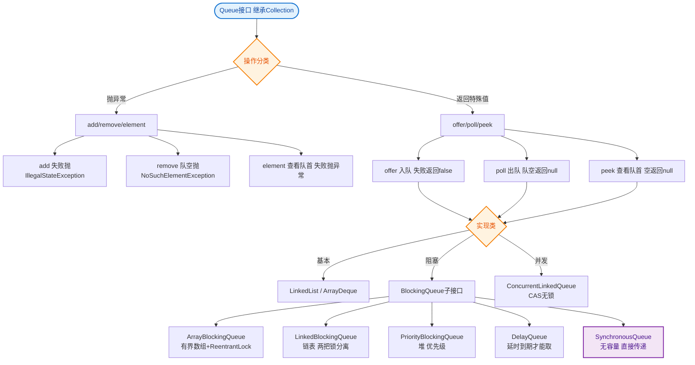
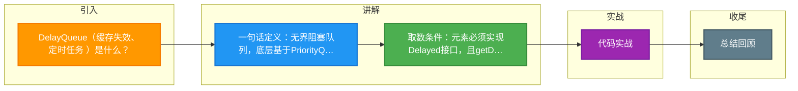

# DelayQueue（缓存失效、定时任务 ）是什么？

DelayQueue 是一个支持延时获取元素的无界阻塞队列。

### 核心原理
1.  **数据结构**：内部使用 `PriorityQueue`（优先级队列）来存储元素。
2.  **元素要求**：队列中的元素必须实现 `Delayed` 接口，重写 `getDelay(TimeUnit unit)` 方法来计算剩余延迟时间，以及 `compareTo` 方法来排序。
3.  **阻塞机制**：
    - 只有当元素的 `getDelay` 返回值小于等于 0 时，该元素才能从队列中取出。
    - 如果队列为空或队首元素未过期，获取线程会被阻塞。
4.  **Leader-Follower 模式**：为了避免多个线程在等待同一元素时无效的唤醒，DelayQueue 使用 Leader 机制，只有一个线程在等待队首元素到期。

### 队列内部状态流转图
```
   线程 A            线程 B             DelayQueue (PriorityQueue)
     │                  │                    ┌──────────────┐
     │ offer(task)      │                    │ Available:   │
     │ ────────────────▶│                    │ task1(5s)    │
     │                  │                    │ task2(10s)   │
     │                  │                    └──────────────┘
     │                  │                           │
     │                  │ take()                    │ peek()
     │                  │ ────────────────────────▶│ task1 (delay > 0)
     │                  │      (阻塞等待)           │
     │                  │  ...5s later...           │
     │                  │      (唤醒)               │
     │                  │ ◀────────────────────────│ task1
     │                  │                           │
     │                  │                    ┌──────────────┐
     │                  │                    │ task2(5s)... │
```

### 补充关键细节
- **无界性**：底层基于 `PriorityQueue`，由于没有容量限制，`offer` 永远不会阻塞，但可能抛出 `OutOfMemoryError`。
- **堆内存结构**：`PriorityQueue` 是基于小顶堆实现的，堆顶元素是即将最早过期的元素。
- **Leader 线程优化**：
    - 如果有一个线程成为 Leader，它会等待堆顶元素的剩余延迟时间。
    - 其他线程调用 `take()` 时会无限期休眠，直到被 Leader 唤醒。
    - 目的：减少不必要的竞争和上下文切换，因为堆顶元素到期时，只需要唤醒一个线程即可。

### 实战案例
**场景**：在电商大促场景中，DelayQueue 用于实现“下单后 30 分钟未支付自动取消订单”功能。
**踩坑**：如果生产者插入任务的速度远快消费者过期消费的速度，DelayQueue 内存会持续膨胀导致 OOM。建议结合时间轮或引入 Redis 的 Key 过期通知机制来卸载压力。

### 代码示例 (Java)
```java
public class OrderDelayTask implements Delayed {
    private long expireTime;
    private String orderId;

    public OrderDelayTask(String orderId, long delaySeconds) {
        this.orderId = orderId;
        this.expireTime = System.currentTimeMillis() + delaySeconds * 1000;
    }

    @Override
    public long getDelay(TimeUnit unit) {
        return unit.convert(expireTime - System.currentTimeMillis(), TimeUnit.MILLISECONDS);
    }

    @Override
    public int compareTo(Delayed o) {
        return Long.compare(this.expireTime, ((OrderDelayTask) o).expireTime);
    }
}
```

### 应用场景
1.  **缓存失效**：保存缓存元素的有效期，线程定期检测，一旦能取出元素即表示缓存过期。
2.  **定时任务**：如 `ScheduledThreadPoolExecutor` 中用于实现延时或周期性任务。
3.  **订单超时取消**：下单后放入队列，延时时间到若未支付则取消订单。

### 常见考点
1.  **与 Timer/ScheduledExecutor 的区别**：DelayQueue 只是一个数据结构，需要配合外部线程使用（如死循环获取），而 `ScheduledThreadPoolExecutor` 封装了线程池和 DelayQueue，功能更完善。
2.  **时间精度问题**：如果任务执行时间过长，会不会影响后续任务的执行？（DelayQueue 只管取出，执行耗时由消费者线程决定，若任务阻塞会导致后续任务延迟处理）。


## 核心流程图


## 记忆要点

- 一句话定义：无界阻塞队列，底层基于PriorityQueue小顶堆，按到期时间排序
- 取数条件：元素必须实现Delayed接口，且getDelay<=0时才能被取出
- 并发优化：采用Leader-Follower模式，仅Leader线程阻塞等待队首，避免多线程无效唤醒
- 实战避坑：因无界且消费慢易引发OOM，高并发场景建议替换为时间轮或Redis

## 结构化回答

**30 秒电梯演讲：** 基于优先级队列的无界阻塞队列，只有元素到期才能被取出。打个比方，像候车室，车票（元素）上写了发车时间，时间没到不能进站（取出）。

**展开框架：**
1. **一句话定义** — 无界阻塞队列，底层基于PriorityQueue小顶堆，按到期时间排序
2. **取数条件** — 元素必须实现Delayed接口，且getDelay<=0时才能被取出
3. **并发优化** — 采用Leader-Follower模式，仅Leader线程阻塞等待队首，避免多线程无效唤醒

**收尾：** 我在项目里踩过坑——public class OrderDelayTask implements Delayed {。您想深入聊哪一段：原理、避坑还是对比选型？

## 视频脚本

> 预计时长：3 分钟 | 由浅入深

| 时间 | 画面/字幕 | 口播台词 | 讲解要点 |
|------|----------|----------|----------|
| 0:00 | 标题卡：DelayQueue（缓存失效、定时… | "DelayQueue（缓存失效、定时任务 ）是什么？一句话——像候车室，车票（元素）上写了发车时间，时间没到不能进站（取出）。" | 开场钩子 |
| 0:45 | 概念动画/示意图 | "基于优先级队列的无界阻塞队列，只有元素到期才能被取出——像候车室，车票（元素）上写了发车时间，时间没到不能进站（取出）" | 核心定义 |
| 1:30 | 一句话定义示意 | "无界阻塞队列，底层基于PriorityQueue小顶堆，按到期时间排序" | 要点1 |
| 2:15 | 取数条件示意 | "元素必须实现Delayed接口，且getDelay<=0时才能被取出" | 要点2 |
| 3:00 | 总结卡 | "记住这几条，面试不慌。下期讲进阶追问。" | 收尾 |

### 视频流程图



