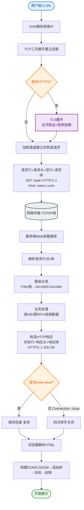

# HTTP原理是什么？

HTTP（超文本传输协议）是客户端和服务端之间请求和应答的标准。

### 工作流程
1.  **地址解析**：浏览器解析 URL，提取协议、主机、端口、路径。通过 DNS 解析域名获得服务器 IP。
2.  **建立连接**：浏览器与服务器通过 TCP 三次握手建立连接（默认端口 80）。
3.  **发送请求**：浏览器发送 HTTP 请求报文，包含请求行（方法、路径、版本）、请求头和请求体。
4.  **服务器处理**：服务器接收请求，解析报文，处理业务逻辑。
5.  **返回响应**：服务器返回 HTTP 响应报文，包含状态行（状态码）、响应头和响应体。
6.  **断开连接**：若请求头包含 `Connection: keep-alive`，则保持 TCP 连接；否则通过四次挥手断开连接。

### 完整请求-响应交互图
```
┌──────────┐                  ┌─────────────────┐
│ Client   │                  │   Server        │
└────┬─────┘                  └──────┬──────────┘
     │                               │
     │ 1. SYN                        │
     │ ────────────────────────────▶│
     │                               │
     │ 2. SYN + ACK                  │
     │◀──────────────────────────── │
     │                               │
     │ 3. ACK                        │
     │ ────────────────────────────▶│
     │     (TCP Connection Established)
     │                               │
     │ 4. HTTP Request               │
     │ ────────────────────────────▶│
     │   (GET /index.html)          │
     │                               │  Process Logic
     │                               │  Read Disk/DB
     │                               │
     │ 5. HTTP Response              │
     │◀──────────────────────────── │
     │   (200 OK + HTML Body)        │
     │                               │
     │ 6. FIN / Keep-Alive           │
```

### 补充关键细节
- **HTTP 报文结构**：
    - 请求报文：请求行、请求头（如 `User-Agent`, `Accept`）、空行、请求体（POST 数据）。
    - 响应报文：状态行（如 `HTTP/1.1 200 OK`）、响应头（如 `Content-Type`, `Content-Length`）、空行、响应体。
- **GET vs POST**：
    - GET：参数在 URL 中，有长度限制，用于请求数据，可被缓存。
    - POST：参数在 Body 中，无长度限制，用于提交数据，通常不可缓存。
- **持久连接**：HTTP/1.1 默认开启 `keep-alive`，多个请求可以复用同一个 TCP 连接，减少 TCP 握手开销。

### 实战案例
**场景**：文件上传接口采用 POST，但客户端反馈上传大文件时浏览器自动中断。
**踩坑**：Nginx 或后端服务端默认限制了 `Content-Length` 或 `client_max_body_size`（如 Nginx 默认 1MB），导致返回 413 Request Entity Too Large。实战中需调整配置并监控超时时间。

### 对比表格：HTTP/1.1 vs HTTP/2

| 特性 | HTTP/1.1 | HTTP/2 |
| :--- | :--- | :--- |
| **传输方式** | 文本传输 | 二进制传输（解析更快，不易出错） |
| **多路复用** | 基于 Keep-Alive 串行请求，需排队（Head-of-Line Blocking） | 基于二进制帧，支持一个 TCP 连接并发发送多个请求流 |
| **头部压缩** | 每次请求携带完整头部（大量重复 Cookie） | 使用 HPACK 算法压缩头部，减少数据量 |
| **服务端推送** | 不支持 | 支持主动推送资源给客户端 |

### HTTP 与 HTTPS
- **HTTP**：明文传输，不安全，默认端口 80。
- **HTTPS**：在 HTTP 下加入 SSL/TLS 层进行加密传输，安全性高，默认端口 443。

### 常见状态码
- **200 OK**：请求成功。
- **301/302**：永久/临时重定向。
- **404 Not Found**：资源未找到。
- **500 Internal Server Error**：服务器内部错误。

## 常见考点
1.  **HTTP 状态码 302 和 301 的区别**：301 是永久重定向，SEO 权重会转移；302 是临时重定向，权重不转移。
2.  **HTTPS 握手过程**：Client Hello -> Server Hello (证书) -> 客户端验证证书并生成随机数 -> 服务端解密随机数生成对称密钥 -> 对称加密传输。


## 核心流程图


## 记忆要点

- 核心流程：解析URL -> TCP三次握手 -> 发送请求报文 -> 处理并返回响应 -> Keep-Alive或断开
- 报文对比：请求行/状态行+请求头/响应头+空行+请求体/响应体
- 方法对比：GET参数在URL可缓存，POST参数在Body无限制
- 版本演进：1.1串行文本传输，2.0支持二进制分帧、多路复用和头部压缩
- 安全对比：HTTP明文端口80，HTTPS基于SSL/TLS加密端口443

## 结构化回答

**30 秒电梯演讲：** 基于请求/响应模型的客户端与服务端通信协议，无状态。打个比方，像寄信，你写好信（请求）寄给朋友，朋友看完回信（响应），一次交互完成。

**展开框架：**
1. **核心流程** — 解析URL -> TCP三次握手 -> 发送请求报文 -> 处理并返回响应 -> Keep-Alive或断开
2. **报文对比** — 请求行/状态行+请求头/响应头+空行+请求体/响应体
3. **方法对比** — GET参数在URL可缓存，POST参数在Body无限制

**收尾：** 这三点都能配合实战聊。您想深入聊原理、对比还是避坑？

## 视频脚本

> 预计时长：3 分钟 | 由浅入深

| 时间 | 画面/字幕 | 口播台词 | 讲解要点 |
|------|----------|----------|----------|
| 0:00 | 标题卡：HTTP原理是什么 | "HTTP原理是什么？一句话——像寄信，你写好信（请求）寄给朋友，朋友看完回信（响应），一次交互完成。" | 开场钩子 |
| 0:45 | 概念动画/示意图 | "基于请求/响应模型的客户端与服务端通信协议，无状态——像寄信，你写好信（请求）寄给朋友，朋友看完回信（响应），一次交互完成" | 核心定义 |
| 1:30 | 核心流程示意 | "解析URL -> TCP三次握手 -> 发送请求报文 -> 处理并返回响应 -> Keep-Alive或断开" | 要点1 |
| 2:15 | 报文对比示意 | "请求行/状态行+请求头/响应头+空行+请求体/响应体" | 要点2 |
| 3:00 | 总结卡 | "记住这几条，面试不慌。下期讲进阶追问。" | 收尾 |
