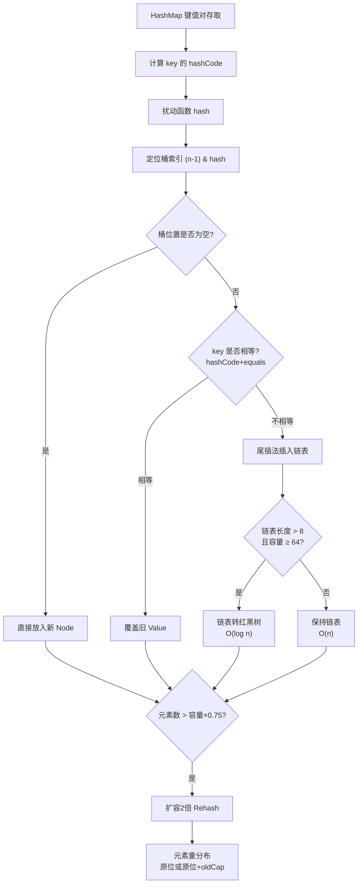

# HashMap中的循环链表是如何产生的？

在 JDK 1.7 中，HashMap 在多线程环境下扩容可能导致死循环（循环链表）。

### 产生原因（JDK 1.7）
1.  **头插法**：JDK 1.7 中，HashMap 扩容时，链表元素的迁移采用**头插法**，即新链表的顺序与旧链表顺序相反。
2.  **并发扩容**：假设两个线程同时检测到扩容。线程 A 刚准备处理节点，由于时间片用完被挂起；线程 B 完成了扩容，链表顺序已经反转（A->B 变成了 B->A）。
3.  **链表成环**：线程 A 恢复执行，继续进行头插迁移。由于它引用的还是旧顺序，它会将节点指向已经被线程 B 调整过的节点，导致形成环形引用（A.next = B, B.next = A）。
4.  **后果**：后续调用 `get()` 方法遍历链表时，会陷入 `while(true)` 死循环，导致 CPU 飙升至 100%。

### 链表成环过程图解
```
初始状态 :
Index[3]: Node A -> Node B -> null

线程 A 执行 transfer: 记录 e=A, next=B
--- 此时线程 A 挂起 ---

线程 B 完成 transfer (头插法):
New Table Index[3]: Node B -> Node A -> null
注意: 此时 A.next 和 B.next 已经更新指向新表的位置

线程 A 恢复执行:
1. 处理 A: 插入到新表头部
   New Table Index[3]: Node A -> ...
   问题: 此时线程 A 中的 A.next 还是引用的旧逻辑指向 B，
   但在内存中 B 已经指向 A (因为线程 B 已完成)。
2. 处理 B (A.next): 将 B 插入头部
   New Table Index[3]: Node B -> Node A ...
   B.next 指向 A。
   而 A.next 指向 B。

结果: A <-> B (环形链表)
```

### 补充关键细节
- **resize 触发条件**：当元素个数大于 `容量 * 负载因子`（默认 0.75）时触发扩容。
- **JDK 1.7 扩容逻辑**：`transfer()` 方法遍历旧数组，计算新索引后，插入到新数组的头部。
- **并发丢失**：除了死循环，JDK 1.7 并发 put 还会导致数据覆盖丢失（多线程同时计算 index 都为空，同时赋值）。

### 实战案例
**场景**：高并发缓存系统使用 HashMap 做本地缓存，运行一段时间后服务 CPU 100% 响应超时。
**踩坑**：Hash 冲突严重且并发触发扩容。Dump 线程栈发现大量线程卡在 `HashMap.get()` 的循环遍历中。解决方法是将 HashMap 替换为 ConcurrentHashMap 或使用不可变的 Map。

### 代码示例 (JDK 1.7 头插法逻辑简化)
```java
void transfer(Entry[] newTable, boolean rehash) {
    int newCapacity = newTable.length;
    for (Entry<K,V> e : table) { // 遍历旧数组
        while(null != e) {
            Entry<K,V> next = e.next; // 线程A挂起可能在这里，记录了next
            if (rehash) {
                e.hash = null == e.key ? 0 : hash(e.key);
            }
            int i = indexFor(e.hash, newCapacity);
            e.next = newTable[i]; // 头插：指向新表头
            newTable[i] = e;      // 成为新表头
            e = next;
        }
    }
}
```

### 解决方案
1.  **JDK 1.8 改进**：
    - **尾插法**：将扩容时的迁移方式改为**尾插法**，保持链表元素顺序不变，避免了逆序导致的倒置和成环问题。
    - **红黑树**：链表长度超过 8 且数组长度超过 64 时转为红黑树，提高查询效率，减少哈希冲突后的遍历时间。
2.  **线程替代**：多线程环境下使用 `ConcurrentHashMap` 代替 HashMap。
    - JDK 1.7 `ConcurrentHashMap` 使用分段锁。
    - JDK 1.8 `ConcurrentHashMap` 使用 `CAS + synchronized` 锁数组节点，粒度更细。

## 常见考点
1.  **JDK 1.8 还会有死循环吗？**：不会，因为尾插法保持了顺序，不会形成环形引用。但仍会有数据覆盖问题。
2.  **为什么 JDK 1.7 用头插法，1.8 改成尾插法？**：1.7 头插法认为后插入的数据被访问的概率更高（热点数据原理）；1.8 尾插法主要是为了解决并发死循环问题，并减少链表遍历的性能损耗。
3.  **HashMap 在 JDK 1.8 中的其他并发问题**：虽然解决了死循环，但并发 put 仍可能导致数据丢失，多线程必须使用 `ConcurrentHashMap`。


## 核心架构图


## 核心知识点图


## 记忆要点

- 独有顽疾：JDK1.7多线程扩容并发执行transfer方法引发环形链表，导致CPU飙升100%
- 罪魁祸首：因为1.7采用头插法，并发迁移时链表被反转，极易形成A.next=B且B.next=A
- 报错根因：后续get操作遍历到成环节点时陷入while(true)死循环
- 版本差异：1.7头插致并发死循环，1.8改尾插保持顺序解决死循环，但仍有数据覆盖问题
- 解决方案：多线程并发必须舍弃HashMap，使用ConcurrentHashMap替代

## 结构化回答

**30 秒电梯演讲：** JDK1.7扩容采用头插法，并发迁移导致链表节点引用顺序错乱形成死循环。打个比方，两人同时挪动一串珠子，一人倒着挂，另一人顺着挂，最后珠子首尾相连成了死结。

**展开框架：**
1. **独有顽疾** — JDK1.7多线程扩容并发执行transfer方法引发环形链表，导致CPU飙升100%
2. **罪魁祸首** — 因为1.7采用头插法，并发迁移时链表被反转，极易形成A.next=B且B.next=A
3. **报错根因** — 后续get操作遍历到成环节点时陷入while(true)死循环

**收尾：** 我在项目里踩过坑——void transfer(Entry[] newTable, boolean rehash) {。您想深入聊哪一段：原理、避坑还是对比选型？

## 视频脚本

> 预计时长：3 分钟 | 由浅入深

| 时间 | 画面/字幕 | 口播台词 | 讲解要点 |
|------|----------|----------|----------|
| 0:00 | 标题卡：HashMap中的循环链表是如何产生… | "HashMap中的循环链表是如何产生的？一句话——两人同时挪动一串珠子，一人倒着挂，另一人顺着挂，最后珠子首尾相连成了死结。" | 开场钩子 |
| 0:45 | 概念动画/示意图 | "JDK1.7扩容采用头插法，并发迁移导致链表节点引用顺序错乱形成死循环——两人同时挪动一串珠子，一人倒着挂，另一人顺着挂，最后珠子首尾相连成了死结" | 核心定义 |
| 1:30 | 独有顽疾示意 | "JDK1.7多线程扩容并发执行transfer方法引发环形链表，导致CPU飙升100%" | 要点1 |
| 2:15 | 罪魁祸首示意 | "因为1.7采用头插法，并发迁移时链表被反转，极易形成A.next=B且B.next=A" | 要点2 |
| 3:00 | 总结卡 | "记住这几条，面试不慌。下期讲进阶追问。" | 收尾 |
