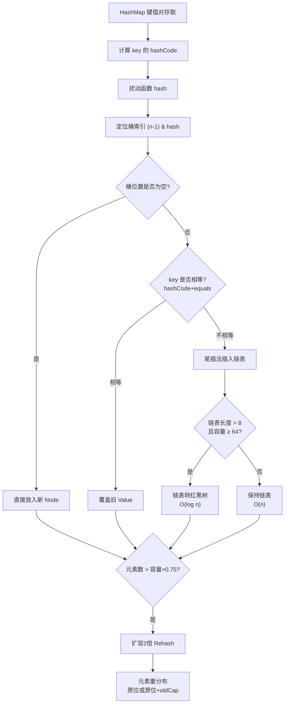

# HashMap和Hashtabe的区别？

HashMap 和 Hashtable 的主要区别在于历史遗留、线程安全和性能。

### 1. 线程安全性
- **Hashtable**：是线程安全的。它的所有方法（如 `put`, `get`）都经过 `synchronized` 修饰，锁住的是整个表对象，并发度低（类似于 JDK 1.7 ConcurrentHashMap 只有一个 Segment 的情况）。
- **HashMap**：是非线程安全的。如果是单线程环境，效率远高于 Hashtable。

### 2. 性能
- **Hashtable**：由于全表锁，多线程竞争激烈时性能较差。
- **HashMap**：无锁开销，单线程访问速度非常快。

### 3. 对 Null 键值的支持
- **Hashtable**：**不允许** Key 或 Value 为 `null`。如果存入 null，会直接抛出 `NullPointerException`。
- **HashMap**：**允许** Key 为 `null`（只能有一个，位于 index 0），允许 Value 为 `null`（可以有多个）。

### 4. 继承关系
- **Hashtable**：继承自古老的 `Dictionary` 类，是一个过时的类，实现了 Map 接口。
- **HashMap**：继承自 `AbstractMap`，是 Java 集合框架的一部分。

### 5. 初始容量与扩容
- **Hashtable**：默认初始容量为 **11**，扩容时变为 `2 * oldCapacity + 1`。
- **HashMap**：默认初始容量为 **16**，扩容时总是 `2 * oldCapacity`（即左移一位，保持 2 的幂次方，利用位运算优化取模）。

**容量增长对比图：**
```text
Hashtable: 11 -> 23 -> 47 -> 95 ... (保证奇数，利于哈希散列，但效率慢)
HashMap : 16 -> 32 -> 64 -> 128 ... (保证2的幂，利用 hash & (n-1) 替代 hash % n)
```

### 对比表格
| 特性 | HashMap | Hashtable |
| :--- | :--- | :--- |
| **线程安全** | 非线程安全 | 线程安全 (全表锁) |
| **性能** | 高 (单线程) | 低 (锁竞争严重) |
| **Null Key/Value** | 允许 (Key只能一个null) | 不允许 (抛 NPE) |
| **迭代器** | Fail-Fast (迭代时修改报错) | Fail-Safe (枚举器不强校验) |
| **父类** | AbstractMap | Dictionary (过时) |
| **默认容量** | 16 | 11 |
| **扩容倍数** | 2倍 | 2n+1 |

### 建议
在现代开发中，几乎不再使用 Hashtable。如需线程安全，应使用 `ConcurrentHashMap`；如无需线程安全，使用 `HashMap`。

### 实战案例
在维护老旧系统时曾遇到使用 `Hashtable` 缓存热点配置，导致高并发下接口超时。通过快照分析发现全表锁导致大量线程阻塞，替换为 `ConcurrentHashMap` 后吞吐量提升 10 倍以上。

## 常见考点
1. **为什么 Hashtable 的默认容量是 11 且扩容是 2n+1？**
   - 为了让容量保持为奇数。如果容量是偶数，`hash % length` 的结果会丢失 hash 值的奇偶性，增加哈希冲突的概率。但现代 HashMap 使用位运算且 hash 扰动更充分，已不需要此限制。
2. ** Hashtable 的 iterator 和 HashMap 的 iterator 有何区别？**
   - Hashtable 的 enumerator 和 iterator 也不是 Fail-Fast 的（比较古老），而 HashMap 的 iterator 是 Fail-Fast 的。但这并不是 Hashtable 的优点，反而是设计不统一的表现。
3. **如何将 Hashtable 替换为线程安全的 Map？**
   - 直接替换为 `ConcurrentHashMap`，或者使用 `Collections.synchronizedMap(new HashMap<>())`（后者也是全表锁，性能不如 ConcurrentHashMap）。


## 核心架构图



## 记忆要点

- 线程对比：HashMap非线程安全，Hashtable全表加synchronized锁并发性能极差
- Null值：HashMap允许Key和Value为null，而Hashtable存入直接抛出NPE
- 容量机制：HashMap初始16且按2倍扩容，Hashtable初始11按2n+1扩容
- 结构演进：HashMap继承AbstractMap，Hashtable继承过时的Dictionary
- 实战建议：Hashtable已被淘汰，单线程用HashMap，多线程必用ConcurrentHashMap

## 结构化回答

**30 秒电梯演讲：** Hashtable是古老的线程安全Map（全表锁），HashMap是现代的非线程安全Map。打个比方，Hashtable是老旧的单行道收费站（一次只能过一辆，安全但慢），HashMap是高速公路（快但不安全）。

**展开框架：**
1. **线程对比** — HashMap非线程安全，Hashtable全表加synchronized锁并发性能极差
2. **Null值** — HashMap允许Key和Value为null，而Hashtable存入直接抛出NPE
3. **容量机制** — HashMap初始16且按2倍扩容，Hashtable初始11按2n+1扩容

**收尾：** 我在项目里踩过坑——在维护老旧系统时曾遇到使用 `Hashtable` 缓存热点配置，导致高并发下接口超时。您想深入聊哪一段：原理、避坑还是对比选型？

## 视频脚本

> 预计时长：3 分钟 | 由浅入深

| 时间 | 画面/字幕 | 口播台词 | 讲解要点 |
|------|----------|----------|----------|
| 0:00 | 标题卡：HashMap和Hashtabe的区… | "HashMap和Hashtabe的区别？一句话——Hashtable是老旧的单行道收费站（一次只能过一辆，安全但慢），HashMap是高速公路（快但不安全）。" | 开场钩子 |
| 0:45 | 概念动画/示意图 | "Hashtable是古老的线程安全Map（全表锁），HashMap是现代的非线程安全Map——Hashtable是老旧的单行道收费站（一次只能过一辆，安全但慢），HashMap是高速公路（快但不安全）" | 核心定义 |
| 1:30 | 线程对比示意 | "HashMap非线程安全，Hashtable全表加synchronized锁并发性能极差" | 要点1 |
| 2:15 | Null值示意 | "HashMap允许Key和Value为null，而Hashtable存入直接抛出NPE" | 要点2 |
| 3:00 | 总结卡 | "记住这几条，面试不慌。下期讲进阶追问。" | 收尾 |
