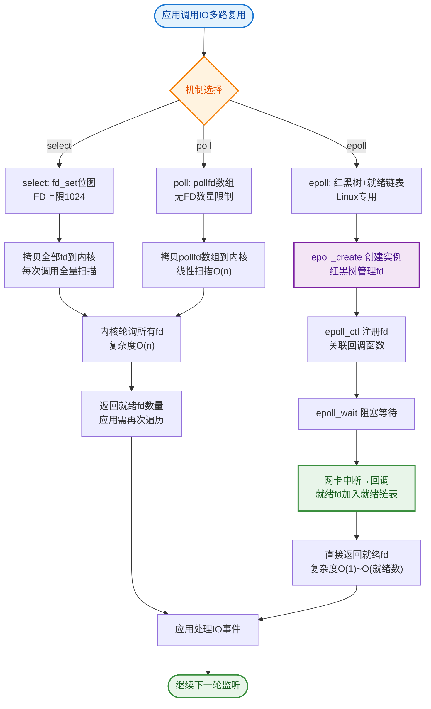

# Java NIO中Selector的作用是什么？

Selector（选择器）是 Java NIO 中能够检测一到多个通道，并能够知晓通道是否为诸如读写事件做好准备的组件。这样，一个单独的线程可以管理多个通道，从而管理多个网络连接。

### 1. 核心作用
- **I/O 多路复用**：使用单个线程管理多个 Channel，避免为每个连接创建一个线程，减少线程上下文切换开销。
- **事件驱动**：只有当 Channel 真正有读写事件就绪时，才进行处理，而不是一直阻塞等待。

### 2. 工作原理
1. **注册**：将 Channel 注册到 Selector 上，并指定关注的事件（如 `SelectionKey.OP_ACCEPT`、`OP_READ`、`OP_WRITE`）。
2. **监听**：调用 Selector 的 `select()` 方法，线程会阻塞直到有感兴趣的事件发生。
3. **获取就绪键**：`select()` 返回后，通过 `selectedKeys()` 获取就绪的 SelectionKey 集合。
4. **处理事件**：遍历 SelectionKey，根据事件类型（如 isReadable）对对应的 Channel 进行读写操作。

### 3. 架构图
```
   Client 1      Client 2      Client 3
      │             │             │
      ▼             ▼             ▼
[Channel 1]   [Channel 2]   [Channel 3]
      │             │             │
      └──────┬──────┴──────┬──────┘
             │ (Register) │
             ▼             │
         ┌───────────────┐ │
         │   Selector    │◄┘
         └───────┬───────┘
                 │ select() / poll()
      ┌──────────┴──────────┐
      ▼                     ▼
 [Single Thread]      [OS Kernel]
 (Event Loop)         (Underlying)
```

### 4. 关键细节与底层实现
- **SelectionKey**：表示 Channel 与 Selector 的注册关系。包含 `interest_set`（感兴趣的事件集合）和 `ready_set`（已就绪的事件集合）。
- **select() 方法行为**：
  - `select()`：阻塞直到至少有一个通道在你注册的事件上就绪。
  - `select(long timeout)`：最多阻塞 timeout 毫秒。
  - `selectNow()`：非阻塞，立即返回当前就绪的通道数量。
- **wakeup()**：如果有线程阻塞在 `select()` 上，调用 `selector.wakeup()` 会使该线程立即返回（即便没有事件就绪），常用于线程间通知。
- **底层机制**：在 Linux 上，传统 Java NIO 使用 `select/poll` 系统调用（受限于 FD_SETSIZE，通常为 1024）；现代 Java NIO（如 Linux 2.6+）在 `EPollSelectorImpl` 中使用 `epoll`，支持海量连接，效率更高（O(1) vs O(n)）。
- **NIO 空轮询 Bug**：在早期 Linux JDK 版本中，`selector.select()` 可能会即使没有事件也无限阻塞退出，导致 CPU 100%。解决方案是重建 Selector 或使用 `select(timeout)` 并计数。

### 5. 应用场景
适用于高并发、高连接量但每个连接活跃度低的场景，如即时通讯软件、Web 服务器（Netty 底层即基于此封装）。

### 代码示例 (NIO Selector 服务端核心)
```java
Selector selector = Selector.open();
ServerSocketChannel serverChannel = ServerSocketChannel.open();
serverChannel.bind(new InetSocketAddress(8080));
serverChannel.configureBlocking(false);
serverChannel.register(selector, SelectionKey.OP_ACCEPT);

while (true) {
    int readyCount = selector.select(); // 阻塞直到有事件
    if (readyCount == 0) continue;
    Set<SelectionKey> selectedKeys = selector.selectedKeys();
    Iterator<SelectionKey> iterator = selectedKeys.iterator();
    while (iterator.hasNext()) {
        SelectionKey key = iterator.next();
        if (key.isAcceptable()) {
            // 处理连接
        } else if (key.isReadable()) {
            // 处理读
        }
        iterator.remove(); // 必须手动移除
    }
}
```

### 实战案例
在维护一个基于原生 NIO 的推送系统时，遇到过由于未及时处理 `SelectionKey` 导致的“空轮询”bug，使得 CPU 占用率飙升。通过引入 Netty（其对 Selector 的 Bug 进行了修复和优化），问题得到彻底解决。


## 核心流程图


## 记忆要点

- 一句话核心：I/O多路复用，单线程管理海量Channel，极度减少线程上下文切换开销
- 事件驱动：通道需注册到Selector，有读写就绪事件才唤醒处理
- 工作四步曲：注册通道 -> select阻塞监听 -> selectedKeys获取就绪键 -> 遍历事件分发处理
- 底层基石：Linux系统下底层调用是epoll（早期为select/poll），支持海量并发连接
- 避坑指南：警惕早期版本空轮询Bug导致CPU 100%，实战多用Netty底层封装

## 结构化回答

**30 秒电梯演讲：** 单线程监控多通道，实现IO多路复用。打个比方，像前台接待员，盯着多个房间，哪个房间有动静（事件）就处理哪个。

**展开框架：**
1. **一句话核心** — I/O多路复用，单线程管理海量Channel，极度减少线程上下文切换开销
2. **事件驱动** — 通道需注册到Selector，有读写就绪事件才唤醒处理
3. **工作四步曲** — 注册通道 -> select阻塞监听 -> selectedKeys获取就绪键 -> 遍历事件分发处理

**收尾：** 我在项目里踩过坑——在维护一个基于原生 NIO 的推送系统时，遇到过由于未及时处理 `SelectionKey` 导致的“空轮询”bug，使得 CPU 占用率飙升。您想深入聊哪一段：原理、避坑还是对比选型？

## 视频脚本

> 预计时长：3 分钟 | 由浅入深

| 时间 | 画面/字幕 | 口播台词 | 讲解要点 |
|------|----------|----------|----------|
| 0:00 | 标题卡：Java NIO中Selector的… | "Java NIO中Selector的作用是什么？一句话——像前台接待员，盯着多个房间，哪个房间有动静（事件）就处理哪个。" | 开场钩子 |
| 0:45 | 概念动画/示意图 | "单线程监控多通道，实现IO多路复用——像前台接待员，盯着多个房间，哪个房间有动静（事件）就处理哪个" | 核心定义 |
| 1:30 | 一句话核心示意 | "I/O多路复用，单线程管理海量Channel，极度减少线程上下文切换开销" | 要点1 |
| 2:15 | 事件驱动示意 | "通道需注册到Selector，有读写就绪事件才唤醒处理" | 要点2 |
| 3:00 | 总结卡 | "记住这几条，面试不慌。下期讲进阶追问。" | 收尾 |
