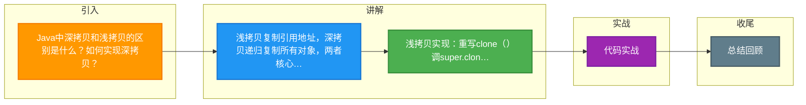

# Java中深拷贝和浅拷贝的区别是什么？如何实现深拷贝？

### 1. 浅拷贝
- **定义**：创建一个新对象，新对象的属性和原对象完全相同。对于基本数据类型，复制值；对于引用数据类型，复制引用地址（即指向同一个对象）。
- **特点**：修改副本对象中的引用类型字段，会影响原对象。
- **实现**：重写 `clone()` 方法，调用 `super.clone()`（需实现 `Cloneable` 接口）。

### 2. 深拷贝
- **定义**：创建一个新对象，并递归复制所有引用对象指向的对象。
- **特点**：修改副本对象不会影响原对象，两者完全独立。
- **实现方式**：
  1. **层层 clone**：引用类型类也实现 `Cloneable` 并重写 `clone()` 方法，在主对象 clone 中手动调用引用的 clone。
  2. **序列化**：推荐方式。将对象序列化为字节流（二进制），再反序列化回对象（需实现 `Serializable` 接口）。

### 3. 代码示例
**浅拷贝：**
```java
class Person implements Cloneable {
    int age;
    Address addr; // 引用类型
    public Object clone() throws CloneNotSupportedException {
        return super.clone(); // 浅拷贝
    }
}
```
**深拷贝（序列化）：**
```java
public Object deepClone() throws Exception {
    ByteArrayOutputStream bos = new ByteArrayOutputStream();
    ObjectOutputStream oos = new ObjectOutputStream(bos);
    oos.writeObject(this);
    
    ByteArrayInputStream bis = new ByteArrayInputStream(bos.toByteArray());
    ObjectInputStream ois = new ObjectInputStream(bis);
    return ois.readObject();
}
```

### 4. 原理与图解
**内存模型对比：**
```
浅拷贝内存布局：
[ 原对象 Person ]      [ 副本 Person' ]
  age = 25               age = 25
  addr ─────────┐        addr ────────┘
                │ (引用共享)
                ▼
         [ 对象 Address ]
         city = "Beijing"

深拷贝内存布局：
[ 原对象 Person ]      [ 副本 Person' ]
  age = 25               age = 25
  addr ─────┐           addr ─────┐
             │                    │
             ▼                    ▼
    [ Address ]          [ Address' ]
    city="Beijing"        city="Beijing"
```

### 5. 其他实现方式
- **构造函数**：手动在构造函数中传入新对象并复制所有字段（繁琐但安全）。
- **JSON 库**：使用 Gson 或 Jackson 将对象转为 JSON 字符串再转回对象（要求有无参构造，性能略低但通用）。
- **Apache Commons Lang**：使用 `SerializationUtils.clone(serializableObj)`。

### 6. 实战经验与对比
**实战案例**：在开发电商购物车功能时，曾遇到因为浅拷贝导致“下单预览”修改了购物车原数据的 Bug。下单时应深拷贝 Cart 对象生成 Order，此时使用 JSON 转换方式比序列化更方便，因为它可以忽略不需要拷贝的 transient 字段（如计算用的缓存价格）。

**代码示例（JSON 方式）**：
```java
// 使用 Jackson 实现深拷贝（推荐用于非敏感数据的通用拷贝）
ObjectMapper mapper = new ObjectMapper();
// 假设 User 类有标准的 Getter/Setter
User copy = mapper.readValue(mapper.writeValueAsString(originalUser), User.class);
```

**深拷贝方案对比**：
| 方案 | 实现难度 | 性能 | 依赖/限制 | 适用场景 |
| :--- | :--- | :--- | :--- | :---
| **Cloneable (层层)** | 高 (易漏) | 极高 | 强耦合代码 | 性能敏感，结构简单 |
| **Java 序列化** | 低 | 低 | 需实现 Serializable | 不跨网络，通用性要求低 |
| **JSON 转换** | 低 | 中 | 需无参构造/Getter/Setter | Web 开发，对象结构复杂 |
| **Kryo/FST** | 中 | 极高 | 引入第三方库 | 高性能 RPC 场景 |


## 核心架构图

```mermaid
flowchart TD
    classDef start fill:#4CAF50,color:#fff
    classDef process fill:#2196F3,color:#fff
    classDef decision fill:#FF9800,color:#fff
    classDef special fill:#9C27B0,color:#fff
    classDef error fill:#f44336,color:#fff
    classDef info fill:#607D8B,color:#fff
    class A start
    class B process
    class B1 decision
    class B2 special
    class B3 error
    class B4 info
    class C start
    class C1 process
    class C2 decision
    class C3 special
    class Cloneable error
    class D info
    class D1 start
    class Deep process
    class E decision
    class F special
    class G error
    class H info
    class I start
    class J process
    class JSON decision
    class K special
    class Object error
    class Protobuf info
    class Reference start
    class Shallow process
    class br decision
    class clone special
    A[对象拷贝] --> B[浅拷贝 Shallow]
    A --> C[深拷贝 Deep]
    A --> D[引用拷贝 Reference]
    D --> D1[只复制引用<br/>指向同一对象]
    B --> B1[新建对象]
    B --> B2[基本类型复制值]
    B --> B3[引用类型复制引用<br/>共享内部对象]
    B --> B4["Object.clone 默认浅拷贝"]
    C --> C1[新建对象]
    C --> C2[递归拷贝所有引用对象]
    C --> C3[完全独立 互不影响]
    E[深拷贝实现] --> F[实现 Cloneable 递归 clone]
    E --> G[序列化/反序列化<br/>JSON/Protobuf]
    E --> H["拷贝构造器"]
    I[场景] --> J[不可变对象 配置快照]
    I --> K[事件回放]
```



## 记忆要点

- 浅拷贝复制引用地址，深拷贝递归复制所有对象，两者核心差异在于引用字段是否独立。
- 浅拷贝实现：重写clone()调super.clone()；深拷贝层层clone繁琐易漏。
- 深拷贝推荐实现：序列化机制或JSON转换，将对象转为独立副本。
- 选型对比：Cloneable性能极高但强耦合；序列化/JSON简单通用但性能偏低。

## 结构化回答

**30 秒电梯演讲：** 浅拷贝复制引用，深拷贝复制对象实体。打个比方，浅拷贝是复印件，改了复印件原稿未必变；深拷贝是重新画一张，改了不影响原图。

**展开框架：**
1. **浅拷贝复制引用地址** — 深拷贝递归复制所有对象，两者核心差异在于引用字段是否独立。
2. **浅拷贝实现** — 重写clone()调super.clone()；深拷贝层层clone繁琐易漏。
3. **深拷贝推荐实现** — 序列化机制或JSON转换，将对象转为独立副本。

**收尾：** 我在项目里踩过坑——在开发电商购物车功能时，曾遇到因为浅拷贝导致“下单预览”修改了购物车原数据的 Bug。您想深入聊哪一段：原理、避坑还是对比选型？

## 视频脚本

> 预计时长：3 分钟 | 由浅入深

| 时间 | 画面/字幕 | 口播台词 | 讲解要点 |
|------|----------|----------|----------|
| 0:00 | 标题卡：Java中深拷贝和浅拷贝的区别是什么… | "Java中深拷贝和浅拷贝的区别是什么？如何实现深拷贝？一句话——浅拷贝是复印件，改了复印件原稿未必变；深拷贝是重新画一张，改了不影响原图。" | 开场钩子 |
| 0:45 | 概念动画/示意图 | "浅拷贝复制引用，深拷贝复制对象实体——浅拷贝是复印件，改了复印件原稿未必变；深拷贝是重新画一张，改了不影响原图" | 核心定义 |
| 1:30 | 浅拷贝复制引用地址示意 | "深拷贝递归复制所有对象，两者核心差异在于引用字段是否独立。" | 要点1 |
| 2:15 | 浅拷贝实现示意 | "重写clone()调super.clone()；深拷贝层层clone繁琐易漏。" | 要点2 |
| 3:00 | 总结卡 | "记住这几条，面试不慌。下期讲进阶追问。" | 收尾 |

### 视频流程图



