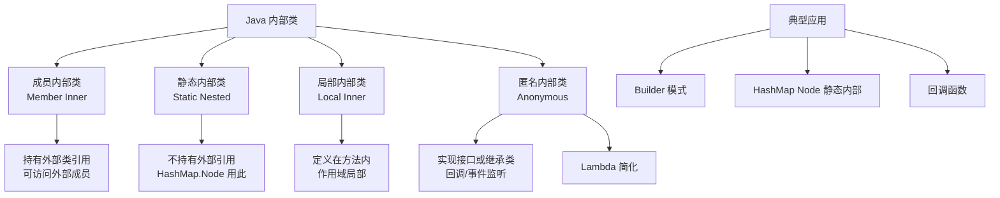

# Java内部类有哪几种？各自的特点和使用场景？

Java 内部类主要分为四种：静态内部类、成员内部类、局部内部类、匿名内部类。

### 1. 静态内部类
- **定义**：使用 `static` 修饰，定义在类内部。
- **特点**：
  - 不依赖外部类实例，可直接创建（`new Outer.Inner()`）。
  - 只能访问外部类的静态成员（变量和方法）。
  - 可以定义静态成员变量和方法。
- **使用场景**：当内部类与外部类关系紧密，且不需要访问外部类实例成员时使用。如 `HashMap.Node`、`Integer.IntegerCache`。

### 2. 成员内部类
- **定义**：定义在类内部，无 `static` 修饰。
- **特点**：
  - 必须依赖外部类实例创建（`outer.new Inner()`）。
  - 可以访问外部类的所有成员（包括私有成员）。
  - 不能定义静态成员（JDK 16 以前）。
  - 持有外部类的引用。
- **使用场景**：需要访问外部类实例状态时，如 Iterator 的实现。

### 3. 局部内部类
- **定义**：定义在方法或作用域内部。
- **特点**：
  - 作用域仅限于所在的方法或块，外部不可见。
  - 可以访问外部类的成员和方法内的局部变量（局部变量必须是 final 或事实上的 final）。
  - 不能使用访问修饰符。
- **使用场景**：仅在某个方法内使用的辅助逻辑。

### 4. 匿名内部类
- **定义**：没有类名的内部类，直接使用 `new` 接口或抽象类创建。
- **特点**：
  - 必须继承一个父类或实现一个接口。
  - 只能使用一次。
  - 访问局部变量同局部内部类要求。
- **使用场景**：简化代码，用于事件监听、多线程 `new Thread(){...}` 等快速回调场景。

### 5. 编译原理与结构
编译后，每个内部类都会生成一个独立的 `.class` 文件。命名规则如下：
- 静态内部类：`Outer$Inner.class`
- 成员内部类：`Outer$Inner.class`
- 局部内部类：`Outer$1Inner.class` (数字代表出现顺序)
- 匿名内部类：`Outer$1.class`

**成员内部类隐含引用图示：**
```
[ Outer Instance ]
      ▲
      │ (持有外部引用 this$0)
      │
[ Inner Instance ]
```
内部类在编译时会被注入一个指向外部类实例的引用字段（通常是 `this$0`），这也是为什么成员内部类能访问外部成员的原因。

### 6. 实战经验与代码
**实战案例**：在 Android 开发或旧版 Swing 中，经常使用匿名内部类设置监听器。但在高并发环境下，如果匿名内部类持有外部类的引用（如 Activity），而该内部类被异步线程（如 Thread）持有且长时间未执行，会导致外部类无法被 GC 回收，引发严重的内存泄漏。解决办法是使用静态内部类 + WeakReference。

**代码示例（静态内部类解决内存泄漏）**：
```java
// 避免内存泄漏的标准 Handler 写法（Java/Android 通用场景）
public class OuterClass {
    // 使用静态内部类，不持有外部类引用
    private static class SafeHandler extends Thread {
        private final WeakReference<OuterClass> ref;
        SafeHandler(OuterClass outer) {
            this.ref = new WeakReference<>(outer);
        }
        @Override
        public void run() {
            OuterClass outer = ref.get();
            if (outer != null) {
                outer.doSomething();
            }
        }
    }
}
```

**内部类特性对比表**：
| 特性 | 静态内部类 | 成员内部类 | 局部内部类 | 匿名内部类 |
| :--- | :--- | :--- | :--- | :--- |
| **持有外部引用** | 否 | 是 | 是 | 是 |
| **生命周期** | 独立于外部实例 | 依赖外部实例 | 依赖方法栈帧 | 依赖方法栈帧 |
| **访问外部类非静态成员** | 否 | 是 | 是 | 是 |
| **可定义静态成员** | 是 | 否 (JDK16+) | 否 | 否 |
| **可见性** | 可设 public/private | 可设 public/private | 仅方法内 | 仅定义处 |


## 核心架构图



## 记忆要点

- 四种类型：静态、成员、局部、匿名；口诀「静成局匿」对应不同作用域。
- 静态内部类不持有外部引用，可直接new且只能访问外部静态成员。
- 非静态内部类隐式持有外部引用(this$0)，可访问外部所有成员，但易致内存泄漏。
- 局部/匿名内部类访问局部变量时，变量必须事实上的final。

## 结构化回答

**30 秒电梯演讲：** 定义在类内部的类，分为静态、成员、局部、匿名四种。打个比方，像心脏（成员内部类）属于身体，必须依赖身体存在；像衣服（静态内部类）可以独立穿脱。

**展开框架：**
1. **四种类型** — 静态、成员、局部、匿名；口诀「静成局匿」对应不同作用域。
2. **静态内部类不持有外部引用** — 可直接new且只能访问外部静态成员。
3. **非静态内部类隐式持有外部引用(this$0)** — 可访问外部所有成员，但易致内存泄漏。

**收尾：** 我在项目里踩过坑——在 Android 开发或旧版 Swing 中，经常使用匿名内部类设置监听器。您想深入聊哪一段：原理、避坑还是对比选型？

## 视频脚本

> 预计时长：3 分钟 | 由浅入深

| 时间 | 画面/字幕 | 口播台词 | 讲解要点 |
|------|----------|----------|----------|
| 0:00 | 标题卡：Java内部类有哪几种？各自的特点和… | "Java内部类有哪几种？各自的特点和使用场景？一句话——像心脏（成员内部类）属于身体，必须依赖身体存在；像衣服（静态内部类）可以独立穿脱。" | 开场钩子 |
| 0:45 | 概念动画/示意图 | "定义在类内部的类，分为静态、成员、局部、匿名四种——像心脏（成员内部类）属于身体，必须依赖身体存在；像衣服（静态内部类）可以独立穿脱" | 核心定义 |
| 1:30 | 四种类型示意 | "静态、成员、局部、匿名；口诀「静成局匿」对应不同作用域。" | 要点1 |
| 2:15 | 静态内部类不持有外部引用示意 | "可直接new且只能访问外部静态成员。" | 要点2 |
| 3:00 | 总结卡 | "记住这几条，面试不慌。下期讲进阶追问。" | 收尾 |
