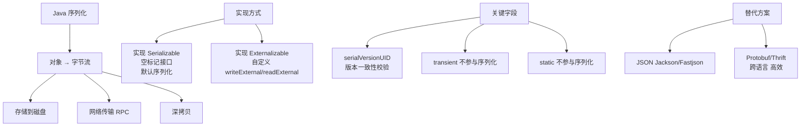
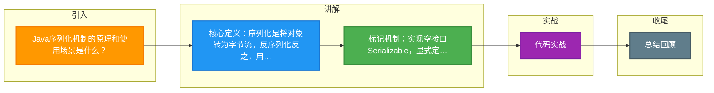

# Java序列化机制的原理和使用场景是什么？

Java 序列化是指将 Java 对象转换为字节序列（二进制流）的过程，以便存储到磁盘或通过网络传输；反序列化则是将字节序列恢复为 Java 对象的过程。

### 1. 工作原理
- **标记接口**：`java.io.Serializable` 是一个标记接口，无方法，告诉 JVM 该对象可被序列化。
- **序列化 ID (`serialVersionUID`)**：用于版本控制。反序列化时，如果类的 UID 与数据中的 UID 不一致，会抛出 `InvalidClassException`。建议显式定义以避免编译器自动生成导致的不一致。
- **默认机制**：JVM 通过反射遍历对象的非 `transient` 字段，写入字节流。

### 2. 关键字
- **`transient`**：修饰字段，表示该字段不参与序列化（如密码等敏感信息）。
- **`static`**：静态变量属于类，不属于对象状态，故不参与序列化。

### 3. 使用场景
1. **持久化存储**：将对象状态保存到文件或数据库（如 Session 存储到 Redis）。
2. **网络传输**：在 RMI、RPC 或 HTTP 传输对象（如 Protobuf、JSON 序列化的替代方案）。

### 4. 自定义序列化
可通过在类中实现 `writeObject(ObjectOutputStream out)` 和 `readObject(ObjectInputStream in)` 方法来控制序列化逻辑（如加密、加密字段）。

### 5. 序列化流程详解
**协议流程图：**
```
[ Java Object ]
      │
      ▼ (1. 检查 Serializable)
[ ObjectOutputStream ]
      │
      ▼ (2. 写入 Class Descriptor/Meta)
[ 0xAC 0xED ... ] (Stream Header)
      │
      ├─> (3. 遍历字段，递归序列化父类)
      │
      ▼
[ Byte Stream / Network ]
```

### 6. Externalizable 接口
- `Externalizable` 继承自 `Serializable`。
- 强制实现 `writeExternal` 和 `readExternal` 方法。
- **区别**：Serializable 由 JVM 自动保存，性能稍差；Externalizable 由程序员完全控制读写，通常性能更高，且必须提供 public 无参构造函数。

### 7. 注意事项
- **性能**：Java 原生序列化产生的字节流较大，且处理速度较慢，不如 Protobuf、Kryo 等第三方库高效。
- **安全性**：反序列化过程可能执行任意代码（如 gadget chain），容易遭受 RCE 攻击。生产环境处理不可信数据时应尽量避免使用原生序列化。

### 8. 实战经验与对比
**实战案例**：某系统通过 HTTP Header 传递序列化 Token 进行认证，攻击者利用 Java 反序列化漏洞（Apache Commons Collections gadget chain）构造恶意 Token，成功接管服务器。**教训**：严禁对不受信任的输入进行原生 Java 反序列化，升级到 JDK 9+ 以上或使用白名单机制（`ObjectInputFilter`）。

**代码示例（安全反序列化过滤器）**：
```java
// JDK 9+ 提供的 ObjectInputFilter 防御反序列化攻击
ObjectInputFilter filter = ObjectInputFilter.Config.createFilter("java.base/*;!*java.lang.reflect.Proxy");
ObjectInputStream ois = new ObjectInputStream(in) {
    @Override
    protected ObjectInputFilter getObjectInputFilter() {
        return filter; // 仅允许基础类，拒绝反射代理
    }
};
```

**序列化方案选型对比**：
| 特性 | Java Native | Hessian | Kryo | Protobuf |
| :--- | :--- | :--- | :--- | :--- |
| **易用性** | 高 (仅需实现接口) | 高 | 中 | 低 (需写 .proto 文件) |
| **性能/速度** | 慢 | 快 | 极快 | 极快 |
| **压缩率** | 低 (体积大) | 中 | 高 | 高 |
| **跨语言** | 否 | 是 | 有限 (需配置) | 是 (完美支持) |
| **安全性** | 差 (已知漏洞多) | 较好 | 一般 | 较好 |


## 核心架构图



## 记忆要点

- 核心定义：序列化是将对象转为字节流，反序列化反之，用于跨网络传输或持久化。
- 标记机制：实现空接口Serializable，显式定义serialVersionUID以防版本不兼容。
- 排除字段：transient修饰的实例变量和static静态变量不参与序列化。
- 安全红线：原生反序列化存在RCE漏洞，严禁对不可信数据执行反序列化。

## 结构化回答

**30 秒电梯演讲：** 将对象状态转为字节流以便存储或传输，反之亦然。打个比方，像把家具拆解打包（序列化）寄送到异地，再重新组装（反序列化）。

**展开框架：**
1. **核心定义** — 序列化是将对象转为字节流，反序列化反之，用于跨网络传输或持久化。
2. **标记机制** — 实现空接口Serializable，显式定义serialVersionUID以防版本不兼容。
3. **排除字段** — transient修饰的实例变量和static静态变量不参与序列化。

**收尾：** 我在项目里踩过坑——某系统通过 HTTP Header 传递序列化 Token 进行认证，攻击者利用 Java 反序列化漏洞（Apache Commons Collections gadget chain）构造恶意 Token，成功接管服务器。您想深入聊哪一段：原理、避坑还是对比选型？

## 视频脚本

> 预计时长：3 分钟 | 由浅入深

| 时间 | 画面/字幕 | 口播台词 | 讲解要点 |
|------|----------|----------|----------|
| 0:00 | 标题卡：Java序列化机制的原理和使用场景是… | "Java序列化机制的原理和使用场景是什么？一句话——像把家具拆解打包（序列化）寄送到异地，再重新组装（反序列化）。" | 开场钩子 |
| 0:45 | 概念动画/示意图 | "将对象状态转为字节流以便存储或传输，反之亦然——像把家具拆解打包（序列化）寄送到异地，再重新组装（反序列化）" | 核心定义 |
| 1:30 | 核心定义示意 | "序列化是将对象转为字节流，反序列化反之，用于跨网络传输或持久化。" | 要点1 |
| 2:15 | 标记机制示意 | "实现空接口Serializable，显式定义serialVersionUID以防版本不兼容。" | 要点2 |
| 3:00 | 总结卡 | "记住这几条，面试不慌。下期讲进阶追问。" | 收尾 |

### 视频流程图



