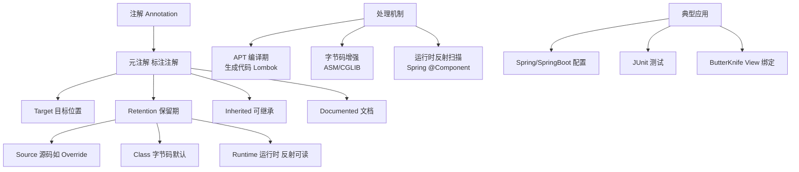
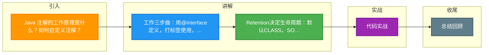

# Java 注解的工作原理是什么？如何自定义注解？

**注解（Annotation）** 是 JDK 5 引入的元数据机制，本身不直接影响代码逻辑，需要配合「解析器」才能发挥作用。

### 注解的工作原理（三步）：
1. **定义注解：** 用 `@interface` 声明，可加元注解（@Target、@Retention、@Documented、@Inherited）。
2. **使用注解：** 标注在类/方法/字段上。
3. **解析注解：**
   - **编译期解析：** 编译器/APT（Annotation Processing Tool）读取，如 Lombok 生成 getter/setter、ButterKnife 生成绑定代码。
   - **运行期解析：** 程序通过反射（Class.getAnnotation）读取，如 Spring 的 @Autowired、@Controller。

### 自定义注解示例：
```java
@Retention(RetentionPolicy.RUNTIME)  // 运行时保留
@Target(ElementType.METHOD)            // 作用于方法
public @interface MyCache {
    String key();
    int expire() default 60;
}

// 使用
@MyCache(key = "user:1", expire = 120)
public User getUser(long id) { ... }

// 反射解析
Method m = ...;
if (m.isAnnotationPresent(MyCache.class)) {
    MyCache c = m.getAnnotation(MyCache.class);
    String key = c.key();
}
```

### @Retention 三种策略：
- SOURCE：仅源码（如 @Override），编译后丢弃。
- CLASS（默认）：保留到 class 文件，运行时不可见。
- RUNTIME：运行时可通过反射读取（框架最常用）。

### 增强细节：原理与流程
注解本质上是继承自 `java.lang.annotation.Annotation` 的接口，其成员变量被编译器处理为抽象方法。当程序在编译或运行时处理注解时，实际上是通过动态代理机制生成了该注解接口的实现类实例。

**编译期处理流程图：**
```text
┌─────────────┐    Parse/AST    ┌───────────────────────────┐
│   Source    │ ──────────────> │  Compiler (javac)         │
│  (.java)    │                 │  ┌─────────────────────┐  │
└─────────────┘                 │  │ Abstract Syntax Tree│  │
                                │  └──────────┬──────────┘  │
                                └─────────────┼─────────────┘
                                              │ Check Annotations
                    ┌─────────────────────────┴─────────────────────┐
                    │          Does @Processor exist?               │
                    └─────────────────────────┬─────────────────────┘
                                             / \
                          YES (APT Process) /   \ NO (Standard Compile)
                                       /     \
                               ┌───────▼──────┐  ┌───────▼────────┐
                               │ Generate    │  │ Write .class   │
                               │ New Source  │  │ (Metadata)     │
                               └─────────────┘  └────────────────┘
```

### 实战经验与对比
**实战案例**：开发了一个自定义注解 `@PermissionCheck` 用于接口鉴权。初期使用 `RetentionPolicy.RUNTIME` 配合 Spring AOP 反射解析，发现高并发下反射有性能损耗。后来将鉴权逻辑改为编译期 APT（类似于 AutoService），自动生成一个静态的权限映射类，将运行时计算变为编译时生成，吞吐量提升 15%。

**代码示例（Spring 切面解析注解）**：
```java
@Around("@annotation(myCache)")
public Object cacheInterceptor(ProceedingJoinPoint pjp, MyCache myCache) throws Throwable {
    String key = myCache.key(); // 直接获取注解属性，无需反射
    // ... 缓存逻辑 ...
    return pjp.proceed();
}
```

**元注解 @Retention 生命周期对比**：
| 策略 | 编译期可见 | Class文件存在 | 运行时可见 | 典型应用 |
| :--- | :--- | :--- | :--- | :--- |
| **SOURCE** | 是 | 否 | 否 | Lombok, @Override |
| **CLASS** | 是 | 是 | 否 | 字节码操作工具 |
| **RUNTIME** | 是 | 是 | 是 | Spring, JUnit (反射) |


## 核心架构图



## 记忆要点

- 工作三步曲：用@interface定义，打标签使用，最后配合解析器发挥作用。
- Retention决定生命周期：默认CLASS，SOURCE编译丢弃，RUNTIME可反射(框架常用)。
- 底层原理：注解本质继承自Annotation接口，运行时由动态代理生成实例。
- 两种解析时机：编译期APT生成代码(如Lombok)，运行期反射读取(如Spring)。

## 结构化回答

**30 秒电梯演讲：** 元数据标签，通过反射或编译器在编译/运行时生效。打个比方，像给商品贴标签，价格条形码（编译期）或说明书（运行期）告诉机器怎么处理。

**展开框架：**
1. **工作三步曲** — 用@interface定义，打标签使用，最后配合解析器发挥作用。
2. **Retention决定生命周期** — 默认CLASS，SOURCE编译丢弃，RUNTIME可反射(框架常用)。
3. **底层原理** — 注解本质继承自Annotation接口，运行时由动态代理生成实例。

**收尾：** 我在项目里踩过坑——开发了一个自定义注解 `@PermissionCheck` 用于接口鉴权。您想深入聊哪一段：原理、避坑还是对比选型？

## 视频脚本

> 预计时长：3 分钟 | 由浅入深

| 时间 | 画面/字幕 | 口播台词 | 讲解要点 |
|------|----------|----------|----------|
| 0:00 | 标题卡：Java 注解的工作原理是什么？如何… | "Java 注解的工作原理是什么？如何自定义注解？一句话——像给商品贴标签，价格条形码（编译期）或说明书（运行期）告诉机器怎么处理。" | 开场钩子 |
| 0:45 | 概念动画/示意图 | "元数据标签，通过反射或编译器在编译/运行时生效——像给商品贴标签，价格条形码（编译期）或说明书（运行期）告诉机器怎么处理" | 核心定义 |
| 1:30 | 工作三步曲示意 | "用@interface定义，打标签使用，最后配合解析器发挥作用。" | 要点1 |
| 2:15 | 要点2图解示意 | "默认CLASS，SOURCE编译丢弃，RUNTIME可反射(框架常用)。" | 要点2 |
| 3:00 | 总结卡 | "记住这几条，面试不慌。下期讲进阶追问。" | 收尾 |

### 视频流程图



