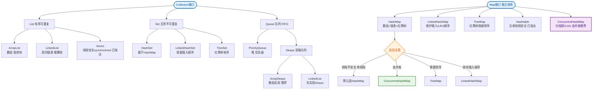

# Java集合框架的接口继承关系是怎样的？

**Java 集合框架**的接口继承关系：

```
                    Iterable
                       │
                   Collection
                ╱    │    ╲
             List   Set   Queue
              │      │      │
        ╱────┴────╲  │  ╱───┴───╲
    ArrayList  Vector │ PriorityQueue Deque
              │       │              │
          Stack   ╱───┴──╲        ArrayDeque
                HashSet  TreeSet
                  │
             LinkedHashSet

     Map（独立体系）
    ╱──────┴──────╲
  HashMap      TreeMap
     │
  LinkedHashMap
```

## 两大体系

| 体系 | 根接口 | 特点 | 常见实现 |
|------|--------|------|----------|
| **Collection** | Collection | 存储单值 | List, Set, Queue |
| **Map** | Map | 存储键值对 | HashMap, TreeMap |

## Collection 三大子接口

| 接口 | 特点 | 实现 |
|------|------|------|
| **List** | 有序、可重复、可索引 | ArrayList, LinkedList, Vector |
| **Set** | 无序、不可重复 | HashSet, TreeSet, LinkedHashSet |
| **Queue/Deque** | 队列/双端队列 | PriorityQueue, ArrayDeque |

## Map 接口

| 实现 | 特点 |
|------|------|
| **HashMap** | 最常用，O(1)查找，允许null |
| **LinkedHashMap** | 保持插入顺序 |
| **TreeMap** | 按key排序（红黑树） |
| **ConcurrentHashMap** | 线程安全 |

### 增强细节：Iterable 与 Iterator
`Collection` 继承自 `Iterable` 接口，这意味着所有集合都支持“foreach”循环。`Iterable` 定义了 `iterator()` 方法返回 `Iterator` 对象，用于遍历。Java 8 还在 `Iterable` 中增加了 `forEach(Consumer)` 默认方法，支持 Lambda 表达式遍历。

### 增强细节：Queue 的层级关系
```
Queue (接口)
  │
  ├─ Deque (接口，双端队列)
  │    ├─ ArrayDeque (数组实现，高效)
  │    └─ LinkedList (链表实现，也实现了 List)
  │
  ├─ PriorityQueue (堆实现，优先级队列)
  └─ BlockingQueue (并发包，阻塞队列)
```

## 常见考点
1. **Collection 和 Collections 的区别**：一个是接口根体系，一个是工具类（包含 sort, synchronizedList 等静态方法）。
2. **List, Set, Map 是否继承自 Collection**：只有 List 和 Set 继承 Collection，Map 是独立的顶层接口。
3. **为何 Map 不继承 Collection**：Map 是键值对结构，与 Collection 的单元素结构语义不同，强行继承会导致接口设计混乱。
4. **Fail-Fast 机制**：集合在迭代过程中被修改会抛出 `ConcurrentModificationException`，其原理是检查 `modCount`。

---

### 实战案例：线上 OOM 排查
曾遇到线上服务 OOM，堆 Dump 显示 `ArrayList` 占用 90% 内存。经排查是代码在处理数据导出时，未预估数据量大小，直接将百万级数据库结果集一次性加载到 `ArrayList` 中导致。**实战建议**：涉及大批量数据处理时，应限制集合大小或使用流式处理（如 MyBatis 的 `Cursor` 或分页查询）。

### 代码示例：避免 Fail-Fast 异常
在遍历 List 时删除元素，使用 `Iterator.remove()` 而非 `List.remove()`。

```java
List<String> list = new ArrayList<>(Arrays.asList("a", "b", "c"));
// 错误做法：抛出 ConcurrentModificationException
// for (String s : list) { if (s.equals("b")) list.remove(s); }

// 正确做法：使用 Iterator
Iterator<String> it = list.iterator();
while (it.hasNext()) {
    String s = it.next();
    if ("b".equals(s)) {
        it.remove(); // 安全删除
    }
}
```

### 选型对比：核心 List 实现

| 特性 | ArrayList | LinkedList |
| :--- | :--- | :--- |
| **底层数据结构** | 动态数组 | 双向链表 |
| **随机访问 (get)** | **O(1)** 高效 | O(n) 需遍历 |
| **插入/删除** | O(n) 需移动元素（除尾部） | **O(1)** 只需改指针（若已知位置） |
| **内存占用** | 较低（无额外指针） | 较高（每个节点存 prev/next/data） |
| **线程安全** | 不安全 | 不安全 |
| **实战场景** | **绝大多数场景**，如查询列表、数据传输 | 很少使用，除非频繁在头尾操作（如队列/栈） |


## 核心流程图


## 记忆要点

- 双大顶层接口：单值体系Collection，键值对体系Map，Map独立不继承Collection。
- Collection三大子接口：List有序可重复，Set无序唯一，Queue按特定规则进出。
- 遍历基石：Collection继承Iterable接口，使得所有单列集合支持foreach循环。
- Fail-Fast保护：迭代时若发生结构修改会抛异常，修改元素必须用Iterator.remove()。

## 结构化回答

**30 秒电梯演讲：** Collection存单值，Map存键值对，List/Set/Queue派生自Collection。打个比方，Collection是单列火车（装人），Map是双列火车（一人一座对号入座）。

**展开框架：**
1. **双大顶层接口** — 单值体系Collection，键值对体系Map，Map独立不继承Collection。
2. **Collection三大子接口** — List有序可重复，Set无序唯一，Queue按特定规则进出。
3. **遍历基石** — Collection继承Iterable接口，使得所有单列集合支持foreach循环。

**收尾：** 我在项目里踩过坑——曾遇到线上服务 OOM，堆 Dump 显示 `ArrayList` 占用 90% 内存。您想深入聊哪一段：原理、避坑还是对比选型？

## 视频脚本

> 预计时长：2 分钟 | 由浅入深

| 时间 | 画面/字幕 | 口播台词 | 讲解要点 |
|------|----------|----------|----------|
| 0:00 | 标题卡：Java集合框架的接口继承关系是怎样… | "Java集合框架的接口继承关系是怎样的？一句话——Collection是单列火车（装人），Map是双列火车（一人一座对号入座）。" | 开场钩子 |
| 0:40 | 概念动画/示意图 | "Collection存单值，Map存键值对，List/Set/Queue派生自Collection——Collection是单列火车（装人），Map是双列火车（一人一座对号入座）" | 核心定义 |
| 1:20 | 双大顶层接口示意 | "单值体系Collection，键值对体系Map，Map独立不继承Collection。" | 要点1 |
| 2:00 | 总结卡 | "记住这几条，面试不慌。下期讲进阶追问。" | 收尾 |
