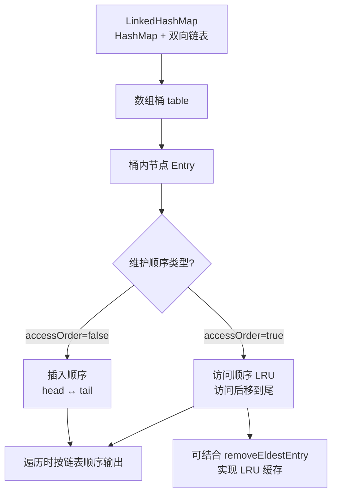

# LinkHashSet（HashSet+LinkedHashMap）是什么？

LinkedHashSet 是 Java 集合框架中的一种 Set 实现，它是 **HashSet** 的子类，但在内部使用了 **LinkedHashMap** 来存储元素。

### 1. 核心特点
- **唯一性**：继承自 HashSet，保证元素的唯一性（不重复）。
- **有序性**：基于 LinkedHashMap 实现，维护了元素的**插入顺序**（或者访问顺序，取决于构造参数）。遍历时，元素顺序与插入顺序一致。

### 2. 底层原理
LinkedHashSet 的代码实现非常简单，它继承自 HashSet，其内部构造方法通过调用父类 `HashSet` 的特定构造器，传入一个 `true` 标识位，使得底层创建一个 `LinkedHashMap` 而不是普通的 HashMap。

```java
// HashSet 中 LinkedHashSet 使用的构造逻辑
HashSet(int initialCapacity, float loadFactor, boolean dummy) {
    map = new LinkedHashMap<>(initialCapacity, loadFactor);
}
```

### 3. 性能
- **时间复杂度**：由于基于哈希表，添加、删除、查找操作的时间复杂度仍为 **O(1)**，但为了维护链表顺序，性能略低于 HashSet。

### 4. 使用场景
- 需要去重，但同时又需要保持元素插入顺序的场景（如：最近去重访问记录、解析 XML 配置标签列表）。

### 增强细节：底层结构
LinkedHashSet 实际上就是 **HashMap + 双向链表** 的封装。其维护顺序的原理如下：

```text
┌──────────────────────────────────────────────────────────────┐
│                   LinkedHashMap (内部数组)                     │
│  ┌───────┬──────────┬────────────────────────────────────┐   │
│  │ Index │  Entry   │   (哈希桶)                        │   │
│  ├───────┼──────────┼────────────────────────────────────┤   │
│  │   0   │   null   │                                    │   │
│  │   1   │  Node A  │ ┌─────┐    ┌─────┐    ┌─────┐     │   │
│  │       │          │ │ Key │ -> │ Val │ -> │Next │---> │   │
│  │       │          │ └──┬──┘    └──┬──┘    └─────┘     │   │
│  │       │          │    │ (维护双向链表指针)           │   │
│  │       │          │    ▼         ▲         │         │   │
│  │       │          │ ┌───────────────────────┐       │   │
│  │       │          │ │   Before <-> After     │ <---->│   │
│  │       │          │ └───────────────────────┘       │   │
│  ├───────┼──────────┼────────────────────────────────────┤   │
│  │   2   │  Node B  │ ...                                  │   │
│  └───────┴──────────┴────────────────────────────────────┘   │
│                                                              │
│   LinkedHashSet 遍历时，不按数组下标，而是按 After 指针遍历。 │
└──────────────────────────────────────────────────────────────┘
```

### 5. 实战深化
#### 实战案例
在做 **“最近访问的商品去重”** 功能时，如果使用 HashSet 会导致去重后的商品展示顺序乱跳，用户体验差；改用 LinkedHashSet 后，既保证了商品不重复，又能保留用户的浏览时间顺序。

#### 代码示例
```java
// 模拟用户浏览记录，利用 LinkedHashSet 维持插入顺序且去重
Set<String> viewHistory = new LinkedHashSet<>();
viewHistory.add("ProductA");
viewHistory.add("ProductB");
viewHistory.add("ProductA"); // 重复，自动去重
viewHistory.add("ProductC");

// 输出顺序一定是 ProductA -> ProductB -> ProductC
System.out.println(viewHistory); 
```

#### 对比表格
| 特性 | HashSet | LinkedHashSet | TreeSet |
| :--- | :--- | :--- | :--- |
| **底层实现** | HashMap | LinkedHashMap | TreeMap (红黑树) |
| **有序性** | 无序（不保证遍历顺序） | **有序（插入顺序）** | 有序（自然排序/自定义） |
| **性能** | 最快（O(1)） | 次之（需维护链表，O(1)） | 较慢（树旋转，O(logN)） |
| **允许 Null** | 允许 | 允许 | 不允许 |
| **适用场景** | 仅需去重 | 需去重+保持顺序（如历史记录） | 需去重+排序（如排行榜） |


## 核心架构图



## 记忆要点

- 核心特性：HashSet子类，基于LinkedHashMap，既保证元素唯一又保持插入顺序。
- 底层原理：本质是HashMap数组+双向链表，链表负责记录和维持元素的迭代顺序。
- 性能对比：增删查时间复杂度维持O(1)，但因维护链表性能略逊于HashSet。
- 实战场景：用户浏览记录去重等需要「去重+保序」的业务场景。

## 结构化回答

**30 秒电梯演讲：** HashSet基础上增加了链表维护插入顺序。打个比方，像排队领号，每个人号码唯一（Set），且按来的先后顺序排队（Linked）。

**展开框架：**
1. **核心特性** — HashSet子类，基于LinkedHashMap，既保证元素唯一又保持插入顺序。
2. **底层原理** — 本质是HashMap数组+双向链表，链表负责记录和维持元素的迭代顺序。
3. **性能对比** — 增删查时间复杂度维持O(1)，但因维护链表性能略逊于HashSet。

**收尾：** 我在项目里踩过坑——在做 “最近访问的商品去重” 功能时，如果使用 HashSet 会导致去重后的商品展示顺序乱跳，用户体验差；改用 LinkedHashSet 后，既保证了商品不重复，又能保留用户的浏览时间顺序。您想深入聊哪一段：原理、避坑还是对比选型？

## 视频脚本

> 预计时长：3 分钟 | 由浅入深

| 时间 | 画面/字幕 | 口播台词 | 讲解要点 |
|------|----------|----------|----------|
| 0:00 | 标题卡：LinkHashSet（HashSe… | "LinkHashSet（HashSet+LinkedHashMap）是什么？一句话——像排队领号，每个人号码唯一（Set），且按来的先后顺序排队（Linked）。" | 开场钩子 |
| 0:45 | 概念动画/示意图 | "HashSet基础上增加了链表维护插入顺序——像排队领号，每个人号码唯一（Set），且按来的先后顺序排队（Linked）" | 核心定义 |
| 1:30 | 核心特性示意 | "HashSet子类，基于LinkedHashMap，既保证元素唯一又保持插入顺序。" | 要点1 |
| 2:15 | 底层原理示意 | "本质是HashMap数组+双向链表，链表负责记录和维持元素的迭代顺序。" | 要点2 |
| 3:00 | 总结卡 | "记住这几条，面试不慌。下期讲进阶追问。" | 收尾 |
