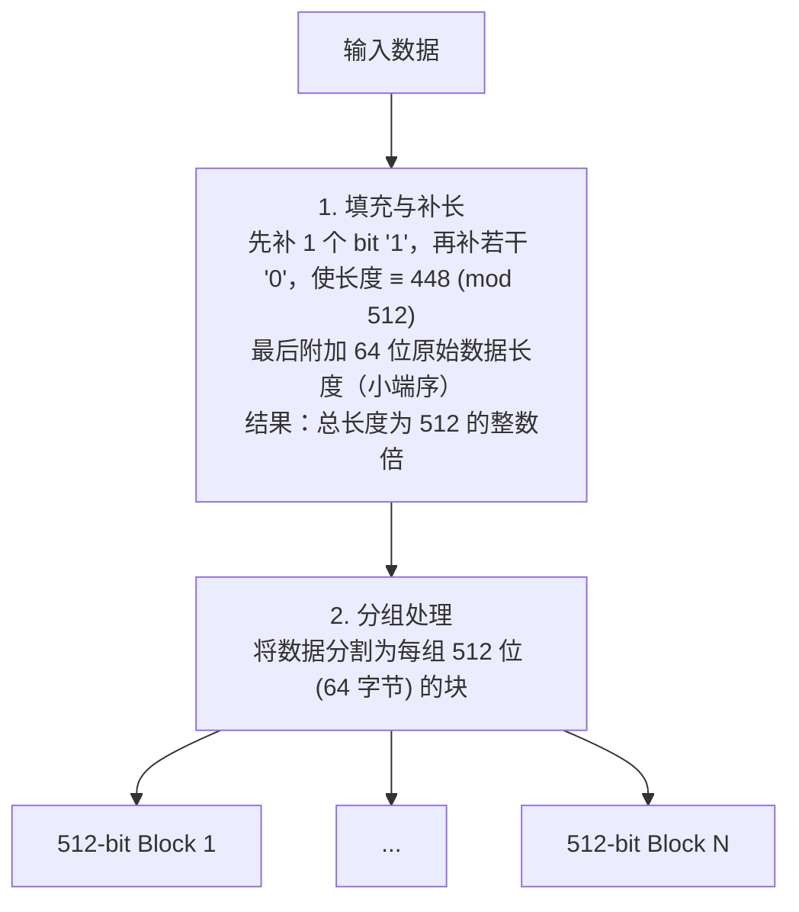

# MD5哈希算法的原理和安全性问题是什么？

### MD5（Message-Digest Algorithm 5）

**原理**：
MD5 是一种广泛使用的**哈希算法**，它能将任意长度的输入数据通过一系列复杂的位运算（填充、附加长度、分组处理、循环移位等）映射为一个固定长度（128位，通常用32位十六进制字符串表示）的“指纹”。

**特点**：
1.  **不可逆**：无法通过哈希值反推原始数据。
2.  **雪崩效应**：输入数据的微小改变会导致哈希值发生巨大变化。
3.  **固定输出**：无论输入多长，输出长度始终一致。

**应用场景**：
1.  **文件完整性校验**：在下载文件时，官方提供 MD5 值，用户下载后计算文件 MD5 并对比，防止文件被篡改或下载损坏。
2.  **密码存储（已不推荐直接使用）**：历史上用于存储用户密码，但因安全性问题，现在建议加盐或使用更现代的算法（如 bcrypt、Argon2）。
3.  **数字签名**：作为签名算法的一部分，确保数据的唯一性。

**安全性问题**：
MD5 已被证明**不安全**，不再应用于安全领域（如SSL证书、密码存储）：
1.  **碰撞**：黑客可以找到两个不同的文件，它们的 MD5 值完全相同（即“MD5 碰撞”）。这意味着恶意文件可以伪装成合法文件。
2.  **暴力破解**：由于计算速度快，结合彩虹表技术，普通密码的 MD5 哈希值极易被反向破解。

### 增强细节：算法流程图
MD5 处理数据分为四个主要阶段，具体流程如下：



### 5. 实战深化
#### 实战案例
某电商系统曾使用 **MD5 存储用户支付密码**。黑客拖库后，利用彩虹表瞬间破解了大量弱口令密码。修复方案不仅仅是改成 SHA-256（因为同样可以彩虹表攻击），而是升级为 **BCrypt 算法**（自带盐值且计算故意变慢），有效抵御暴力破解。

#### 代码示例
```java
import java.security.MessageDigest;
import java.nio.charset.StandardCharsets;

public class MD5Util {
    public static String encrypt(String input) throws Exception {
        MessageDigest md = MessageDigest.getInstance("MD5");
        byte[] digest = md.digest(input.getBytes(StandardCharsets.UTF_8));
        StringBuilder sb = new StringBuilder();
        for (byte b : digest) {
            sb.append(String.format("%02x", b)); // 转为16进制字符串
        }
        return sb.toString();
    }
}
```

#### 对比表格
| 算法 | 输出长度 | 抗碰撞性 | 计算速度 | 适用场景 |
| :--- | :--- | :--- | :--- | :--- |
| **MD5** | 128 bit | **低（已碰撞）** | 极快 | 非安全校验（如文件一致性） |
| **SHA-1** | 160 bit | **低（已碰撞）** | 快 | 已废弃
| **SHA-256** | 256 bit | 高 | 中等 | 数字签名、区块链、安全校验 |
| **BCrypt** | 192 bit | 高 | **慢（设计初衷）** | **密码存储**（加盐，抗彩虹表） |


## 记忆要点

- 基础特性：任意长度输入转为128位固定输出，具有不可逆性与雪崩效应。
- 安全缺陷：因计算速度过快且存在碰撞漏洞，极易被彩虹表反向破解。
- 实战结论：严禁用于密码存储等安全场景，密码加密必须改用BCrypt等慢算法。
- 局限应用：目前仅适用于非安全场景的文件完整性校验或数字签名。

## 结构化回答

**30 秒电梯演讲：** 将任意数据映射为固定位数指纹的单向散列算法。打个比方，像把切碎的食材混合做成唯一的肉丸，无法还原成原来的整块肉。

**展开框架：**
1. **基础特性** — 任意长度输入转为128位固定输出，具有不可逆性与雪崩效应。
2. **安全缺陷** — 因计算速度过快且存在碰撞漏洞，极易被彩虹表反向破解。
3. **实战结论** — 严禁用于密码存储等安全场景，密码加密必须改用BCrypt等慢算法。

**收尾：** 我在项目里踩过坑——某电商系统曾使用 MD5 存储用户支付密码。您想深入聊哪一段：原理、避坑还是对比选型？

## 视频脚本

> 预计时长：3 分钟 | 由浅入深

| 时间 | 画面/字幕 | 口播台词 | 讲解要点 |
|------|----------|----------|----------|
| 0:00 | 标题卡：MD5哈希算法的原理和安全性问题是什… | "MD5哈希算法的原理和安全性问题是什么？一句话——像把切碎的食材混合做成唯一的肉丸，无法还原成原来的整块肉。" | 开场钩子 |
| 0:45 | 概念动画/示意图 | "将任意数据映射为固定位数指纹的单向散列算法——像把切碎的食材混合做成唯一的肉丸，无法还原成原来的整块肉" | 核心定义 |
| 1:30 | 基础特性示意 | "任意长度输入转为128位固定输出，具有不可逆性与雪崩效应。" | 要点1 |
| 2:15 | 安全缺陷示意 | "因计算速度过快且存在碰撞漏洞，极易被彩虹表反向破解。" | 要点2 |
| 3:00 | 总结卡 | "记住这几条，面试不慌。下期讲进阶追问。" | 收尾 |
