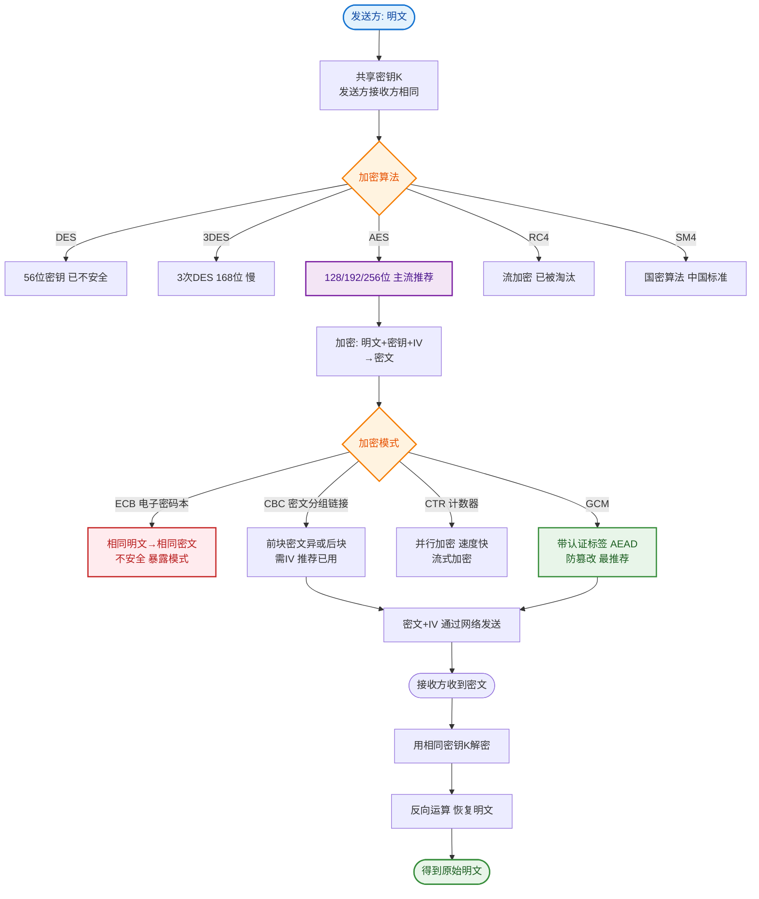

# RSA非对称加密算法的原理是什么？

**RSA**是最广泛使用的非对称加密算法，基于大整数分解的数学难题。

## 核心原理

RSA 的安全性基于：**对极大整数做因数分解极其困难**。

两个大素数 p 和 q 相乘得到 N = p×q 很容易；但已知 N 反推 p 和 q 极其困难（当 N 足够大时）。

## 密钥生成步骤

```
1. 选两个大素数 p, q（如 1024 bit）
2. 计算 n = p × q （公开模数）
3. 计算欧拉函数 φ(n) = (p-1)(q-1)
4. 选公钥指数 e：1 < e < φ(n)，且 gcd(e, φ(n)) = 1（通常 e=65537）
5. 计算私钥指数 d：e × d ≡ 1 (mod φ(n))，即 d = e⁻¹ mod φ(n)

公钥 = (e, n) → 公开
私钥 = (d, n) → 保密
```

## 加密与解密

```
加密：密文 C = M^e mod n （M为明文，用公钥加密）
解密：明文 M = C^d mod n （用私钥解密）
```

## 流程示意图

```text
      [发送方 Alice]                                  [接收方 Bob]
           │                                              │
           │  1. 请求公钥                                  │
           ├─────────────────────────────────────────────>│
           │                                              │
           │                 2. 返回公钥 (e, n)            │
           │<─────────────────────────────────────────────┤
           │                                              │
           │  3. 使用公钥加密: C = M^e mod n               │
           │                                              │
           │  4. 发送密文 C ──────────────────────────────>│
           │                                              │ 5. 使用私钥解密: M = C^d mod n
           │                                              │
           │                                          获得明文 M
```

## 代码示例

```java
// 使用 Java 内置 RSA
KeyPairGenerator kpg = KeyPairGenerator.getInstance("RSA");
kpg.initialize(2048);
KeyPair keyPair = kpg.generateKeyPair();

// 加密
Cipher cipher = Cipher.getInstance("RSA");
cipher.init(Cipher.ENCRYPT_MODE, keyPair.getPublic());
byte[] encrypted = cipher.doFinal("Hello RSA".getBytes());

// 解密
cipher.init(Cipher.DECRYPT_MODE, keyPair.getPrivate());
byte[] decrypted = cipher.doFinal(encrypted);
```

## 实战案例：中间人攻击与 OAEP
在金融支付网关对接中，如果直接使用默认的 `RSA/ECB/PKCS1Padding` 存在“选择密文攻击”风险。实战中必须强制使用 `RSA/ECB/OAEPWithSHA-256AndMGF1Padding` 填充模式，OAEP 引入了随机因子，使得相同的明文每次加密结果不同，有效抵御了中间人重放攻击和预言者攻击。

## 加密与签名对比
RSA 既可做加密也可做签名，但两者的用法完全相反，容易混淆：

| 场景 | 私钥作用 | 公钥作用 | 目的 |
| :--- | :--- | :--- | :--- |
| **加密** | 解密 | 加密 | 保证机密性（只有私钥持有者能看） |
| **签名** | 签名 | 验签 | 保证完整性和不可抵赖性（只有私钥持有者能发） |

## 实际应用

1. **HTTPS**：RSA 用于交换 AES 会话密钥。
2. **JWT (Json Web Token)**：使用 RS256 算法（RSA + SHA256）对 Token 进行私钥签名，网关使用公钥验签，实现服务间的无状态认证。


## 核心流程图


## 记忆要点

- 核心难题：基于大整数极难分解，正向相乘极易，反向分解极难。
- 加密解密：公钥(e,n)加密为C=M^e mod n，私钥(d,n)解密为M=C^d mod n。
- 易混对比：加密用公钥保证机密性，而签名用私钥保证不可抵赖性。
- 实战避坑：禁用默认填充，必须用OAEP防重放，相同明文每次密文不同。

## 结构化回答

**30 秒电梯演讲：** 基于大数分解难题的非对称加密算法。打个比方，像公开信箱（公钥）谁都能投信，只有有钥匙（私钥）的人能开箱取信。

**展开框架：**
1. **核心难题** — 基于大整数极难分解，正向相乘极易，反向分解极难。
2. **加密解密** — 公钥(e,n)加密为C=M^e mod n，私钥(d,n)解密为M=C^d mod n。
3. **易混对比** — 加密用公钥保证机密性，而签名用私钥保证不可抵赖性。

**收尾：** 我在项目里踩过坑——实战案例：中间人攻击与 OAEP。您想深入聊哪一段：原理、避坑还是对比选型？

## 视频脚本

> 预计时长：2 分钟 | 由浅入深

| 时间 | 画面/字幕 | 口播台词 | 讲解要点 |
|------|----------|----------|----------|
| 0:00 | 标题卡：RSA非对称加密算法的原理是什么 | "RSA非对称加密算法的原理是什么？一句话——像公开信箱（公钥）谁都能投信，只有有钥匙（私钥）的人能开箱取信。" | 开场钩子 |
| 0:40 | 概念动画/示意图 | "基于大数分解难题的非对称加密算法——像公开信箱（公钥）谁都能投信，只有有钥匙（私钥）的人能开箱取信" | 核心定义 |
| 1:20 | 核心难题示意 | "基于大整数极难分解，正向相乘极易，反向分解极难。" | 要点1 |
| 2:00 | 总结卡 | "记住这几条，面试不慌。下期讲进阶追问。" | 收尾 |
