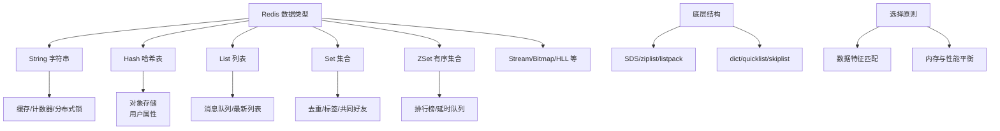

# Redis五种数据结构和应用场景是什么？

### Redis 五种基础数据结构及应用场景

Redis 提供了五种基础数据类型，每种类型都有其特定的底层实现和适用场景：

#### 1. String（字符串）
*   **底层结构**：SDS（简单动态字符串）。
*   **应用场景**：
    *   **缓存对象**：直接缓存对象的 JSON 字符串。
    *   **计数器**：利用原子递增命令（`INCR`），如文章点赞数、视频播放数、分布式库存扣减。
    *   **分布式锁**：使用 `SETNX`（Set if Not Exists）实现简单的互斥锁。
    *   **共享 Session**：分布式系统中存储用户 Session 信息。
*   **进阶**：二进制安全，可以存储图片、视频等二进制数据。

#### 2. Hash（哈希）
*   **底层结构**：压缩列表 或 哈希表。Redis 7.0 使用 listpack 替代了压缩列表。
*   **应用场景**：
    *   **对象存储**：适合存储对象的部分字段，比 String 存 JSON 更方便更新单个字段（`HSET`）。
    *   **购物车**：以用户 ID 为 key，商品 ID 为 field，商品数量为 value。
*   **边界**：当 field 数量超过配置阈值（默认 512）或 value 字符串长度超过阈值（默认 64字节）时，会从 ziplist 转换为 hashtable。

#### 3. List（列表）
*   **底层结构**：双向链表、压缩列表（Redis 7.0 用 listpack）或 **QuickList**（3.2 以后）。
*   **应用场景**：
    *   **消息队列**：利用 `LPUSH` + `BRPOP` 实现简单的队列（生产者消费模型）。
    *   **最新列表**：如微博关注人的时间线、朋友圈点赞列表（利用 `LPUSH` + `LRANGE`）。
*   **进阶**：Redis 3.2 之后使用 QuickList（双向链表 + ziplist），兼顾了链表的两端操作效率和 ziplist 的内存紧凑性。

#### 4. Set（集合）
*   **底层结构**：哈希表 或 整数集合。
*   **应用场景**：
    *   **去重**：如标签系统，存储用户的标签。
    *   **交集/并集**：计算共同关注（`SINTER`）、共同喜好等。
    *   **抽奖**：利用 `SPOP` 随机获取元素。
*   **细节**：Set 中元素唯一，查找操作 O(1)。

#### 5. Zset（有序集合）
*   **底层结构**：压缩列表 或 **跳表 + 哈希表**。跳表保证范围查询的高效，哈希表保证成员查询 O(1)。
*   **应用场景**：
    *   **排行榜**：如实时游戏积分榜、视频热度排行，通过 `ZRANGE` 或 `ZREVRANGE` 获取 Top N。
    *   **延时队列**：利用 Score 作为时间戳。
    *   **范围查找**：如查找某个分数段内的所有元素。
*   **原理**：跳表是一种多层链表结构，查询效率平均 O(logN)，最坏 O(N)，通过概率平衡实现。

**Zset 底层跳表示意图**：
```text
Level 3:  1  ------------------------------------>  100
Level 2:  1  ----------------->  50  ------------>  100
Level 1:  1  -------->  25  ----->  50  ----->  75  ->  100
Head                                                            Tail
```

## 实战案例：大Key监控与内存优化
在双十一大促预热阶段，监控发现某 Hash 结构的单个 Key 内存高达 500MB。原因是将用户的几万条历史订单ID全部存入了一个 Hash 中。这不仅导致主线程阻塞（rehash耗时长），还影响了网络传输。解决方案是将“宽表”拆分，按天数或订单类型生成多个 Key，或使用 String 存储经过 GZIP 压缩后的 JSON 字符串。

## 代码示例：Zset 实现延时任务
```java
// 生产者：5秒后执行的任务，score为时间戳
long executeTime = System.currentTimeMillis() + 5000;
jedis.zadd("delay_queue", executeTime, "order:123");

// 消费者（轮询）
while (true) {
    Set<Tuple> items = jedis.zrangeWithScores("delay_queue", 0, 0);
    if (items.isEmpty()) continue;
    Tuple item = items.iterator().next();
    long score = item.getScore();
    if (score <= System.currentTimeMillis()) {
        String taskId = item.getElement();
        // 移除并执行
        if (jedis.zrem("delay_queue", taskId) > 0) {
            processTask(taskId);
        }
    }
}
```

## 数据结构选型对比

| 场景需求 | 推荐类型 | 替代方案及缺点 | 核心优势 |
| :--- | :--- | :--- | :--- |
| **排行榜** | Zset | List: 插入慢、去重难、按分排序麻烦 | O(log N) 插入/更新、范围查询极快 |
| **最新列表** | List | Zset: 分数需要维护、内存占用高 | LPUSH 极其高效，适合追加写 |
| **对象存储** | Hash | String (JSON): 修改需全量读写、CPU开销大 | 支持部分字段更新，序列化开销小 |
| **去重统计** | Set | Hash: 模拟 Set 但代码复杂 | 内存结构紧凑，自带去重 |

## 常见考点
1.  **SDS 与 C String 区别**：为什么 Redis 使用 SDS？（O(1) 获取长度、二进制安全、杜绝缓冲区溢出）。
2.  **跳表 vs 平衡树**：为什么 Zset 使用跳表而不是 B+ 树或红黑树？（内存占用更少、实现更简单、范围查询效率更高）。
3.  **ZipList 转换条件**：List/Hash/Zset 在什么情况下会从 ZipList 转换为 Skiplist/Hashtable？（元素个数和元素大小的配置阈值）。
4.  **BitMap/HyperLogLog**：这些虽然是特殊类型，但通常基于 String 实现，面试中可能会问它


## 核心架构图



## 记忆要点

- 口诀：S-H-L-S-Z 对应 缓存/对象、购物车、消息队列、去重、排行榜。
- String原子递增(INCR)：专做计数器与分布式锁；Hash：专做对象字段更新。
- List底层演进：双向链表+压缩列表升级为QuickList，兼顾效率与内存。
- Zset底层核心：跳表保证范围查询高效，哈希表保证单成员查询O(1)。

## 结构化回答

**30 秒电梯演讲：** 基于内存的高性能键值对数据库，支持多种数据结构。打个比方，像一把瑞士军刀，有刀、剪子、锯等不同工具，针对不同需求用不同工具。

**展开框架：**
1. **口诀** — S-H-L-S-Z 对应 缓存/对象、购物车、消息队列、去重、排行榜。
2. **String原子递增(INCR)** — 专做计数器与分布式锁；Hash：专做对象字段更新。
3. **List底层演进** — 双向链表+压缩列表升级为QuickList，兼顾效率与内存。

**收尾：** 我在项目里踩过坑——实战案例：大Key监控与内存优化。您想深入聊哪一段：原理、避坑还是对比选型？

## 视频脚本

> 预计时长：3 分钟 | 由浅入深

| 时间 | 画面/字幕 | 口播台词 | 讲解要点 |
|------|----------|----------|----------|
| 0:00 | 标题卡：Redis五种数据结构和应用场景是什… | "Redis五种数据结构和应用场景是什么？一句话——像一把瑞士军刀，有刀、剪子、锯等不同工具，针对不同需求用不同工具。" | 开场钩子 |
| 0:45 | 概念动画/示意图 | "基于内存的高性能键值对数据库，支持多种数据结构——像一把瑞士军刀，有刀、剪子、锯等不同工具，针对不同需求用不同工具" | 核心定义 |
| 1:30 | 口诀示意 | "S-H-L-S-Z 对应 缓存/对象、购物车、消息队列、去重、排行榜。" | 要点1 |
| 2:15 | 要点2图解示意 | "专做计数器与分布式锁；Hash：专做对象字段更新。" | 要点2 |
| 3:00 | 总结卡 | "记住这几条，面试不慌。下期讲进阶追问。" | 收尾 |
