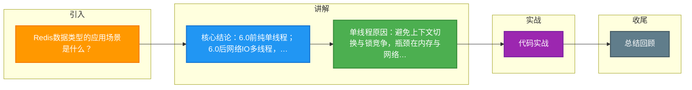

# Redis数据类型的应用场景是什么？

### Redis 单线程模型与数据类型应用

#### 为什么 Redis 是单线程？
**Redis 单线程指的是**：主要处理网络请求模块和命令执行模块使用单线程（Redis 6.0 引入多线程处理网络 IO，命令执行仍是单线程）。

*   **原因**：
    1.  **避免上下文切换**：多线程频繁切换会带来 CPU 开销。
    2.  **避免锁竞争**：单线程不需要处理并发数据的一致性问题，简化了实现。
    3.  **瓶颈不在 CPU**：Redis 的性能瓶颈通常在**内存**或**网络带宽**，而不是 CPU。

#### Redis 6.0 的多线程
Redis 6.0 引入多线程主要用于**网络数据读写**（协议解析、封包），以充分利用多核 CPU，**命令执行依然由单线程串行处理**，保证了原子性。

**Redis 6.0 IO 多线程模型图**：
```text
客户端网络请求
      │
      ▼
┌──────────────────────────────────────────┐
│   IO Threads (多线程)                    │
│   ├─ Thread 1: 读取 Socket A, 解析请求   │
│   ├─ Thread 2: 读取 Socket B, 解析请求   │
│   └─ ...                                 │
└──────────────┬───────────────────────────┘
               │ (解析后的命令放入队列)
               ▼
┌──────────────────────────────────────────┐
│   Main Thread (主线程, 单线程)           │
│   ├─ 执行命令   │
│   └─ 修改内存数据结构                     │
└──────────────┬───────────────────────────┘
               │ (处理结果)
               ▼
┌──────────────────────────────────────────┐
│   IO Threads (多线程)                    │
│   ├─ Thread 1: 将结果写回 Socket A       │
│   └─ Thread 2: 将结果写回 Socket B       │
└──────────────────────────────────────────┘
```

#### Redis 数据类型及应用场景

**五种基础类型**：
1.  **String**：缓存对象、计数器、分布式锁、Session。
2.  **Hash**：存储对象（适合部分更新）、购物车。
3.  **List**：消息队列（List 实现的消息队列不支持消费组）、最新列表。
4.  **Set**：点赞（去重）、共同关注（交集）、抽奖。
5.  **Zset**：排行榜、延时队列、范围搜索。

**四种高级类型**：
1.  **BitMap (2.2+)**：位图，用于**二值状态统计**，如用户签到、在线状态。
2.  **HyperLogLog (2.8+)**：基数估算，用于**海量数据去重统计**，如百万级 UV 统计（有一定误差）。
3.  **GEO (3.2+)**：地理位置，用于**附近的人**、滴滴打车距离计算。
4.  **Stream (5.0+)**：专门为**消息队列**设计，支持消费组、消息确认（ACK），解决了 List 做消息队列的缺陷。

## 实战案例：List 消息丢失的排查
某系统使用 `LPUSH` + `RPOP` 做消息队列，偶发性出现消息丢失。经排查发现是消费者进程在 `RPOP` 取出消息后、处理完成前发生崩溃，导致消息未处理且已从队列中移除。**解决方案**：改用 `BRPOPLPUSH` 命令，将读取的消息同时备份到一个处理中的队列（Processing Queue），待业务逻辑处理完毕再从备份队列中删除；或者直接升级为 Redis 5.0 的 Stream 结构，支持 ACK 机制。

## 代码示例：使用 Stream 实现可靠消息队列
```bash
# 生产者：发送消息到 stream:mystream
XADD stream:mystream * sensor_id 1234 temp 26.5

# 消费者组：创建消费者组（如果尚未创建）
XGROUP CREATE stream:mystream mygroup $ MKSTREAM

# 消费者：读取消息（阻塞 1秒，不确认历史消息）
XREADGROUP GROUP mygroup consumer1 COUNT 1 BLOCK 1000 STREAMS stream:mystream >

# 消费者：手动确认消息处理完成（ACK）
XACK stream:mystream mygroup 1643720000000-0
```

## 消息队列选型对比

| 特性 | Redis List | Redis Stream | RabbitMQ/Kafka |
| :--- | :--- | :--- | :--- |
| **消息可靠性** | 低（RPOP即删除） | 高（支持 ACK/Pending List） | 极高（持久化+ACK） |
| **消费模型** | 竞争消费者 | 消费组（支持多消费者） | 丰富的消费模型 | 
| **回溯能力** | 不支持 | 支持 | 视配置而定 |
| **吞吐量** | 高 | 中 | 中高 |
| **适用场景** | 简单异步、低可靠需求 | 需要ACK的轻量级MQ | 复杂业务解耦、削峰填谷 |

## 常见考点
1.  **真的是单线程吗？**：Redis 在处理持久化（RDB 生成、AOF 重写）时会 fork 子进程，这些操作是异步且多进程的，但不影响主线程处理命令。
2.  **为什么 6.0 才引入多线程？**：随着带宽增加，网络 IO 解析成为了新的瓶颈，利用多核 CPU 处理网络包可以显著提升吞吐量，但核心执行逻辑保持单线程以避免并发逻辑复杂度。
3.  **List vs Stream 做消息队列**：List 有什么缺点？（不支持消息确认 ACK，消费者挂掉消息可能丢失；不支持 Group 消费；不支持回溯）。
4.  **Pipeline**：Pipeline 也是为了解决网络往返（RTT）问题，它和多线程 IO 有什么区别？（Pipeline 是客户端批量发送命令，一次 IO；多线程 IO 是服务端并行处理多个 IO 请求）。


## 核心流程图

```mermaid
flowchart TD
    R([Redis五大数据类型]):::start --> STR[String 字符串]
    R --> HS2[Hash 哈希表]
    R --> LST[List 列表]
    R --> SET2[Set 集合]
    R --> ZSET[ZSet 有序集合]
    STR --> STR1["单值缓存<br/>验证码/商品库存"]
    STR --> STR2[对象JSON缓存<br/>用户信息]
    STR --> STR3["计数器 incr<br/>点赞数/阅读量"]:::async
    STR --> STR4[分布式锁<br/>setnx+expire]
    STR --> STR5[Bitmap签到<br/>底层就是String]
    HS2 --> HS1[对象字段存储<br/>用户属性 商品详情]
    HS2 --> HS2A["购物车<br/>userId→{skuId:num}"]
    LST --> L1[消息队列<br/>lpush+brpop]
    LST --> L2["最新N条<br/>朋友圈/文章列表"]
    LST --> L3[操作日志栈]
    SET2 --> S1["标签/共同好友<br/>sinter交集"]
    SET2 --> S2[去重<br/>UV统计 抽奖 srandmember]
    SET2 --> S3["黑名单/白名单"]
    ZSET --> Z1["排行榜<br/>score排序 游戏/热搜"]
    ZSET --> Z2[延时队列<br/>score=到期时间戳]:::async
    ZSET --> Z3[范围查找<br/>滑动窗口限流]
        classDef start fill:#e3f2fd,stroke:#1976d2,stroke-width:2px,color:#0d47a1
    classDef decision fill:#fff3e0,stroke:#f57c00,stroke-width:2px,color:#e65100
    classDef success fill:#e8f5e9,stroke:#388e3c,stroke-width:2px,color:#1b5e20
    classDef error fill:#ffebee,stroke:#c62828,stroke-width:2px,color:#b71c1c
    classDef storage fill:#eceff1,stroke:#455a64,stroke-width:2px,color:#263238
    classDef async fill:#f3e5f5,stroke:#7b1fa2,stroke-width:2px,color:#4a148c

```


## 记忆要点

- 核心结论：6.0前纯单线程；6.0后网络IO多线程，命令执行仍单线程。
- 单线程原因：避免上下文切换与锁竞争，瓶颈在内存与网络而非CPU。
- 基础5类型：String至Zset依次实现缓存、对象、队列、去重、排行。
- 高级4扩展：BitMap签到、HyperLogLog去重UV、GEO附近人、Stream可靠队列。

## 结构化回答

**30 秒电梯演讲：** 命令执行单线程保证原子性，多线程处理网络IO。打个比方，像只有一个厨师做饭（保证菜品有序），但有多个服务员传菜（提高接单效率）。

**展开框架：**
1. **核心结论** — 6.0前纯单线程；6.0后网络IO多线程，命令执行仍单线程。
2. **单线程原因** — 避免上下文切换与锁竞争，瓶颈在内存与网络而非CPU。
3. **基础5类型** — String至Zset依次实现缓存、对象、队列、去重、排行。

**收尾：** 我在项目里踩过坑——实战案例：List 消息丢失的排查。您想深入聊哪一段：原理、避坑还是对比选型？

## 视频脚本

> 预计时长：3 分钟 | 由浅入深

| 时间 | 画面/字幕 | 口播台词 | 讲解要点 |
|------|----------|----------|----------|
| 0:00 | 标题卡：Redis数据类型的应用场景是什么 | "Redis数据类型的应用场景是什么？一句话——像只有一个厨师做饭（保证菜品有序），但有多个服务员传菜（提高接单效率）。" | 开场钩子 |
| 0:45 | 概念动画/示意图 | "命令执行单线程保证原子性，多线程处理网络IO——像只有一个厨师做饭（保证菜品有序），但有多个服务员传菜（提高接单效率）" | 核心定义 |
| 1:30 | 核心结论示意 | "6.0前纯单线程；6.0后网络IO多线程，命令执行仍单线程。" | 要点1 |
| 2:15 | 单线程原因示意 | "避免上下文切换与锁竞争，瓶颈在内存与网络而非CPU。" | 要点2 |
| 3:00 | 总结卡 | "记住这几条，面试不慌。下期讲进阶追问。" | 收尾 |

### 视频流程图



