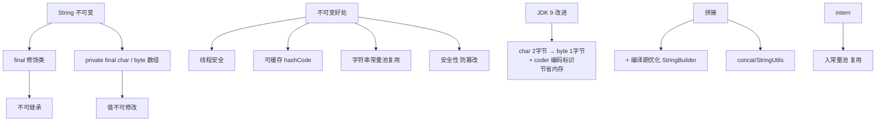

# String底层使用的什么类型是什么？

### String 底层实现与不可继承性

#### 1. String 类能被继承吗？
**不能**。String 类被 `final` 修饰符修饰，`final` 修饰的类被称为**最终类**，无法被继承。

#### 2. 为什么设计为 final？
1.  **安全性**：String 在 Java 中被广泛使用（如作为 HashMap 的 key、参数传递）。如果可被继承，子类可能会破坏其不可变性，导致严重的安全漏洞。
2.  **高效性**：不可变性保证了字符串常量池的实现，允许 JVM 优化（如共享字符串引用）。

#### 3. String 底层使用的什么类型？
*   **JDK 1.8 及之前**：底层使用 `char[]` 数组存储字符。
    ```java
    // JDK 8 源码片段
    private final char value[];
    ```
*   **JDK 9 及之后**：底层改为 `byte[]` 数组存储，并增加了一个 `coder` 字段标识编码。
    ```java
    // JDK 9+ 源码片段
    private final byte[] value;
    private final byte coder;
    ```
    **原因**：`char` 占用 2 字节，对于纯英文或数字等单字节字符来说浪费空间。改为 `byte[]` 并根据字符集选择压缩存储（Latin-1 占 1 字节，UTF-16 占 2 字节），大大降低了内存占用。

#### 4. 实战深化
*   **实战案例**：在 JVM 堆内存分析中，迁移到 JDK 9+ 后，大量包含 JSON 字符串或日志的缓存对象内存占用显著下降（约节省 30%-50%），因为大多数文本是 ASCII 字符。

| 版本 | 底层存储 | 空间占用 | 适用场景 |
| :--- | :--- | :--- | :--- |
| **JDK 8** | `char[]` | 固定 2 字节/字符 | 包含大量非拉丁字符（如中文）的场景差异不大 |
| **JDK 9+** | `byte[]` + `coder` | 1 字节/字符 | 纯英文、数字、JSON 数据，内存节省明显 |

*   **代码示例**：
    ```java
    // JDK 9+ 压缩特性演示
    String s1 = "test";       // 使用 Latin-1 编码，占用 4 字节
    String s2 = "测试";       // 使用 UTF-16 编码，占用 4 字节
    System.out.println(s1.getBytes().length); // 4
    System.out.println(s2.getBytes().length); // 取决于默认 charset，通常 utf-8 为 6
    ```

## 技术原理

**final 修饰不可继承**
`String` 类被 `final` 修饰，是最终类，无法被继承。这样设计有两点考量：一是安全性，String 作为 HashMap 的 key、方法参数、类加载器资源名等被广泛使用，若可被继承，子类可能重写方法破坏不可变性，导致安全漏洞（如权限校验被绕过）；二是高效性，不可变性使得 JVM 可以安全地实现字符串常量池、缓存 hashCode、在多线程间共享而无需同步。

**JDK8 底层是 char[]**
JDK 1.8 及之前，String 底层用 `private final char[] value` 存储，每个 char 占 2 个字节（UTF-16）。对于大量纯英文、数字、JSON 等拉丁字符场景，2 字节是浪费的——实际上 1 个字节就够。这种设计在内存敏感的应用（如缓存大量字符串）中开销明显。

**JDK9 底层改为 byte[]，节省内存**
JDK 9 引入 Compact Strings（JEP 254），底层改为 `private final byte[] value` 配合 `private final byte coder` 字段。`coder` 为 0 表示 Latin-1 编码（1 字节/字符），为 1 表示 UTF-16 编码（2 字节/字符）。String 构造时会自动检测内容，纯 Latin 字符走 1 字节压缩存储。实测在典型 Web 应用中，堆内字符串内存占用下降 30%~50%。

## 代码示例

```java
// JDK 8 源码片段
private final char value[];     // 固定 2 字节/字符

// JDK 9+ 源码片段
private final byte[] value;     // 根据 coder 决定 1 或 2 字节
private final byte coder;       // 0=Latin-1, 1=UTF-16
```

```java
// JDK 9+ 压缩特性验证
String s1 = "test";          // Latin-1，占 4 字节
String s2 = "测试";          // UTF-16，占 4 字节（2 字符 × 2）
// 内部通过反射观察 coder 字段
Field f = String.class.getDeclaredField("coder");
f.setAccessible(true);
System.out.println(f.getByte(s1)); // 0 (LATIN1)
System.out.println(f.getByte(s2)); // 1 (UTF16)
```

## 注意事项

- 核心结论：String 类被 final 修饰，故为最终类，无法被继承。
- JDK8 及之前：底层固定使用 char[] 数组，每个字符占 2 字节，存英文浪费。
- JDK9 及之后：底层改为 byte[] 数组，搭配 coder 标识动态选择压缩编码。
- 设计原因：大部分堆内字符串数据为纯拉丁字母，改 byte[] 节省近半内存。
- 第三方库若通过反射直接访问 String 内部 `value` 字段，在 JDK 9+ 会因类型变更（char[]→byte[]）而报错，需升级库版本。


## 核心架构图


## 记忆要点

- 核心结论：String类被final修饰，故为最终类，无法被继承。
- JDK8及之前：底层固定使用char[]数组，每个字符占2字节，存英文浪费。
- JDK9及之后：底层改为byte[]数组，搭配coder标识动态选择压缩编码。
- 设计原因：大部分堆内字符串数据为纯拉丁字母，改byte[]节省近半内存。

## 结构化回答

**30 秒电梯演讲：** final类，底层由char[]改为byte[]存储以节省内存。打个比方，像把双人间装修改成单人间和双人间的灵活组合，住宿效率更高。

**展开框架：**
1. **核心结论** — String类被final修饰，故为最终类，无法被继承。
2. **JDK8及之前** — 底层固定使用char[]数组，每个字符占2字节，存英文浪费。
3. **JDK9及之后** — 底层改为byte[]数组，搭配coder标识动态选择压缩编码。

**收尾：** 这三点都能配合实战聊。您想深入聊原理、对比还是避坑？

## 视频脚本

> 预计时长：3 分钟 | 由浅入深

| 时间 | 画面/字幕 | 口播台词 | 讲解要点 |
|------|----------|----------|----------|
| 0:00 | 标题卡：String底层使用的什么类型是什么 | "String底层使用的什么类型是什么？一句话——像把双人间装修改成单人间和双人间的灵活组合，住宿效率更高。" | 开场钩子 |
| 0:45 | 概念动画/示意图 | "final类，底层由char[]改为byte[]存储以节省内存——像把双人间装修改成单人间和双人间的灵活组合，住宿效率更高" | 核心定义 |
| 1:30 | 核心结论示意 | "String类被final修饰，故为最终类，无法被继承。" | 要点1 |
| 2:15 | JDK8及之前示意 | "底层固定使用char[]数组，每个字符占2字节，存英文浪费。" | 要点2 |
| 3:00 | 总结卡 | "记住这几条，面试不慌。下期讲进阶追问。" | 收尾 |
