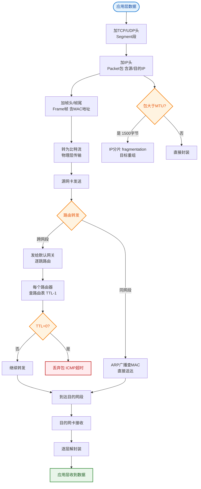

# TCP/IP原理是什么？

### TCP/IP 协议族原理

TCP/IP 并非单指 TCP 和 IP 两个协议，而是指整个**互联网协议族**（Internet Protocol Suite）。它通常采用四层分层模型（也有教科书分为五层），从下到上依次为：

#### 1. 网络接口层
*   **对应 OSI**：物理层 + 数据链路层。
*   **功能**：负责监视数据在主机和网络之间的交换。实际上，TCP/IP 标准并未对这一层做严格规定，兼容各种物理网络（如以太网、Wi-Fi、光纤）。
*   **协议**：ARP (地址解析协议), RARP。

#### 2. 网络层
*   **对应 OSI**：网络层。
*   **功能**：
    *   **逻辑寻址**：为主机分配 IP 地址。
    *   **路由选择**：决定数据包如何在复杂的网络中传输到达目的地（选路）。
    *   **分组转发**：将数据包封装成 IP 数据报进行传输。
*   **核心协议**：**IP** (互联网协议), ICMP (控制报文，如 Ping), IGMP, BGP。

#### 3. 传输层
*   **对应 OSI**：传输层。
*   **功能**：为两台主机上的应用程序提供**端到端**的数据通信服务。
*   **核心协议**：
    *   **TCP (传输控制协议)**：面向连接、可靠、基于字节流。提供顺序控制、错误检测、流量控制、拥塞控制。
    *   **UDP (用户数据报协议)**：无连接、不可靠、基于数据报。速度快，但不保证送达，用于视频直播、DNS 查询等对实时性要求高的场景。

#### 4. 应用层
*   **对应 OSI**：会话层 + 表示层 + 应用层。
*   **功能**：直接为用户的应用程序提供服务，定义应用程序间交换的数据格式。
*   **常见协议**：
    *   **HTTP/HTTPS** (网页浏览)
    *   **FTP** (文件传输)
    *   **SMTP/POP3/IMAP** (电子邮件)
    *   **DNS** (域名解析)
    *   **SSH** (远程登录)

```text
┌───────────────────────────────────────┐
│         应用层 (HTTP, FTP, DNS)       │
├───────────────────────────────────────┤
│     传输层 (TCP, UDP) ──── Port       │
├───────────────────────────────────────┤
│   网络层 (IP, ICMP, ARP) ──── IP      │
├───────────────────────────────────────┤
│ 网络接口层 (Ethernet, Wi-Fi) ── MAC  │
└───────────────────────────────────────┘
          ↓ 封装流程 ↓
Application Data (用户数据)
      ↓
TCP Header + Data (TCP 段)
      ↓
IP Header + TCP Segment (IP 数据报)
      ↓
Ethernet Header + IP Packet + FCS (以太网帧)
```

#### ## 常见考点
1. **TCP 三次握手/四次挥手的状态变化**：SYN_SENT, SYN_RCVD, ESTABLISHED, FIN_WAIT_1, TIME_WAIT 等。
2. **ARP 协议的作用**：将 IP 地址解析为 MAC 地址（属于网络接口层，但常与网络层一起考）。
3. **Ping 原理**：使用 ICMP 协议发送回显请求和回显应答。

#### 4. 实战深化
*   **实战案例**：排查服务器无法连通问题时，发现网络层 `ping` 通但应用层 `telnet` 端口不通，这通常是因为防火墙拦截了特定端口或应用进程挂掉；反之，如果 `ping` 不通，则优先排查物理线路或路由配置。

*   **代码示例 (Socket 模拟分层发包)**：
    ```java
    // Java 中 Socket 数据发送体现了分层封装
    Socket socket = new Socket("192.168.1.1", 8080);
    OutputStream os = socket.getOutputStream();
    // 应用层：写入业务数据
    os.write("Hello".getBytes()); 
    // 传输层 + 网络层：OS 自动封装 TCP 头和 IP 头发送
    ```


## 核心流程图


## 记忆要点

- 模型结构：自下而上四层依次为网络接口、网络、传输、应用层。
- 核心对比：传输层TCP面向连接且可靠，UDP无连接但快，负责端到端通信。
- 网络层核心：提供IP逻辑寻址与路由选择，对应OSI网络层。
- 实战排查：ping通属于网络层正常，telnet端口不通排查应用层或防火墙。

## 结构化回答

**30 秒电梯演讲：** 互联网通信的四层协议栈模型，负责数据封装与传输。打个比方，像寄快递：打包（应用层）、分拣（传输层）、运输（网络层）、装卸（接口层）。

**展开框架：**
1. **模型结构** — 自下而上四层依次为网络接口、网络、传输、应用层。
2. **核心对比** — 传输层TCP面向连接且可靠，UDP无连接但快，负责端到端通信。
3. **网络层核心** — 提供IP逻辑寻址与路由选择，对应OSI网络层。

**收尾：** 我在项目里踩过坑——代码示例 (Socket 模拟分层发包)：。您想深入聊哪一段：原理、避坑还是对比选型？

## 视频脚本

> 预计时长：3 分钟 | 由浅入深

| 时间 | 画面/字幕 | 口播台词 | 讲解要点 |
|------|----------|----------|----------|
| 0:00 | 标题卡：TCP/IP原理是什么 | "TCP/IP原理是什么？一句话——像寄快递：打包（应用层）、分拣（传输层）、运输（网络层）、装卸（接口层）。" | 开场钩子 |
| 0:45 | 概念动画/示意图 | "互联网通信的四层协议栈模型，负责数据封装与传输——像寄快递：打包（应用层）、分拣（传输层）、运输（网络层）、装卸（接口层）" | 核心定义 |
| 1:30 | 模型结构示意 | "自下而上四层依次为网络接口、网络、传输、应用层。" | 要点1 |
| 2:15 | 核心对比示意 | "传输层TCP面向连接且可靠，UDP无连接但快，负责端到端通信。" | 要点2 |
| 3:00 | 总结卡 | "记住这几条，面试不慌。下期讲进阶追问。" | 收尾 |
