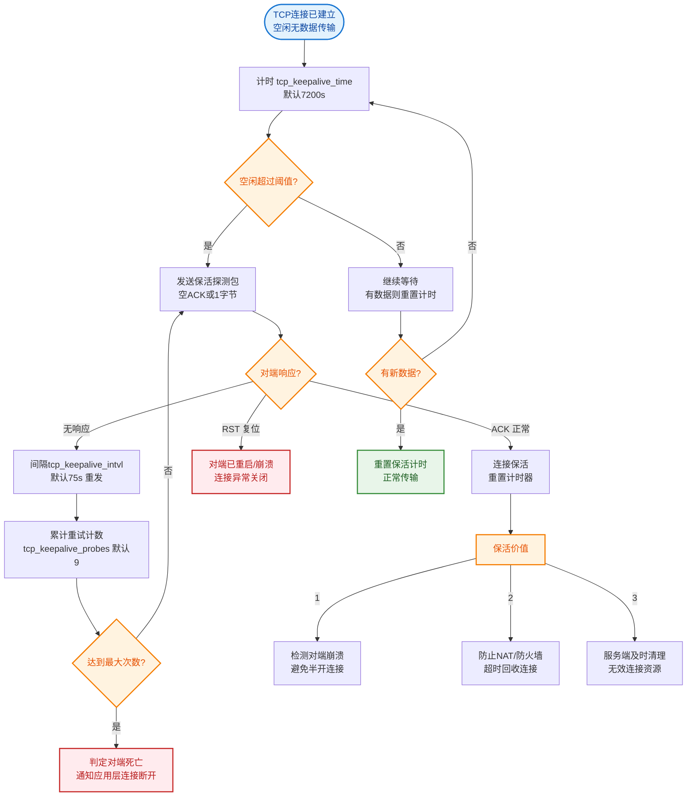
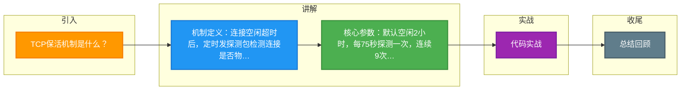

# TCP保活机制是什么？

### TCP保活机制

TCP保活（Keepalive）机制用于检测连接的有效性。在一个定义的时间段内TCP连接无任何活动时，会启动TCP保活机制，每隔一定时间间隔发送一个探测报文，等待响应。

#### 1. 保活机制原理
```text
客户端                      服务端
  │                          │
  │  ─────────(正常数据)─────>│
  │  <────────(ACK)──────────│
  │                          │
  │  (空闲超过 keepalive_time)│
  │                          │
  │  ────(Keepalive Probe)───>│ (ACK, Seq = x-1)
  │  <────────(ACK)──────────│ (确认连接存活)
  │                          │
  ... (若无响应则重试 probes 次) ...
  │                          │
  │  ────(Keepalive Probe)───>│ (无响应)
  │  (超时)                   │
  │  ──(RST)────────────────>│ (复位连接)
```

#### 2. SYN攻击与防御

1.  **原理**：攻击者伪造不同IP地址的SYN报文请求连接，服务端收到连接请求后分配资源，回复ACK+SYN包，但是由于IP地址是伪造的，无法收到回应，久而久之造成服务端半连接队列被占满，无法正常工作。

2.  **避免方式**：
   *   **修改半连接队列大小**：使服务端能够容纳更多半连接。`net.core.somaxconn` 调大。此外还可以修改服务端超时重传次数，使服务端尽早丢弃无用连接（`net.ipv4.tcp_synack_retries`）。
   *   **开启 SYN Cookies**：当半连接队列满时，启动 syn cookie。后续连接不进入半连接队列，而是根据特定信息（源/目的IP、端口、时间戳等）计算一个 cookie 值作为 ISN（初始序列号）发送给客户端。如果服务端收到客户端确认报文（ACK），会验证 ACK 包中携带的确认号是否包含正确的 cookie，如果合法，直接分配资源并加入到 Accept 队列（全连接队列）。

#### ## 常见考点
1. **TCP Keepalive 参数细节**：默认空闲时间（通常 2 小时）、探测间隔（75秒）、探测次数（9 次）。
2. **TCP Keepalive 的局限性**：它只能检测连接是否“物理”连通，无法检测应用层是否僵死（例如应用死锁但 TCP 栈仍响应），因此通常应用层会实现更短的心跳机制。
3. **半连接队列 vs 全连接队列**：SYN 队列存放收到 SYN 但未完成三次握手的请求；Accept 队列存放已完成三次握手等待应用层 `accept()` 的连接。

#### 4. 实战深化
*   **实战案例**：在高并发短连接服务（如 Nginx）中，如果全连接队列 溢出，操作系统会丢弃 ACK 包，导致客户端收到 `Connection reset by peer` 或直接超时。通过监控 `netstat -s | grep "listen queue"` 发现 `overflow` 数值增加，此时需调大 `somaxconn` 和 `backlog` 参数。

*   **对比表格**：

| 队列类型 | 存放内容 | 溢出后果 | 调优参数 (Linux) |
| :--- | :--- | :--- | :--- |
| **半连接队列 (SYN Queue)** | 收到 SYN 包的连接 | 丢弃 SYN，客户端重试 | `net.ipv4.tcp_max_syn_backlog`, `tcp_syncookies` |
| **全连接队列 (Accept Queue)** | 完成 3 次握手的连接 | 丢弃 ACK，服务器不回 RST | `net.core.somaxconn`, 应用层 `listen backlog` |

*   **代码示例 (防止 FIN_WAIT2 状态僵死)**：
    ```java
    // 设置 SO_LINGER 优雅关闭，避免大量 TIME_WAIT 或 FIN_WAIT2 僵死
    Socket socket = ...;
    socket.setSoLinger(true, 0); // 强制关闭，发送 RST 而非 FIN (慎用，可能丢失数据)
    // 或者开启 TCP Keepalive
    socket.setKeepAlive(true);
    ```


## 核心流程图


## 记忆要点

- 机制定义：连接空闲超时后，定时发探测包检测连接是否物理存活。
- 核心参数：默认空闲2小时，每75秒探测一次，连续9次无响应则判死。
- 局限性：TCP探针能查主机断网，但无法测应用死锁，故需应用层心跳。
- SYN攻击防御：调大半连接队列，核心是开启SYN Cookies避免分配资源。

## 结构化回答

**30 秒电梯演讲：** 定时发送探测包确认对端存活，防止死连接占用资源。打个比方，打电话时没声音了，每隔一会儿问一句“喂，在吗？”，没人挂就挂断。

**展开框架：**
1. **机制定义** — 连接空闲超时后，定时发探测包检测连接是否物理存活。
2. **核心参数** — 默认空闲2小时，每75秒探测一次，连续9次无响应则判死。
3. **局限性** — TCP探针能查主机断网，但无法测应用死锁，故需应用层心跳。

**收尾：** 这三点都能配合实战聊。您想深入聊原理、对比还是避坑？

## 视频脚本

> 预计时长：3 分钟 | 由浅入深

| 时间 | 画面/字幕 | 口播台词 | 讲解要点 |
|------|----------|----------|----------|
| 0:00 | 标题卡：TCP保活机制是什么 | "TCP保活机制是什么？一句话——打电话时没声音了，每隔一会儿问一句“喂，在吗？”，没人挂就挂断。" | 开场钩子 |
| 0:45 | 概念动画/示意图 | "定时发送探测包确认对端存活，防止死连接占用资源——打电话时没声音了，每隔一会儿问一句“喂，在吗？”，没人挂就挂断" | 核心定义 |
| 1:30 | 机制定义示意 | "连接空闲超时后，定时发探测包检测连接是否物理存活。" | 要点1 |
| 2:15 | 核心参数示意 | "默认空闲2小时，每75秒探测一次，连续9次无响应则判死。" | 要点2 |
| 3:00 | 总结卡 | "记住这几条，面试不慌。下期讲进阶追问。" | 收尾 |

### 视频流程图



