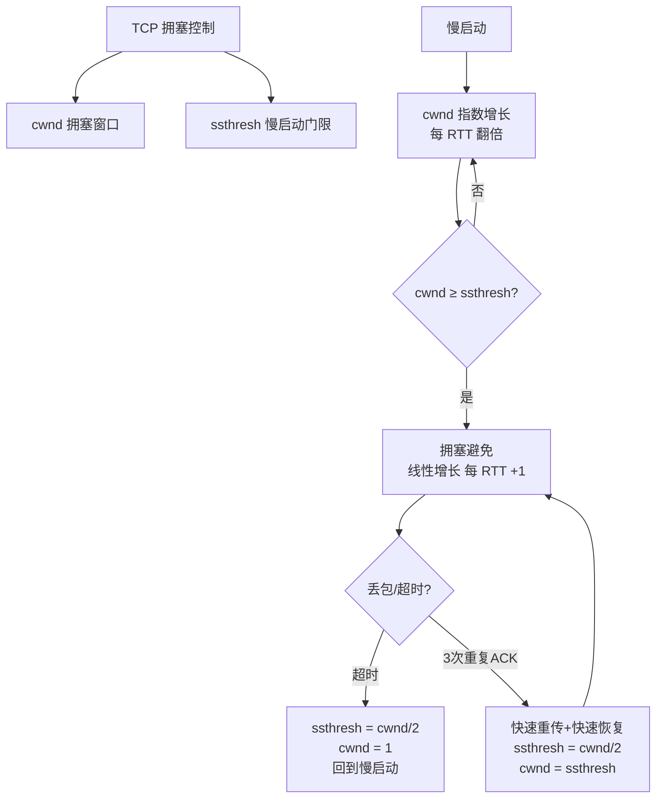

# TCP的拥塞控制机制是什么？

### TCP的拥塞控制机制

拥塞控制的目的是避免“发送方”的数据填满整个网络。拥塞控制通过拥塞窗口cwnd来防止过多的数据注入网络，使得网络中的路由器或者链路过载。发送窗口的值是 `swnd = min(cwnd, rwnd)`。

只要发送方没有在规定时间内接收到 ACK 应答报文（超时重传），就会认为网络出现了拥塞。

拥塞控制的常见算法包含四个部分：

#### 1. 慢启动
TCP在连接建立完成后，使用慢启动算法一点一点地提高发送数据包的数量。
* **规则**：每当收到一个 ACK，拥塞窗口 cwnd 的大小就会加 1。发包的个数呈指数性增长。
* **ssthresh（慢启动阈值）**：
  * 当 `cwnd < ssthresh` 时，使用慢启动算法。
  * 当 `cwnd >= ssthresh` 时，就会使用拥塞避免算法。

#### 2. 拥塞避免
进入拥塞避免算法后，规则变为：每当收到一个 ACK 时，cwnd 增加 `1/cwnd`。这使得窗口大小变为线性增长。

#### 3. 拥塞发生
当网络出现拥塞导致丢包时，根据重传机制不同，处理方式也不同：
* **超时重传**：认为拥塞严重。
  * `ssthresh` 设为 `cwnd / 2`。
  * `cwnd` 重置为 1。
  * 重新开始慢启动。
* **快速重传**：认为拥塞不严重（只丢了一部分）。
  * `cwnd = cwnd / 2`（设置为原来的一半）。
  * `ssthresh = cwnd`。
  * 进入快速恢复算法。

#### 4. 快速恢复
认为还能收到 3 个重复 ACK 说明网络不那么糟糕。
* `cwnd = ssthresh + 3`。
* 重传丢失的数据包。
* 如果再收到重复的 ACK，`cwnd` 增加 1。
* 如果收到新数据的 ACK，把 `cwnd` 设置为 `ssthresh` 的值，进入拥塞避免状态。

#### 5. 实战案例与代码
**实战案例**：在跨地域的云服务器之间传输大文件（如从北京同步到弗吉尼亚）时，默认的 TCP 拥塞窗口往往无法填满高带宽高延迟（BDP）的长肥管道，导致传输速度跑不满带宽。此时需要调整内核参数 `net.ipv4.tcp_window_scaling` 并启用 `BBR` 拥塞控制算法来替代传统的 CUBD 算法，以提升吞吐量。

**代码示例 (Linux内核参数调整)**：
```bash
# 开启 TCP 窗口缩放，支持大于 64KB 的窗口
sysctl -w net.ipv4.tcp_window_scaling=1
# 启用 BBR 拥塞控制算法 (需内核 4.9+)
sysctl -w net.core.default_qdisc=fq
sysctl -w net.ipv4.tcp_congestion_control=bbr
```

#### 6. 拥塞算法选型对比
| 特性 | Reno/CUBIC (传统) | BBR (Google) | PCC (Vivace) |
| :--- | :--- | :--- | :--- |
| **核心依据** | 基于丢包 (Loss-based) | 基于带宽和延迟 (Model-based) | 基于延迟变化 (Latency-based) |
| **丢包表现** | 丢包即认为拥塞，急剧降速 | 尽量不占满缓冲区，减少丢包 | 激进探测，延迟低时加速 |
| **适用场景** | 传统网络，通用性强 | 高延迟、高丢包率网络 (如跨洋、移动网) | 实验性，低延迟需求场景 |
| **bufferbloat** | 容易造成缓冲区膨胀 | 有效缓解缓冲区膨胀 | 较好缓解 |
| **公平性** | 公平性较好 | 在某些场景下可能挤占传统算法流量 | 可能导致不公平 |


## 核心架构图


## 记忆要点

- 核心目的：控制发送方数据注入速率，防止过多数据填满网络导致过载。
- 发送窗口限制：实际发送窗口由接收方rwnd与网络拥塞cwnd的最小值决定。
- 四大核心算法：慢启动指数增长、避免线性增长、遇3ACK快重传与快恢复。
- 超时惩罚重：超时认定严重拥塞，cwnd直接降为1；现代网络常换BBR算法提效。

## 结构化回答

**30 秒电梯演讲：** 基于网络反馈（丢包/ACK）动态调整发送速率的闭环控制。打个比方，倒水进瓶子，开始慢倒（慢启动），快满时匀速（拥塞避免），溢出了就减少水流（快速恢复）。

**展开框架：**
1. **核心目的** — 控制发送方数据注入速率，防止过多数据填满网络导致过载。
2. **发送窗口限制** — 实际发送窗口由接收方rwnd与网络拥塞cwnd的最小值决定。
3. **四大核心算法** — 慢启动指数增长、避免线性增长、遇3ACK快重传与快恢复。

**收尾：** 这三点都能配合实战聊。您想深入聊原理、对比还是避坑？

## 视频脚本

> 预计时长：3 分钟 | 由浅入深

| 时间 | 画面/字幕 | 口播台词 | 讲解要点 |
|------|----------|----------|----------|
| 0:00 | 标题卡：TCP的拥塞控制机制是什么 | "TCP的拥塞控制机制是什么？一句话——倒水进瓶子，开始慢倒（慢启动），快满时匀速（拥塞避免），溢出了就减少水流（快速恢复）。" | 开场钩子 |
| 0:45 | 概念动画/示意图 | "基于网络反馈（丢包/ACK）动态调整发送速率的闭环控制——倒水进瓶子，开始慢倒（慢启动），快满时匀速（拥塞避免），溢出了就减少水流（快速恢复）" | 核心定义 |
| 1:30 | 核心目的示意 | "控制发送方数据注入速率，防止过多数据填满网络导致过载。" | 要点1 |
| 2:15 | 发送窗口限制示意 | "实际发送窗口由接收方rwnd与网络拥塞cwnd的最小值决定。" | 要点2 |
| 3:00 | 总结卡 | "记住这几条，面试不慌。下期讲进阶追问。" | 收尾 |
