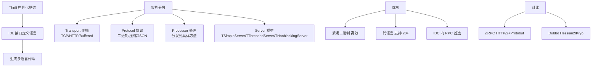

# Thrift序列化框架的原理和特点是什么？

### Thrift 序列化框架

Apache Thrift 是一种高效的、支持多种编程语言的远程服务调用框架。

#### 特点与原理
Thrift 采用接口描述语言（IDL）定义并创建服务，支持可扩展的跨语言服务开发。它可以将数据序列化为二进制格式进行传输。

**Thrift 序列化效率高、体积小的原因：**
1.  **二进制编码**：相对于文本格式（如 XML、JSON），二进制格式更紧凑，解析速度更快，无需进行文本解析。
2.  **TLV 结构**：采用 Tag-Length-Value（类型-长度-值）的数据存储方式。
    *   **Tag**: 包含 Field ID 和数据类型信息（Compact 协议中采用 ZigZag 编码和 VarInt 编码进一步压缩）。
    *   **Length**: 数据长度（变长类型才有）。
    *   **Value**: 实际数据值。
    这种方式减少了分隔符的使用，数据存储紧凑，且支持字段的增加而不破坏向后兼容性。
3.  **跨语言支持**：通过代码生成引擎，可以在多种语言（C++, Java, Python, PHP 等）中自动生成高效的服务端和客户端代码。

**数据格式示意图（TLV）：**

```
+----------------+------------------+----------------------+
|  Field ID &    |  Length (Optional)|       Value          |
|  Type (Tag)    |  (e.g. string)   |  (Raw Bytes)         |
+----------------+------------------+----------------------+
<-- 2 bytes (Binary Protocol) -->
```

#### 为什么使用 Thrift
1.  **多语言开发的需要**：不同语言编写的系统之间需要进行高效通信。
2.  **性能问题**：相比于 XML 和 JSON，Thrift 在传输效率和解析速度上有显著优势，适用于高并发、大数据量的场景。
3.  **版本兼容性**：Thrift IDL 支持字段标识符，新增字段不影响旧版客户端/服务端解析（只要不修改 Field ID），非常适合服务的平滑升级。

#### 4. 实战案例与 IDL 示例
**实战案例**：在日志采集服务中，从最初使用 JSON 改为 Thrift Compact 协议后，单节点吞吐量从 5MB/s 提升至 20MB/s，且 CPU 占用率下降 40%。但需要注意，若 IDL 字段发生不兼容变更（如修改了已有字段的 type），会导致老版本客户端反序列化崩溃，发布时需严格遵循“加字段不改字段”的原则。

**代码示例**：
```thrift
// user.thrift
namespace java com.example.demo

struct User {
    1: required i64 id,           // 必须字段，tag=1
    2: optional string name,      // 可选字段，tag=2
    3: map<string, string> props  // 复杂类型
}

service UserService {
    User getUser(1: i64 userId)
}
```

#### 5. Thrift 协议选型对比
| 协议类型 | 特点 | 体积 | 解析速度 | 适用场景 |
| :--- | :--- | :--- | :--- | :--- |
| **Binary** | 固定长度 Tag，不压缩 | 较大 | 快 | 通用场景，调试较难 |
| **Compact** | VarInt + ZigZag 编码 | **最小** | 较快 | 对带宽敏感，生产环境推荐 |
| **JSON** | 文本格式，可读性强 | 最大 | 慢 | 跨语言调试，对性能要求不高 |
| **Multiplexed** | 支持单端口多服务 | 中 | 快 | 一个 Server 暴露多个 Service 接口 |


## 核心架构图


## 核心知识点图


## 记忆要点

- 核心作用：IDL定义+生成跨语言代码，解决异构系统高效RPC通信。
- 高效原因：二进制格式+TLV结构，摒弃冗余文本分隔符，体积小解析快。
- Compact协议：结合VarInt+ZigZag变长编码，压缩率极高，生产环境首选。
- 兼容性原则：支持新增字段，严禁修改已有Field ID或类型，保证服务平滑升级。

## 结构化回答

**30 秒电梯演讲：** 跨语言的高性能二进制RPC框架，通过IDL定义接口。打个比方，像翻译官+快递员，把你的东西打包成只有系统懂的小包裹（二进制），发给不同语种的人。

**展开框架：**
1. **核心作用** — IDL定义+生成跨语言代码，解决异构系统高效RPC通信。
2. **高效原因** — 二进制格式+TLV结构，摒弃冗余文本分隔符，体积小解析快。
3. **Compact协议** — 结合VarInt+ZigZag变长编码，压缩率极高，生产环境首选。

**收尾：** 这三点都能配合实战聊。您想深入聊原理、对比还是避坑？

## 视频脚本

> 预计时长：3 分钟 | 由浅入深

| 时间 | 画面/字幕 | 口播台词 | 讲解要点 |
|------|----------|----------|----------|
| 0:00 | 标题卡：Thrift序列化框架的原理和特点是… | "Thrift序列化框架的原理和特点是什么？一句话——像翻译官+快递员，把你的东西打包成只有系统懂的小包裹（二进制），发给不同语种的人。" | 开场钩子 |
| 0:45 | 概念动画/示意图 | "跨语言的高性能二进制RPC框架，通过IDL定义接口——像翻译官+快递员，把你的东西打包成只有系统懂的小包裹（二进制），发给不同语种的人" | 核心定义 |
| 1:30 | 核心作用示意 | "IDL定义+生成跨语言代码，解决异构系统高效RPC通信。" | 要点1 |
| 2:15 | 高效原因示意 | "二进制格式+TLV结构，摒弃冗余文本分隔符，体积小解析快。" | 要点2 |
| 3:00 | 总结卡 | "记住这几条，面试不慌。下期讲进阶追问。" | 收尾 |
