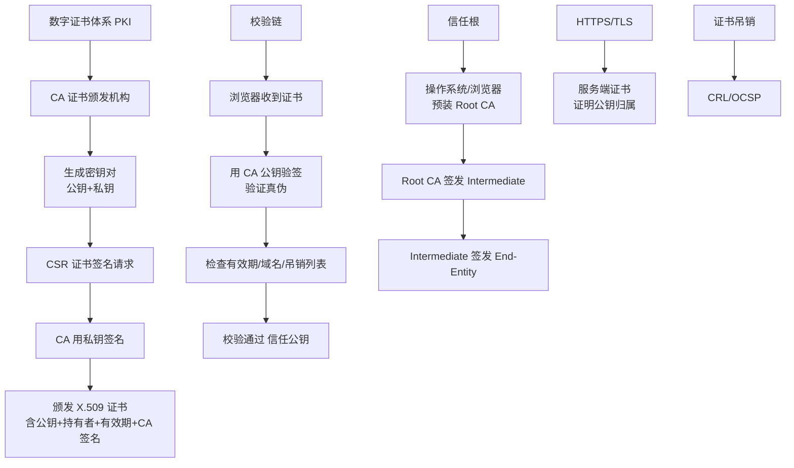

# proxy_pass请求转发是什么？

### proxy_pass 请求转发

`proxy_pass` 指令属于 `ngx_http_proxy_module` 模块，此模块可以将请求转发到另一台服务器。在实际的反向代理工作中，会通过 `location` 功能匹配指定的 URI，然后把接收到服务匹配 URI 的请求通过 `proxy_pass` 抛给定义好的 upstream 节点池。

### upstream_module 和健康检测

`ngx_http_upstream_module` 是负载均衡模块，可以实现网站的负载均衡功能。它允许 Nginx 定义一组或多组节点服务器组，使用时可通过 `proxy_pass` 代理方式把网站的请求发送给事先定义好的 upstream 组。

**常用参数说明：**
*   **weight**：服务器权重，默认为1，权重越高被分配到的概率越大。
*   **max_fails**：允许请求失败的次数。在 `fail_timeout` 时间内失败次数达到该值，则认为服务器挂掉。
*   **fail_timeout**：认为服务器挂起的暂停时间，默认10秒。`max_fails` 和 `fail_timeout` 一般关联使用。
*   **backup**：标记为备用服务器。只有其他非 backup 服务器都挂掉或很忙时才会分配请求给它。
*   **down**：标志服务器永久不可用。
*   **keepalive**：限制每个 worker 进程与 upstream 服务器的空闲 keepalive 连接数，提高性能。

**配置示例：**
```nginx
upstream lvsServer {
    server 191.168.1.11 weight=5;
    server 191.168.1.22:82;
    server example.com:8080 max_fails=2 fail_timeout=10s backup;
}

location /download/ {
    proxy_pass http://lvsServer/vedio/;
}
```

**请求转发流程示意图：**

```
Client Request
    |
    v
[ Nginx Server ]
    |
    +---> [ Location Match: /download/ ]
              |
              v
         [ proxy_pass ]
              |
              v
     [ Upstream Pool (lvsServer) ]
              |
      +-------+-------+-------+
      |       |       |       |
   [Svr 1] [Svr 2] [Svr 3] [Backup]
      |       |       |       |
      +-------+-------+-------+
              |
              v
       Backend Response
```

#### 4. 实战案例与 URL 拼接陷阱
**实战案例**：在做网关迁移时，发现后端收到的请求路径多了一层前缀。原因是 `location /api/` 配置了 `proxy_pass http://backend/;`。Nginx 将 `/api/` 替换为 `/`，导致路径改变。改为 `proxy_pass http://backend;`（无斜杠）后，原始 URI `/api/v1/user` 被完整透传。此外，若后端返回 302 跳转，务必配置 `proxy_redirect` 来修正 `Location` 头中的域名，否则客户端会直接跳转到后端内网地址。

**代码示例 (含 header 修改与重定向修正)**：
```nginx
location /api/ {
    # 不带斜杠，透传原始 URI /api/xxx -> backend /api/xxx
    proxy_pass http://backend_service; 
    
    # 修改 Host，保持后端路由一致性
    proxy_set_header Host $host;
    
    # 修正后端 302 跳转的域名，防止暴露内网 IP
    proxy_redirect http://backend_service/ http://$host/;
}
```

#### 5. 负载均衡策略对比
| 策略 | 配置指令 | 原理 | 适用场景 |
| :--- | :--- | :--- | :--- |
| **轮询 (RR)** | (默认) | 按时间顺序逐一分配 | 服务器性能相近 |
| **加权轮询** | `weight` | 按权重比例分配 | 服务器性能不均 |
| **IP Hash** | `ip_hash` | 根据客户端 IP 哈希分配 | 需要会话保持，不支持备份服务器 |
| **Least Conn** | `least_conn` | 优先分配给连接数最少的服务器 | 长连接，请求处理时长差异大 |
| **Hash** | `hash $key` | 对指定 key (如 uri) 哈希 | 缓存命中率要求高，动静分离 |


## 核心架构图



## 记忆要点

- 核心定义：Nginx的ngx_http_proxy_module指令，用于反向代理与请求转发。
- 核心关联：配合upstream模块，将匹配的URI请求抛给后端节点池实现负载均衡。
- 致命易错点：带不带尾斜杠决定路径！带斜杠替换location，无斜杠透传完整URI。
- 常用参数：max_fails与fail_timeout联动做健康检测，backup标记备用节点。

## 结构化回答

**30 秒电梯演讲：** Nginx接收请求并转发给后端服务器集群的指令。打个比方，像餐厅前台，接过顾客菜单（请求），转交给后厨（upstream服务器）去做菜。

**展开框架：**
1. **核心定义** — Nginx的ngx_http_proxy_module指令，用于反向代理与请求转发。
2. **核心关联** — 配合upstream模块，将匹配的URI请求抛给后端节点池实现负载均衡。
3. **致命易错点** — 带不带尾斜杠决定路径！带斜杠替换location，无斜杠透传完整URI。

**收尾：** 这三点都能配合实战聊。您想深入聊原理、对比还是避坑？

## 视频脚本

> 预计时长：3 分钟 | 由浅入深

| 时间 | 画面/字幕 | 口播台词 | 讲解要点 |
|------|----------|----------|----------|
| 0:00 | 标题卡：proxy_pass请求转发是什么 | "proxy_pass请求转发是什么？一句话——像餐厅前台，接过顾客菜单（请求），转交给后厨（upstream服务器）去做菜。" | 开场钩子 |
| 0:45 | 概念动画/示意图 | "Nginx接收请求并转发给后端服务器集群的指令——像餐厅前台，接过顾客菜单（请求），转交给后厨（upstream服务器）去做菜" | 核心定义 |
| 1:30 | 核心定义示意 | "Nginx的ngx_http_proxy_module指令，用于反向代理与请求转发。" | 要点1 |
| 2:15 | 核心关联示意 | "配合upstream模块，将匹配的URI请求抛给后端节点池实现负载均衡。" | 要点2 |
| 3:00 | 总结卡 | "记住这几条，面试不慌。下期讲进阶追问。" | 收尾 |
