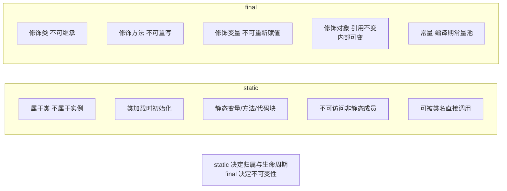
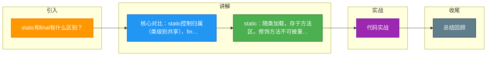

# static和final有什么区别？

### static 和 final 的区别

#### static 关键字
`static` 用于修饰成员（变量、方法、代码块、内部类），表示它们属于类级别，而不是实例级别。

1.  **静态变量（类变量）**：所有实例共享同一个变量。存储在**方法区**的静态域中，随着类的加载而初始化。
2.  **静态方法**：属于类，通过类名直接调用，不能访问非静态成员（因为非静态成员依赖于实例的创建）。静态方法不能被重写，但可以被隐藏。
3.  **静态代码块**：类加载时执行一次（准确来说是初始化阶段），常用于初始化静态资源。如果有多个静态代码块，按定义顺序执行。
4.  **静态内部类**：不依赖外部类实例，可直接实例化。它**不能**访问外部类的非静态成员（实例变量/方法）。

#### final 关键字
`final` 表示“最终的”，用于修饰类、方法、变量，表示不可改变。

1.  **修饰类**：类不能被继承（如 `String` 类）。类中的所有成员方法都隐式地指定为 final 方法。
2.  **修饰方法**：方法不能被子类重写。目的是锁定方法，防止子类修改其实现（私有方法隐式为 final）。
3.  **修饰变量**：
    *   **基本类型**：值一旦赋值就不能修改。
    *   **引用类型**：引用地址不能修改，但对象的内容可以修改（除非引用的对象本身也是不可变的）。
    *   **细节**：final 成员变量必须显式初始化（定义时、代码块中或构造器中）；final 局部变量可以只声明不赋值，但在使用前必须赋值（Blank Final）。

#### 4. 实战案例与内存分析
**实战案例**：在高并发场景下，为了避免 SimpleDateFormat 的线程安全问题，通常将其声明为 `static final`。但 `SimpleDateFormat` 本身是可变对象，虽然引用不可变，但内部 Calendar 字段仍可变。正确的做法是使用 `ThreadLocal` 包装或使用 Java 8 的不可变 `DateTimeFormatter`（它是 `final` 类且线程安全）。另一个常见错误是在 `static` 代码块中初始化资源（如数据库连接池），如果初始化失败抛出异常，会导致类加载失败，且该类在 JVM 生命周期内无法再次尝试加载。

**代码示例 (String 常量池与 final)**：
```java
public class FinalTest {
    // 变量 a 是编译期常量，编译时会被替换为具体值
    static final int a = 10;
    
    // 变量 b 不是编译期常量 (运行时才能确定)，不会发生宏替换
    static final int b = (int) (Math.random() * 10);
    
    public static void main(String[] args) {
        String c = "test" + a; // 等同于 "test10", 指向常量池
        String d = "test" + b; // 等同于 "test" + 变量, 堆中新建对象
        System.out.println(c == "test10"); // true
        System.out.println(d == "test5");   // false
    }
}
```

#### 5. static 与 final 对比
| 维度 | static | final |
| :--- | :--- | :--- |
| **核心作用** | 控制成员归属（类 vs 实例） | 控制内容变更（可变 vs 不可变） |
| **修饰对象** | 变量、方法、代码块、内部类 | 类、方法、变量、参数 |
| **内存分配** | 随类加载存储在方法区 | 基本类型在栈或常量池，引用类型在堆 |
| **执行时机** | 类加载时初始化（静态块） | 构造器结束前赋值（成员变量） |
| **访问方式** | 类名.成员 (推荐) | 对象.成员 或 类名.成员 (如果是 static) |
| **常见用途** | 工具类、全局配置、单例 | 常量定义、不可变类、防止继承/重写 |


## 核心架构图



## 记忆要点

- 核心对比：static控制归属（类级别共享），final控制变更（不可变/不可重写）。
- static：随类加载，存于方法区。修饰方法不可被重写，静态块仅执行一次。
- final：修饰类不可继承，修饰方法不可重写，修饰变量地址不可变（但对象内部可变）。
- 内存陷阱：static final基本类型若为编译期常量，会发生宏替换直接指向常量池。

## 结构化回答

**30 秒电梯演讲：** static控制归属（类），final控制变更（不可变）。打个比方，static是全班共用的黑板（共享），final是刻在石头上的字（改不了）。

**展开框架：**
1. **核心对比** — static控制归属（类级别共享），final控制变更（不可变/不可重写）。
2. **static** — 随类加载，存于方法区。修饰方法不可被重写，静态块仅执行一次。
3. **final** — 修饰类不可继承，修饰方法不可重写，修饰变量地址不可变（但对象内部可变）。

**收尾：** 这三点都能配合实战聊。您想深入聊原理、对比还是避坑？

## 视频脚本

> 预计时长：3 分钟 | 由浅入深

| 时间 | 画面/字幕 | 口播台词 | 讲解要点 |
|------|----------|----------|----------|
| 0:00 | 标题卡：static和final有什么区别 | "static和final有什么区别？一句话——static是全班共用的黑板（共享），final是刻在石头上的字（改不了）。" | 开场钩子 |
| 0:45 | 概念动画/示意图 | "static控制归属（类），final控制变更（不可变）——static是全班共用的黑板（共享），final是刻在石头上的字（改不了）" | 核心定义 |
| 1:30 | 核心对比示意 | "static控制归属（类级别共享），final控制变更（不可变/不可重写）。" | 要点1 |
| 2:15 | st示意 | "随类加载，存于方法区。修饰方法不可被重写，静态块仅执行一次。" | 要点2 |
| 3:00 | 总结卡 | "记住这几条，面试不慌。下期讲进阶追问。" | 收尾 |

### 视频流程图



