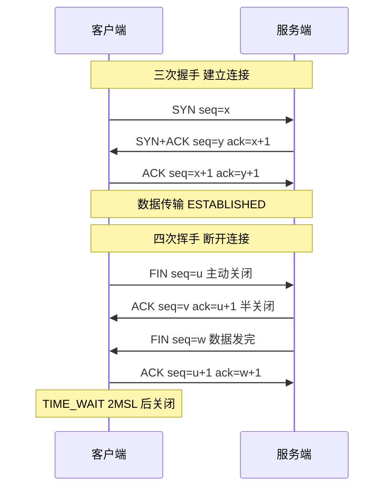

# 两种网络模型的对比？

### OSI 七层网络模型
OSI 模型从下到上分为七层：
1.  **物理层**：利用传输介质为数据链路层提供物理连接，实现比特流的透明传输。设备：网卡、中继器、集线器。
2.  **数据链路层**：建立和管理节点间的链路，通过 MAC 地址寻址，负责帧的传输和差错控制。设备：交换机、网桥。协议：PPP, HDLC。
3.  **网络层**：通过 IP 地址进行逻辑寻址，负责数据包的路由选择和转发（如 IP 协议）。设备：路由器、三层交换机。
4.  **传输层**：提供端到端的可靠或不可靠传输（如 TCP、UDP）。协议：TCP, UDP, SCTP。
5.  **会话层**：建立、管理和终止应用程序之间的会话。控制对话和设备同步。
6.  **表示层**：数据的格式化、加密/解密、压缩/解压，确保一个系统的应用层发送的数据能被另一个系统的应用层读取。
7.  **应用层**：为用户的应用程序（如 HTTP、FTP、SMTP、DNS）提供网络服务接口。

### TCP/IP 四层网络模型
TCP/IP 模型更为简洁，是互联网实际使用的标准：
1.  **网络接口层**（对应 OSI 的物理层和数据链路层）：处理物理硬件和数据帧。
2.  **网际层**（对应 OSI 的网络层）：负责 IP 协议，路由寻址，ICMP, ARP。
3.  **传输层**（对应 OSI 的传输层）：负责 TCP/UDP 协议，端到端传输。
4.  **应用层**（对应 OSI 的应用层、表示层、会话层）：直接为用户应用服务，包含 HTTP、FTP、DNS、SSH 等高层协议。

### 两种模型对比
*   **结构**：OSI 分 7 层，理论完整；TCP/IP 分 4 层，实用性强。
*   **对应关系**：TCP/IP 将 OSI 的上三层合并为应用层，下两层合并为网络接口层。
*   **协议支持**：OSI 模型产生于理论，协议支持较少；TCP/IP 模型包含了互联网通用的核心协议族。

#### 数据封装流程图
```text
+-------------+
|    数据     |  <-- 应用层 (HTTP Data)
+-------------+
|   TCP 头    |  <-- 传输层 (Segment)
+-------------+
|    IP 头    |  <-- 网络层 (Packet)
+-------------+
|   MAC 头    |  <-- 数据链路层 (Frame)
+-------------+
|  010101...  |  <-- 物理层
+-------------+
```

#### 常见考点
*   **ARP 协议**：属于哪一层？（工作在数据链路层和网络层之间，通常归为网络层）。
*   **Ping 命令**：使用的是什么协议？（ICMP，属于网络层）。
*   **三次握手/四次挥手**：发生在哪一层？（传输层，TCP 协议）。

---

### 深化内容

#### 实战案例
在云原生环境中排查微服务超时问题时，常需利用 OSI 模型分层定位。例如，服务 A 调用 B 偶发超时，**Ping**（网络层）通但 **应用层** HTTP 报错，这通常是中间层（如防火墙或 LB）丢包导致的 MTU（最大传输单元）问题，需检查数据链路层的分片设置。

#### 关键代码：TCP Keepalive 设置
在 Socket 编程中，为防止物理连接断开应用层不知晓（防火墙静默丢弃连接），常需调整传输层参数：
```java
// Java Socket 启用 Keepalive (应用层感知 TCP 死链)
Socket socket = new Socket();
socket.setKeepAlive(true);
// 另外在 Linux 内核参数中调整 net.ipv4.tcp_keepalive_time
```

#### 对比表格：OSI 与 TCP/IP 模型选型视角

| 维度 | OSI 七层模型 | TCP/IP 四层模型 |
| :--- | :--- | :--- |
| **设计初衷** | 理论参考标准，强调异构系统互联 | 实际工业标准，强调落地实现与兼容性 |
| **层间耦合** | 耦合度低，服务定义严格 | 耦合度高，某些层（如网络接口）界限模糊 |
| **排错指导** | **适合排查协议兼容性**（如加密、会话问题） | **适合排查网络连通性**（如路由、丢包） |
| **典型设备** | 七层负载均衡（应用层）、四层交换机（传输层） | 路由器（网际层）、普通交换机（接口层） |
| **实战意义** | 解释新技术原理（如 SSL/TLS 在表示层） | 解释互联网实际运行机制（如 IP 路由） |


## 核心架构图



## 记忆要点

- 层级对比：OSI分7层偏理论，TCP/IP分4层是工业实用标准。
- 上下合并：TCP/IP将OSI上三层合并为应用层，下两层合并为网络接口层。
- 考点背诵：网络层IP/ICMP，数据链路层MAC/ARP，传输层TCP/UDP，应用层HTTP。
- 实战选型：排查连通性丢包看TCP/IP，解释加密或代理机制找OSI对应层。

## 结构化回答

**30 秒电梯演讲：** OSI是理论标准七层，TCP/IP是事实标准四层。打个比方，寄信，OSI规定了从买信封（物理）到写话（应用）的7步，TCP/IP直接简化为投递、运输、处理。

**展开框架：**
1. **层级对比** — OSI分7层偏理论，TCP/IP分4层是工业实用标准。
2. **上下合并** — TCP/IP将OSI上三层合并为应用层，下两层合并为网络接口层。
3. **考点背诵** — 网络层IP/ICMP，数据链路层MAC/ARP，传输层TCP/UDP，应用层HTTP。

**收尾：** 我在项目里踩过坑——在云原生环境中排查微服务超时问题时，常需利用 OSI 模型分层定位。您想深入聊哪一段：原理、避坑还是对比选型？

## 视频脚本

> 预计时长：3 分钟 | 由浅入深

| 时间 | 画面/字幕 | 口播台词 | 讲解要点 |
|------|----------|----------|----------|
| 0:00 | 标题卡：两种网络模型的对比 | "两种网络模型的对比？一句话——寄信，OSI规定了从买信封（物理）到写话（应用）的7步，TCP/IP直接简化为投递、运输、处理。" | 开场钩子 |
| 0:45 | 概念动画/示意图 | "OSI是理论标准七层，TCP/IP是事实标准四层——寄信，OSI规定了从买信封（物理）到写话（应用）的7步，TCP/IP直接简化为投递、运输、处理" | 核心定义 |
| 1:30 | 层级对比示意 | "OSI分7层偏理论，TCP/IP分4层是工业实用标准。" | 要点1 |
| 2:15 | 上下合并示意 | "TCP/IP将OSI上三层合并为应用层，下两层合并为网络接口层。" | 要点2 |
| 3:00 | 总结卡 | "记住这几条，面试不慌。下期讲进阶追问。" | 收尾 |

---

## 延伸：OSI七层网络模型和TCP/IP四层模型的区别是什么？

> 合并自 `core-046`（相似度 80%）

OSI 七层模型是理论上的国际标准，而 TCP/IP 模型是事实上的工业标准（互联网协议簇）。两者在分层和功能上有所不同。

### 1. 对应关系
| OSI 七层模型 | 功能描述 | TCP/IP 四层模型 | 对应协议示例 |
| :--- | :--- | :--- | :--- |
| **应用层** (Application) | 为应用程序提供服务 | **应用层** (Application) | HTTP, FTP, DNS, SMTP |
| **表示层** (Presentation) | 数据格式化、加密、压缩 | (合并入应用层) | SSL/TLS, JPEG |
| **会话层** (Session) | 建立、管理和维护会话 | (合并入应用层) | RPC, NetBIOS |
| **传输层** (Transport) | 端到端的数据传输 | **传输层** (Transport) | TCP, UDP |
| **网络层** (Network) | 路由选择，逻辑寻址 (IP) | **网络层** (Internet) | IP, ICMP, ARP |
| **数据链路层** (Data Link) | MAC 寻址，帧传输 | **网络接口层** (Link) | Ethernet, Wi-Fi, MAC |
| **物理层** (Physical) | 比特流传输，电气特性 | (合并入网络接口层) | 光纤, 网线, Hub |

### 2. 主要区别
1. **层数不同**：OSI 是 7 层，TCP/IP 是 4 层（物理层和数据链路层合并为网络接口层，表示层和会话层合并入应用层）。
2. **性质不同**：
   - **OSI 模型**：是理论参考模型，标准化程度高，但由于结构复杂且协议实现困难，并未大规模商用。
   - **TCP/IP 模型**：是从实践中发展出来的协议簇，结构简洁，是互联网的实际基础。
3. **首部开销**：OSI 模型的各层首部开销较大，而 TCP/IP 设计得更为精简。

**实战案例**：在排查 HTTPS 连接建立慢的问题时，需要明确 OSI 表示层（SSL/TLS 握手）位于 TCP 传输层之上，利用 Wireshark 抓包分析时，需要先看到 TCP 三次握手完成，才会看到 TLS Application Data，这直接体现了分层模型在实际排错中的指导意义。

### 3. 数据封装流程图
```text
应用数据 (HTTP Data)
       |
   [OSI: 应用/表示/会话层]
   [TCP/IP: 应用层]
       | 加头部
       v
传输层段 (TCP Header + Data)
       |
   [OSI: 传输层]
   [TCP/IP: 传输层]
       | 加头部
       v
网络层包 (IP Header + TCP Header + Data)
       |
   [OSI: 网络层]
   [TCP/IP: 网络层]
       | 加帧头/帧尾
       v
数据链路层帧
       |
   [OSI: 数据链路层]
   [TCP/IP: 网络接口层]
       | 转为比特流
       v
物理层比特流
```

## 常见考点
1. **ARP 协议归属**：ARP 属于哪一层？（答案：OSI 中位于数据链路层和网络层之间；TCP/IP 中通常划归网络接口层，但它通过 IP 地址解析 MAC 地址）。
2. **ICMP 协议作用**：Ping 和 Traceroute 用的是什么协议？（答案：ICMP，属于网络层，用于传递差错报文和控制信息）。
3. **三次握手在哪一层**？（答案：传输层 TCP 协议负责连接建立与断开，属于传输层功能）。

## 记忆要点

- 层数差异：OSI是7层理论标准，而TCP/IP是4层工业标准
- 层次合并：TCP/IP将表示与会话层并入应用层，物理与链路层并入网络接口层
- 数据封装：数据发送时自上而下逐层添加首部，接收时自下而上逐层剥离
- 协议归属：HTTP属应用层，TCP/UDP属传输层，IP属网络层

## 结构化回答

**30 秒电梯演讲：** OSI理论七层，TCP/IP实践四层，前者是标准，后者是现实。打个比方，OSI是教科书流程（分太细），TCP/IP是实际干活流程（合并同类项）。

**展开框架：**
1. **层数差异** — OSI是7层理论标准，而TCP/IP是4层工业标准
2. **层次合并** — TCP/IP将表示与会话层并入应用层，物理与链路层并入网络接口层
3. **数据封装** — 数据发送时自上而下逐层添加首部，接收时自下而上逐层剥离

**收尾：** 我在项目里踩过坑——应用数据 (HTTP Data)。您想深入聊哪一段：原理、避坑还是对比选型？

## 视频脚本

> 预计时长：2 分钟 | 由浅入深

| 时间 | 画面/字幕 | 口播台词 | 讲解要点 |
|------|----------|----------|----------|
| 0:00 | 标题卡：OSI七层网络模型和TCP/IP四层… | "OSI七层网络模型和TCP/IP四层模型的区别是什么？一句话——OSI是教科书流程（分太细），TCP/IP是实际干活流程（合并同类项）。" | 开场钩子 |
| 0:40 | 概念动画/示意图 | "OSI理论七层，TCP/IP实践四层，前者是标准，后者是现实——OSI是教科书流程（分太细），TCP/IP是实际干活流程（合并同类项）" | 核心定义 |
| 1:20 | 层数差异示意 | "OSI是7层理论标准，而TCP/IP是4层工业标准" | 要点1 |
| 2:00 | 总结卡 | "记住这几条，面试不慌。下期讲进阶追问。" | 收尾 |
