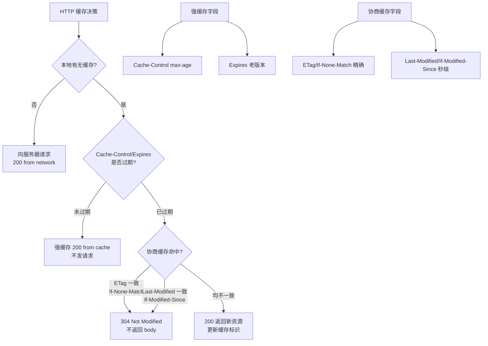

# 二级缓存原理（mapper基本）是什么？

### 二级缓存原理（Mapper 级别）

MyBatis 的二级缓存是 **Mapper 级别**的缓存，默认是不开启的。它的作用域是同一个 namespace（即同一个 Mapper 接口或映射文件）。

#### 基本原理
1.  **结构**：以 namespace 为单位创建缓存数据结构，通常是一个 Map 结构（其核心实现类为 `PerpetualCache`）。Key 通常是 CacheKey（由 MapperID、SQL、Offset、Limit、Params 等组成），Value 是查询结果对象。
2.  **实现方式**：MyBatis 的二级缓存是通过 **CachingExecutor** 装饰器实现的。它包裹在基础 Executor（如 SimpleExecutor）之外，在查询时先检查缓存，未命中再调用被包裹的 Executor 查询数据库。
3.  **工作流程**：
    *   一个会话（SqlSession）执行查询，数据会存入该 SqlSession 的一级缓存（本地）。
    *   当会话关闭（commit 或 close）时，一级缓存的数据会被刷新到二级缓存中（如果不希望刷新，需配置 `localCacheScope=STATEMENT`）。
    *   其他会话查询同一 namespace 下的数据时，可以直接从二级缓存中读取。

#### 架构流程图
```text
SqlSession (User A)           SqlSession (User B)
     |                              |
     v                              v
[ CachingExecutor ]         [ CachingExecutor ]
     |                              |
     +----> [ TransactionalCacheManager ]
     |                              |
     |  1. Query                     |  3. Query
     |  (Check L2 Cache)            |  (Check L2 Cache)
     |                              |      |
     |  Miss?                        |      Hit?
     |    |                          |      |
     v    v                          v      v
[ Base Executor ]            < Return Data >
 (Query DB)                           ^
     |                                  |
     |  2. Commit/Close                 |
     |  (Flush to L2 Cache)-------------+
     |
     v
[ MappedStatement ]
 (Namespace Scope)
```

#### 注意事项
*   **事务隔离**：只有会话提交后，数据才会进入二级缓存，避免脏读。在未提交前，数据暂存在 `TransactionalCache` 中。
*   **更新操作**：执行 insert/update/delete 操作时，会清空对应 namespace 下的二级缓存（配置 `flushCache="true"`）。
*   **脏读问题**：如果两个 Mapper 操作同一张表但 namespace 不同，会导致缓存不一致，通常不建议使用二级缓存，或需自定义缓存覆盖 `clear` 方法。
*   **对象序列化**：二级缓存可能存储在磁盘或分布式缓存中，因此缓存的对象必须实现 `Serializable` 接口。

#### 常见考点
*   **一级缓存与二级缓存的区别**：作用域、何时生效。
*   **为什么二级缓存不推荐使用**：多表查询会导致脏数据，分布式环境下不同步（除非使用 Redis 适配器）。
*   **CacheKey 的组成**：如何确定两次查询是同一个查询？（MappedStatement ID, Offset, Limit, SQL, Params, Environment ID）

---

### 深化内容

#### 实战案例
在电商系统中，**订单表**（Order Mapper）和**用户表**（User Mapper）都在本地开启了二级缓存。若后台管理端直接修改数据库中的订单状态，绕过了 MyBatis，会导致应用服务器内存中的二级缓存与 DB 数据不一致（脏数据）。**解决方案**：对强一致性要求的业务（如金融、订单），严禁开启 MyBatis 本地二级缓存，直接走 DB；若必须缓存，应使用 Redis 等独立缓存中间件并设置合理的 TTL。

#### 关键代码：MyBatis 集成 Redis 缓存适配器
引入 `mybatis-redis` 依赖并配置，将 L2 缓存数据存入 Redis 解决分布式一致性问题：
```java
// 自定义 Cache 接口实现（或使用现有适配器）
public class MybatisRedisCache implements Cache {
    private final ReadWriteLock readWriteLock = new ReentrantReadWriteLock();
    private String id; 
    
    @Override
    public void putObject(Object key, Object value) {
        Jedis jedis = getResource();
        jedis.set(SerializeUtil.serialize(key.toString()), SerializeUtil.serialize(value));
        jedis.close();
    }
    // ... getObject, removeObject 等
}
```

#### 对比表格：MyBatis 一级缓存 vs 二级缓存

| 特性 | 一级缓存 | 二级缓存 |
| :--- | :--- | :--- |
| **作用域** | SqlSession 级别（会话级） | Mapper Namespace（全局） |
| **默认状态** | 默认开启，不可关闭（可调整 Scope） | 默认关闭，需配置开启 |
| **存储介质** | 本地内存（Session 对象中的 Map） | 本地内存 或 Redis/Memcached（可扩展） |
| **脏数据处理** | Session 执行增删改时会清空当前缓存 | 仅在 Commit 时刷新，多 Namespace 联表易脏读 |
| **适用场景** | 事务内部短时重复查询（如循环中查配置） | 读多写少、单表操作、容忍弱一致性 |


## 核心架构图



## 记忆要点

- 作用范围：Mapper级别(namespace)，跨SqlSession共享，默认关闭需手动开启。
- 生效时机：数据不会即时进入！必须等SqlSession执行commit或close后才刷入。
- 底层实现：基于CachingExecutor装饰器，拦截查询请求优先检查缓存。
- 致命缺陷：多表联查极易脏读，分布式不同步，强一致性业务严禁使用。

## 结构化回答

**30 秒电梯演讲：** 跨SqlSession的共享缓存，基于Mapper命名空间。打个比方，班级共享的图书角（二级缓存），每个人把自己看完的书（一级缓存）放进去，别人也能看。

**展开框架：**
1. **作用范围** — Mapper级别(namespace)，跨SqlSession共享，默认关闭需手动开启。
2. **生效时机** — 数据不会即时进入！必须等SqlSession执行commit或close后才刷入。
3. **底层实现** — 基于CachingExecutor装饰器，拦截查询请求优先检查缓存。

**收尾：** 这三点都能配合实战聊。您想深入聊原理、对比还是避坑？

## 视频脚本

> 预计时长：3 分钟 | 由浅入深

| 时间 | 画面/字幕 | 口播台词 | 讲解要点 |
|------|----------|----------|----------|
| 0:00 | 标题卡：二级缓存原理（mapper基本）是什… | "二级缓存原理（mapper基本）是什么？一句话——班级共享的图书角（二级缓存），每个人把自己看完的书（一级缓存）放进去，别人也能看。" | 开场钩子 |
| 0:45 | 概念动画/示意图 | "跨SqlSession的共享缓存，基于Mapper命名空间——班级共享的图书角（二级缓存），每个人把自己看完的书（一级缓存）放进去，别人也能看" | 核心定义 |
| 1:30 | 作用范围示意 | "Mapper级别(namespace)，跨SqlSession共享，默认关闭需手动开启。" | 要点1 |
| 2:15 | 生效时机示意 | "数据不会即时进入！必须等SqlSession执行commit或close后才刷入。" | 要点2 |
| 3:00 | 总结卡 | "记住这几条，面试不慌。下期讲进阶追问。" | 收尾 |
