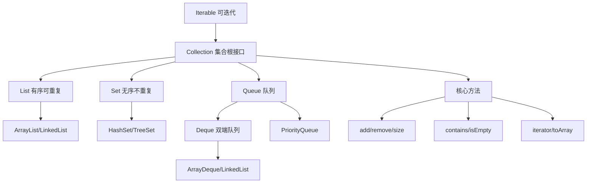

# 什么是Collection接口？

### Collection 接口

`Collection` 是 Java 集合框架中的**根接口**，用于存储一组不唯一的、无序的对象（单列集合的父接口）。

#### 继承体系与核心类
为了让实现者更容易实现这个接口，Java 类库提供了 `AbstractCollection` 抽象类，它实现了除 `iterator()` 和 `size()` 以外的大部分常规方法。
*   **List**：继承自 `AbstractList`，代表有序、可重复的集合（如 `ArrayList`, `LinkedList`）。
*   **Set**：继承自 `AbstractSet`，代表无序、不可重复的集合。要保证不重复，需要正确重写 `equals()` 和 `hashCode()`（如 `HashSet`）。
*   **Queue**：继承自 `AbstractQueue`，代表队列，通常遵循 FIFO 规则。

#### Iterator 迭代器
`Collection` 继承了 `Iterable` 接口，因此可以使用“for-each”循环。通过 `iterator()` 方法可以获取 `Iterator` 对象，用于遍历集合。

**Iterator 的常用功能（单向移动）：**
1.  `hasNext()`：判断是否还有下一个元素。
2.  `next()`：返回下一个元素。
3.  `remove()`：移除当前迭代到的元素（可选操作）。

---

### 深化内容

#### 实战案例
在遍历大 List 数据进行过滤时，新手常犯的错误是在 for-each 循环中直接调用 `list.remove(obj)`，这会抛出 `ConcurrentModificationException`。**实战规范**：必须使用 `Iterator.remove()` 方法，或者 Java 8+ 的 `Collection.removeIf()` 方法来安全地修改集合结构。

#### 关键代码：安全遍历与删除
```java
List<String> data = new ArrayList<>(Arrays.asList("a", "b", "c"));
// 错误做法：for (String s : data) { if ("b".equals(s)) data.remove(s); }

// 正确做法 1：Iterator
Iterator<String> it = data.iterator();
while (it.hasNext()) {
    if ("b".equals(it.next())) {
        it.remove(); // 安全删除
    }
}
// 正确做法 2：Java 8 removeIf
data.removeIf("b"::equals);
```

#### 对比表格：List vs Set vs Queue 选型

| 维度 | List | Set | Queue |
| :--- | :--- | :--- | :--- |
| **有序性** | **有序**（插入顺序或索引顺序） | **无序**（HashSet）或 **排序**（TreeSet） | **FIFO**（PriorityQueue 例外，按优先级） |
| **重复性** | **允许重复** | **不允许重复**（元素唯一） | 通常允许（队列中可存相同任务） |
| **索引访问** | 支持 `get(index)` 高效随机访问 | 不支持索引 | 不支持索引（仅队头/队尾操作） |
| **查找复杂度** | ArrayList O(1), LinkedList O(n) | HashSet O(1), TreeSet O(log n) | LinkedList O(1), ArrayDeque O(1) |
| **典型场景** | 存储列表数据、返回结果集 | 去重（如标签 ID 列表）、关键字查询 | 消息队列、任务缓冲区、广度优先搜索 |


## 核心架构图



## 记忆要点

- 一句话定义：Java单列集合的根接口，继承Iterable接口，存储不唯一的对象。
- 三大子接口：List(有序可重复)、Set(无序不重复)、Queue(FIFO队列)。
- 去重核心：Set依赖元素的equals()和hashCode()方法判断对象是否相同。
- 避坑指南：for-each中直接remove抛异常，必须使用Iterator.remove()或Java8 removeIf。

## 结构化回答

**30 秒电梯演讲：** Java单列集合的顶层接口，定义了存储一组对象的基本操作。打个比方，一个通用的容器规范（Collection），具体做成篮子还是盒子由子类决定。

**展开框架：**
1. **一句话定义** — Java单列集合的根接口，继承Iterable接口，存储不唯一的对象。
2. **三大子接口** — List(有序可重复)、Set(无序不重复)、Queue(FIFO队列)。
3. **去重核心** — Set依赖元素的equals()和hashCode()方法判断对象是否相同。

**收尾：** 我在项目里踩过坑——在遍历大 List 数据进行过滤时，新手常犯的错误是在 for-each 循环中直接调用 `list.remove(obj)`，这会抛出 `ConcurrentModificationException`。您想深入聊哪一段：原理、避坑还是对比选型？

## 视频脚本

> 预计时长：3 分钟 | 由浅入深

| 时间 | 画面/字幕 | 口播台词 | 讲解要点 |
|------|----------|----------|----------|
| 0:00 | 标题卡：什么是Collection接口 | "什么是Collection接口？一句话——一个通用的容器规范（Collection），具体做成篮子还是盒子由子类决定。" | 开场钩子 |
| 0:45 | 概念动画/示意图 | "Java单列集合的顶层接口，定义了存储一组对象的基本操作——一个通用的容器规范（Collection），具体做成篮子还是盒子由子类决定" | 核心定义 |
| 1:30 | 一句话定义示意 | "Java单列集合的根接口，继承Iterable接口，存储不唯一的对象。" | 要点1 |
| 2:15 | 三大子接口示意 | "List(有序可重复)、Set(无序不重复)、Queue(FIFO队列)。" | 要点2 |
| 3:00 | 总结卡 | "记住这几条，面试不慌。下期讲进阶追问。" | 收尾 |
