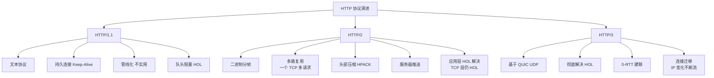

# 什么是HTTP/2？

### HTTP/2 概述
HTTP/2（超文本传输协议第2版）旨在解决 HTTP/1.1 中的性能问题，如头部冗余、队头阻塞（HOL）和请求并发限制。它基于 Google 的 SPDY 协议开发，于 2015 年发布。

#### 核心改进
1.  **二进制帧**：将 HTTP 文本传输改为二进制格式，解析更高效健壮。数据被分割为更小的“帧”，通过“流”进行标识。
2.  **多路复用**：允许在单个 TCP 连接上同时发送多个请求和响应。不同的请求在同一个连接中通过 Stream ID 区分，解决了 HTTP/1.1 的层头阻塞问题。
3.  **头部压缩**：使用 HPACK 算法压缩请求和响应头。通过静态字典、动态字典和 Huffman 编码，减少了因重复发送相同头部造成的带宽浪费。
4.  **服务器推送**：服务器可以在客户端请求之前主动将资源（如 CSS、JS）推送给客户端，减少往返延迟。
5.  **请求优先级**：由于所有请求都在一个连接中复用，可以通过设置依赖关系和权重来分配带宽，确保关键资源优先加载。

#### 二进制帧与流结构
```text
+----------------------------------+
|            TCP 连接             |
+----------------------------------+
|  Stream 1 (ID: 1)    Stream 3   | <--- 并发的虚拟流
|  HEADERS | DATA     HEADERS     |
+----------------------------------+
|  Stream 5 (ID: 5)    Stream 7   |
|  HEADERS | DATA     HEADERS     |
+----------------------------------+
|              二进制帧层          |
+----------------------------------+
```

#### 局限性
尽管 HTTP/2 解决了应用层的队头阻塞，但由于仍基于 TCP 协议，当发生丢包时，TCP 层的阻塞会导致整个连接的所有流暂停，这被称为 **TCP 层队头阻塞**。

#### 常见考点
*   **HTTP/1.1 vs HTTP/2**：文本 vs 二进制，串行/管道 vs 多路复用，无压缩 vs HPACK。
*   **队头阻塞**：HTTP/1.1（HOL）在 HTTP/2 中解决了吗？解决了应用层 HOL，但引入了 TCP 层 HOL。
*   **HTTP/3**：为了解决 TCP 层 HOL，HTTP/3 改用了什么协议？（QUIC/UDP）。
*   **多路复用**：在 HTTP/2 中还需要做域名分片吗？（不需要，因为单连接即可并发）。

---

### 深化内容

#### 实战案例
在弱网环境下（如移动端 4G/5G 信号抖动），HTTP/2 可能出现“TCP 队头阻塞”导致页面卡顿。原因是一个关键的图片包丢失，导致整个 TCP 连接暂停传输，阻塞了后续 JS/CSS 的加载。**实战表现**：虽然多路复用消除了浏览器端的 6 个 TCP 连接限制，但 TCP 层的丢包重传机制使得所有流“一损俱损”。

#### 关键代码：Nginx 开启 HTTP/2
配置 Nginx 支持 HTTP/2（需 OpenSSL 版本支持）：
```nginx
server {
    listen 443 ssl http2;
    server_name example.com;
    
    ssl_certificate /path/to/cert.pem;
    ssl_certificate_key /path/to/key.pem;
    
    # 开启 Gzip 配合 HPACK 减少传输量
    gzip on;
}
```

#### 对比表格：HTTP/1.1 vs HTTP/2 性能细节

| 特性 | HTTP/1.1 | HTTP/2 |
| :--- | :--- | :--- |
| **传输格式** | 文本（ASCII），可读性好但解析慢 | **二进制**，解析高效，扩展性强 |
| **并发模型** | 串行或 Pipeline（需 FIFO） | **多路复用**（交错发送，无需排队） |
| **连接数** | 域名分片（需建立 6+ 个 TCP 连接） | **单连接**复用（减少 TCP/TLS 握手开销） |
| **头部处理** | 原文发送，大量重复 Cookie | **HPACK 压缩**，显著节省带宽 |
| **队头阻塞** | 请求级 HOL（前一个慢，后面等） | **TCP 级 HOL**（丢包影响全连接） |
| **服务器推送** | 不支持（需客户端发起请求） | **支持**（Server Push，虽在后续规范中弱化） |


## 核心架构图


## 记忆要点

- 三大核心：二进制分帧、多路复用、HPACK头部压缩，彻底解决HTTP1.1的慢。
- 多路复用：单TCP连接并发多个请求，通过Stream ID区分，无需域名分片。
- 残留痛点：解决了应用层队头阻塞，但TCP丢包会导致整个连接阻塞(TCP级HOL)。
- 特性补充：支持Server Push主动推送资源，请求设置权重分配带宽。

## 结构化回答

**30 秒电梯演讲：** 基于TCP的二进制分帧协议，实现多路复用，解决HTTP/1.1队头阻塞。打个比方，从单车道修路（按顺序走）升级为多车道高速公路（齐头并进），还能把行李（头部）压缩。

**展开框架：**
1. **三大核心** — 二进制分帧、多路复用、HPACK头部压缩，彻底解决HTTP1.1的慢。
2. **多路复用** — 单TCP连接并发多个请求，通过Stream ID区分，无需域名分片。
3. **残留痛点** — 解决了应用层队头阻塞，但TCP丢包会导致整个连接阻塞(TCP级HOL)。

**收尾：** 我在项目里踩过坑——在弱网环境下（如移动端 4G/5G 信号抖动），HTTP/2 可能出现“TCP 队头阻塞”导致页面卡顿。您想深入聊哪一段：原理、避坑还是对比选型？

## 视频脚本

> 预计时长：3 分钟 | 由浅入深

| 时间 | 画面/字幕 | 口播台词 | 讲解要点 |
|------|----------|----------|----------|
| 0:00 | 标题卡：什么是HTTP/2 | "什么是HTTP/2？一句话——从单车道修路（按顺序走）升级为多车道高速公路（齐头并进），还能把行李（头部）压缩。" | 开场钩子 |
| 0:45 | 概念动画/示意图 | "基于TCP的二进制分帧协议，实现多路复用，解决HTTP/1.1队头阻塞——从单车道修路（按顺序走）升级为多车道高速公路（齐头并进），还能把行李（头部）压缩" | 核心定义 |
| 1:30 | 三大核心示意 | "二进制分帧、多路复用、HPACK头部压缩，彻底解决HTTP1.1的慢。" | 要点1 |
| 2:15 | 多路复用示意 | "单TCP连接并发多个请求，通过Stream ID区分，无需域名分片。" | 要点2 |
| 3:00 | 总结卡 | "记住这几条，面试不慌。下期讲进阶追问。" | 收尾 |

---

## 延伸：HTTP/2 的多路复用是如何解决 HTTP/1.x 的队头阻塞问题的？

> 合并自 `tr4-013`（相似度 73%）

在 HTTP/1.1 中，虽然可以持久连接，但请求必须串行发送，前一个请求的响应未返回时，后续请求只能等待，这被称为队头阻塞。HTTP/2 引入了二进制分帧层，将所有传输的信息分割为更小的消息和帧，并对帧采用二进制格式编码。最重要的是，HTTP/2 允许在同一个 TCP 连接上并发发送多个请求和响应，这些请求和响应被拆分成帧混合传输，但在另一端根据 Stream ID 重新组装。每个 Stream 有独立的 ID 和优先级，互不干扰。这样，即使一个大的请求阻塞了，其他请求的帧依然可以发送和接收，从而实现了真正的多路复用，显著提升了网络利用率。

**实战案例**：在复杂的 Web 单页应用（SPA）加载中，页面通常需要并行请求几十个小资源（API、JS、CSS）。使用 HTTP/1.1 时浏览器会限制同域并发数（通常为 6），导致大量请求排队；而 HTTP/2 通过多路复用消除了这种机制层面的限制，显著减少了首屏加载时间（FCP）。

**代码示例（Node.js HTTP/2 服务端推送关键帧）**：
```javascript
const http2 = require('http2');
const server = http2.createSecureServer({
  key: fs.readFileSync('key.pem'),
  cert: fs.readFileSync('cert.pem')
});
server.on('stream', (stream, headers) => {
  // 利用多路复用，主动推送关键资源，无需客户端请求
  stream.pushStream({ ':path': '/style.css' }, (pushStream) => {
    pushStream.respond({ 'content-type': 'text/css' });
    pushStream.end('body { color: red; }');
  });
});
```

**对比表格**：

| 维度 | HTTP/1.1 | HTTP/2 |
| :--- | :--- | :--- |
| 传输格式 | 文本 (ASCII) | 二进制帧 |
| 多路复用 | 不支持 (需开启多条 TCP 连接) | 支持 (单 TCP 连接多 Stream 并发) |
| 队头阻塞 | 存在 (请求串行) | 消除 HTTP 层队头阻塞 (TCP 层仍存在) |
| 连接数 | 浏览器限制同域并发数 (如 6 个) | 单连接多路复用，减少 TCP 握手开销 |
| 头部压缩 | 无 (纯文本重复发送) | HPACK 算法压缩 |

## 记忆要点

- 前提：因为引入二进制分帧层，所以能将数据打散混合传输。
- 核心机制：单TCP连接并发多Stream，凭借Stream ID在端侧重新组装。
- 解决痛点：因为帧是并发混合传输，所以彻底消除HTTP层的队头阻塞。
- 附加优化：支持HPACK头部压缩且突破HTTP1.1同域6连接数限制。

## 结构化回答

**30 秒电梯演讲：** 基于二进制分帧与 Stream ID，在单 TCP 连接上混合并行传输数据。打个比方，像在高速公路上，以前（HTTP/1.1）车队必须一辆接一辆过收费站，前车卡住后车全等；现在（HTTP/2）所有车被拆散成零件，在不同的车道（Stream）上穿插混行，互不干扰，到了终点再按编号组装回原车。

**展开框架：**
1. **前提** — 因为引入二进制分帧层，所以能将数据打散混合传输。
2. **核心机制** — 单TCP连接并发多Stream，凭借Stream ID在端侧重新组装。
3. **解决痛点** — 因为帧是并发混合传输，所以彻底消除HTTP层的队头阻塞。

**收尾：** 我在项目里踩过坑——在复杂的 Web 单页应用（SPA）加载中，页面通常需要并行请求几十个小资源（API、JS、CSS）。您想深入聊哪一段：原理、避坑还是对比选型？

## 视频脚本

> 预计时长：2 分钟 | 由浅入深

| 时间 | 画面/字幕 | 口播台词 | 讲解要点 |
|------|----------|----------|----------|
| 0:00 | 标题卡：HTTP/2 的多路复用是如何解决 … | "HTTP/2 的多路复用是如何解决 HTTP/1.x 的队头阻塞问题的？一句话——像在高速公路上，以前（HTTP/1.1）车队必须一辆接一辆过收费站，前车卡住后车全等；现在（HTTP/2）所有车被拆散成零件，在不同的车道（Stream）上穿插混行，互不干扰，到了终点再按编号组装回原车。" | 开场钩子 |
| 0:40 | 概念动画/示意图 | "基于二进制分帧与 Stream ID，在单 TCP 连接上混合并行传输数据——像在高速公路上，以前（HTTP/1.1）车队必须一辆接一辆过收费站，前车卡住后车全等；现在（HTTP/2）所有车被拆散成零件，在不同的车道（Stream）上穿插混行，互不干扰，到了终点再按编号组装回原车" | 核心定义 |
| 1:20 | 前提示意 | "因为引入二进制分帧层，所以能将数据打散混合传输。" | 要点1 |
| 2:00 | 总结卡 | "记住这几条，面试不慌。下期讲进阶追问。" | 收尾 |
