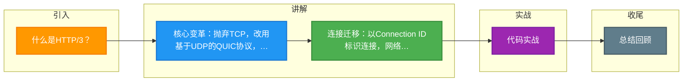

# 什么是HTTP/3？

### HTTP/3 概述
HTTP/3 是 HTTP 协议的第三个主要版本，其核心变革在于将传输层协议从 TCP 替换为基于 UDP 的 QUIC 协议，从而彻底解决了 HTTP/2 的 TCP 层队头阻塞问题。

**核心特性：**
1.  **基于 QUIC（UDP）**：QUIC 在 UDP 之上实现了类似 TCP 的可靠性、流量控制和拥塞控制，摒弃了 TCP 的拥塞机制。
2.  **彻底解决队头阻塞**：QUIC 协议中，不同的 Stream 是独立的。如果某个 Stream 的包丢失，只会阻塞该 Stream，不会影响其他 Stream 的数据传输。
3.  **连接迁移**：QUIC 连接不由四元组（源IP、源端口、目的IP、目的端口）标识，而是由连接 ID 标识。这意味着当客户端网络切换（如从 Wi-Fi 切到 4G）导致 IP 变化时，连接无需断开重连，极大提升了移动端体验。
4.  **更快的连接建立**：QUIC 内部集成了 TLS 1.3，在建立连接的同时进行密钥协商。对于首次连接，通常仅需 1-RTT；对于复用连接，甚至可以实现 0-RTT，直接发送应用数据。
5.  **改进的头部压缩**：使用 QPACK 算法，解决了 HTTP/2 中 HPACK 在丢包时可能导致阻塞的问题。

**HTTP/3 与 QUIC 协议栈架构：**
```text
+-------------------+
|     HTTP/3        |
+-------------------+
|      QUIC         | <--- 提供可靠性、流控、加密
+-------------------+
|       UDP         |
+-------------------+
|       IP          |
+-------------------+
```

#### 常见考点
1.  **HTTP/2 队头阻塞的原因**：HTTP/2 虽然在应用层（多路复用）解决了队头阻塞，但在 TCP 层，如果任何一个 TCP 数据包丢失，整个 TCP 连接的所有流都会等待重传，导致所有 HTTP 请求被阻塞。HTTP/3 基于 UDP，丢失包仅影响对应的 Stream。
2.  **QUIC 的 0-RTT 原理**：客户端在首次连接时保存服务器的配置（包括加密参数），后续连接时可以直接在第一个包中发送应用数据，但存在重放攻击风险，需配合应用层 token 机制使用。
3.  **QPACK 与 HPACK 的区别**：HTTP/2 的 HPACK 依赖严格的顺序性，头部包丢失会阻塞后续解码；HTTP/3 的 QACK 允许乱序更新头部表，解决了队头阻塞。

---

### 深化内容

#### 实战案例
直播 App 用户在从 Wi-Fi 切换到蜂窝网络时，HTTP/2 会导致直播流中断或刷圈，因为 TCP 连接的四元组变化。而启用 HTTP/3 (QUIC) 后，用户在地铁进出站网络频繁切换时，由于 **Connection ID** 不变，直播流几乎无感，显著提升了用户留存率。这是目前 QUIC 最核心的落地价值。

#### 关键代码：Nginx/Octane 开启 HTTP/3 (QUIC)
目前主流 Web 服务器对 HTTP/3 的支持正在成熟，以下为典型配置逻辑（需编译对应模块）：
```nginx
# 示例：Nginx with QUIC (早期版本使用 listen 443 quic)
server {
    listen 443 quic reuseport;
    listen 443 ssl; # 兼容 HTTP/2 回退
    
    ssl_protocols TLSv1.3; # QUIC 强依赖 TLS 1.3
    
    # 添加 Alt-Svc 头告知浏览器支持 H3
    add_header alt-svc 'h3=":443"; ma=86400';
}
```

#### 对比表格：HTTP/2 vs HTTP/3 (QUIC)

| 维度 | HTTP/2 | HTTP/3 |
| :--- | :--- | :--- |
| **传输层协议** | **TCP** | **QUIC (基于 UDP)** |
| **队头阻塞 (HOL)** | **TCP 层阻塞**（一包丢，全连接停） | **无阻塞**（流独立，互不影响） |
| **握手时延** | TCP + TLS 1.2 (约 2-3 RTT) | **0-RTT / 1-RTT**（TLS 1.3 集成在 QUIC 中） |
| **网络切换** | 连接断开，需重连（IP 变更失效） | **连接迁移**（基于 Connection ID，无缝切换） |
| **加密方式** | TLS 在 TCP 之上 | **内置加密**，集成在传输层内部 |
| **头部压缩** | HPACK (顺序依赖) | **QPACK** (支持乱序，防阻塞) |
| **普及度** | 极高（现代浏览器默认支持） | 逐步增长（Google/Cloudflare 推进中） |


## 核心架构图

```mermaid
flowchart TD
    classDef start fill:#4CAF50,color:#fff
    classDef process fill:#2196F3,color:#fff
    classDef decision fill:#FF9800,color:#fff
    classDef special fill:#9C27B0,color:#fff
    classDef error fill:#f44336,color:#fff
    classDef info fill:#607D8B,color:#fff
    class A start
    class Alive process
    class B decision
    class B1 special
    class B2 error
    class B3 info
    class B4 start
    class C process
    class C1 decision
    class C2 special
    class C3 error
    class C4 info
    class C5 start
    class D process
    class D1 decision
    class D2 special
    class D3 error
    class D4 info
    class HOL start
    class HPACK process
    class HTTP decision
    class IP special
    class Keep error
    class QUIC info
    class RTT start
    class TCP process
    class UDP decision
    class br special
    A[HTTP 协议演进] --> B["HTTP/1.1"]
    B --> B1[文本协议]
    B --> B2[持久连接 Keep-Alive]
    B --> B3[管线化 不实用]
    B --> B4[队头阻塞 HOL]
    A --> C["HTTP/2"]
    C --> C1[二进制分帧]
    C --> C2[多路复用<br/>一个 TCP 多请求]
    C --> C3[头部压缩 HPACK]
    C --> C4[服务器推送]
    C --> C5[应用层 HOL 解决<br/>TCP 层仍 HOL]
    A --> D["HTTP/3"]
    D --> D1[基于 QUIC UDP]
    D --> D2[彻底解决 HOL]
    D --> D3[0-RTT 建联]
    D --> D4[连接迁移<br/>IP 变化不断流]
```



## 记忆要点

- 核心变革：抛弃TCP，改用基于UDP的QUIC协议，彻底解决TCP层队头阻塞。
- 连接迁移：以Connection ID标识连接，网络切换(如WIFI切流量)不断连。
- 极速握手：集成TLS 1.3，首次连接仅需1-RTT，会话复用更是0-RTT。
- 防阻塞压缩：使用QPACK替代HTTP2的HPACK，支持乱序解码防头部阻塞。

## 结构化回答

**30 秒电梯演讲：** 基于UDP的QUIC协议实现HTTP，解决TCP队头阻塞，支持连接迁移。打个比方，把原本走公路（TCP）的快递改走空运专线（QUIC），一架飞机延误（丢包）不影响其他飞机，换手机卡也不影响收货。

**展开框架：**
1. **核心变革** — 抛弃TCP，改用基于UDP的QUIC协议，彻底解决TCP层队头阻塞。
2. **连接迁移** — 以Connection ID标识连接，网络切换(如WIFI切流量)不断连。
3. **极速握手** — 集成TLS 1.3，首次连接仅需1-RTT，会话复用更是0-RTT。

**收尾：** 我在项目里踩过坑——直播 App 用户在从 Wi-Fi 切换到蜂窝网络时，HTTP/2 会导致直播流中断或刷圈，因为 TCP 连接的四元组变化。您想深入聊哪一段：原理、避坑还是对比选型？

## 视频脚本

> 预计时长：3 分钟 | 由浅入深

| 时间 | 画面/字幕 | 口播台词 | 讲解要点 |
|------|----------|----------|----------|
| 0:00 | 标题卡：什么是HTTP/3 | "什么是HTTP/3？一句话——把原本走公路（TCP）的快递改走空运专线（QUIC），一架飞机延误（丢包）不影响其他飞机，换手机卡也不影响收货。" | 开场钩子 |
| 0:45 | 概念动画/示意图 | "基于UDP的QUIC协议实现HTTP，解决TCP队头阻塞，支持连接迁移——把原本走公路（TCP）的快递改走空运专线（QUIC），一架飞机延误（丢包）不影响其他飞机，换手机卡也不影响收货" | 核心定义 |
| 1:30 | 核心变革示意 | "抛弃TCP，改用基于UDP的QUIC协议，彻底解决TCP层队头阻塞。" | 要点1 |
| 2:15 | 连接迁移示意 | "以Connection ID标识连接，网络切换(如WIFI切流量)不断连。" | 要点2 |
| 3:00 | 总结卡 | "记住这几条，面试不慌。下期讲进阶追问。" | 收尾 |

### 视频流程图



