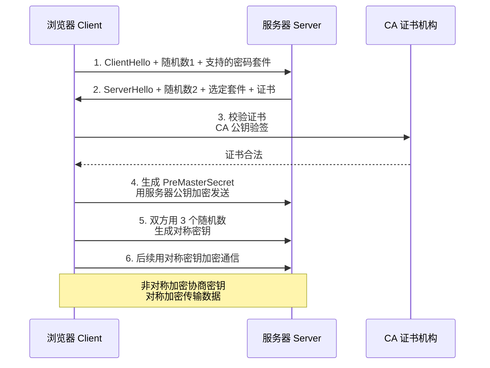

# 什么是HTTPS？

**当前答案**：
HTTPS（Hyper Text Transfer Protocol Secure）是以安全为目标的 HTTP 通道，在 HTTP 的基础上加入 SSL/TLS 协议进行加密。它通过以下机制解决 HTTP 的安全隐患：

**1. 数据加密（混合加密）**
HTTPS 采用**对称加密**和**非对称加密**结合的方式：
*   **非对称加密（如 RSA/ECC）**：用于在握手阶段安全地交换**会话密钥**。公钥加密，私钥解密，解决了密钥分发问题，但速度慢。
*   **对称加密（如 AES-GCM/ChaCha20）**：使用交换好的会话密钥对传输数据进行加密和解密，速度快，适合大量数据传输。

**2. 数据完整性（摘要算法）**
使用哈希算法（如 SHA-256）生成数据的**摘要**（MAC），确保数据在传输过程中未被篡改。

**3. 身份认证（数字证书）**
*   服务端向 CA（证书授权中心）申请数字证书，证书包含服务端公钥、域名和身份信息，并由 CA 用其私钥签名。
*   客户端利用内置的 CA 根证书公钥验证服务端证书的真实性和有效性，防止中间人攻击（如伪造服务器）。

**HTTPS 握手流程（简化版 TLS 1.2/1.3）：**
```text
Client                                    Server
  |                                          |
  | -------------- ClientHello -------------> |
  |    (支持的加密套件、随机数)                |
  |                                          |
  | <------------- ServerHello -------------- |
  | (选定的加密套件、随机数、证书)             |
  | <----------- ServerKeyExchange ---------- |
  |         (服务器公钥，用于交换密钥)        |
  |                                          |
  | -------------- ClientKeyExchange ------> |
  |    (利用服务器公钥加密预主密钥)           |
  | -------------- ChangeCipherSpec ------> |
  |        (通知后续使用加密通信)             |
  | -------------- Finished ---------------> |
  |                                          |
  | <------------- ChangeCipherSpec --------- |
  | <------------- Finished ---------------- |
  |                                          |
  | ========== 加密的应用数据传输 =========== |
```

**## 常见考点**
1.  **中间人攻击原理及防御**：攻击者截获客户端与服务端的通信，伪装成服务端给客户端发假证书，伪装成客户端给服务端发请求。防御的核心在于客户端必须验证证书链的可信度（是否受信任的 CA 签发、域名是否匹配、证书是否过期）。
2.  **对称与非对称加密结合的原因**：非对称加密计算复杂度极高，比对称加密慢几个数量级，不适合传输大量数据，因此仅用于握手阶段协商密钥。
3.  **数字证书的内容**：主要包含证书版本、序列号、签名算法、颁发者、有效期、主体（持有者信息）、公钥信息以及 CA 的签名。

---

**### 深化内容**

**实战案例**：
生产环境中曾遇到过"证书链不完整"导致部分 Android 旧机型无法访问的问题。原因是 Nginx 配置只配置了服务器证书，缺少中间证书，导致客户端无法构建完整的信任链。配置 `ssl_certificate` 时必须包含中间证书（即域名证书 + 中间 CA 证书合并）。

**代码示例**：
```nginx
# Nginx HTTPS 配置关键片段
server {
    listen 443 ssl;
    server_name example.com;
    # 证书文件必须包含域名证书及中间证书（按顺序合并）
    ssl_certificate /etc/nginx/ssl/fullchain.pem; 
    ssl_certificate_key /etc/nginx/ssl/privkey.pem;
    # 优化：优先使用现代加密套件，启用 HSTS
    ssl_protocols TLSv1.2 TLSv1.3;
    ssl_ciphers ECDHE-ECDSA-AES128-GCM-SHA256:ECDHE-RSA-AES128-GCM-SHA256;
    add_header Strict-Transport-Security "max-age=31536000" always;
}
```

**对比表格**：

| 特性 | HTTP | HTTPS |
| :--- | :--- | :--- |
| **协议** | 应用层协议 | HTTP + SSL/TLS (传输层/表示层) |
| **端口** | 默认 80 | 默认 443 |
| **数据形态** | 明文传输，Wireshark 可直接抓包 | 密文传输，仅握手阶段可见部分信息 |
| **SEO 权重** | 较低 | 搜索引擎（如 Google/百度）给予更高权重 |
| **性能开销** | 极低 | 存在 TCP/TLS 握手延迟及加解密 CPU 开销 |
| **安全性** | 易被监听、篡改、劫持 | 防窃听、防篡改、防冒充 |


## 核心架构图


## 核心知识点图


## 记忆要点

- 本质安全：HTTP+SSL/TLS，通过混合加密、摘要算法、数字证书保证安全。
- 混合加密：非对称加密(RSA)交换会话密钥，对称加密(AES)传输实际数据。
- 防中间人：服务端用CA私钥签名证书，客户端用本地公钥验签，确认身份真伪。
- 配置陷阱：Nginx配置必须包含完整证书链(域名证书+中间证书)，否则旧设备报错。

## 结构化回答

**30 秒电梯演讲：** HTTP加SSL/TLS层，通过混合加密和数字证书确保数据机密性、完整性和身份认证。打个比方，寄信前把信放进带锁的保险箱（加密），钥匙只有你有；还要验证快递员身份证（证书），防止坏人掉包。

**展开框架：**
1. **本质安全** — HTTP+SSL/TLS，通过混合加密、摘要算法、数字证书保证安全。
2. **混合加密** — 非对称加密(RSA)交换会话密钥，对称加密(AES)传输实际数据。
3. **防中间人** — 服务端用CA私钥签名证书，客户端用本地公钥验签，确认身份真伪。

**收尾：** 我在项目里踩过坑——生产环境中曾遇到过"证书链不完整"导致部分 Android 旧机型无法访问的问题。您想深入聊哪一段：原理、避坑还是对比选型？

## 视频脚本

> 预计时长：3 分钟 | 由浅入深

| 时间 | 画面/字幕 | 口播台词 | 讲解要点 |
|------|----------|----------|----------|
| 0:00 | 标题卡：什么是HTTPS | "什么是HTTPS？一句话——寄信前把信放进带锁的保险箱（加密），钥匙只有你有；还要验证快递员身份证（证书），防止坏人掉包。" | 开场钩子 |
| 0:45 | 概念动画/示意图 | "HTTP加SSL/TLS层，通过混合加密和数字证书确保数据机密性、完整性和身份认证——寄信前把信放进带锁的保险箱（加密），钥匙只有你有；还要验证快递员身份证（证书），防止坏人掉包" | 核心定义 |
| 1:30 | 本质安全示意 | "HTTP+SSL/TLS，通过混合加密、摘要算法、数字证书保证安全。" | 要点1 |
| 2:15 | 混合加密示意 | "非对称加密(RSA)交换会话密钥，对称加密(AES)传输实际数据。" | 要点2 |
| 3:00 | 总结卡 | "记住这几条，面试不慌。下期讲进阶追问。" | 收尾 |
