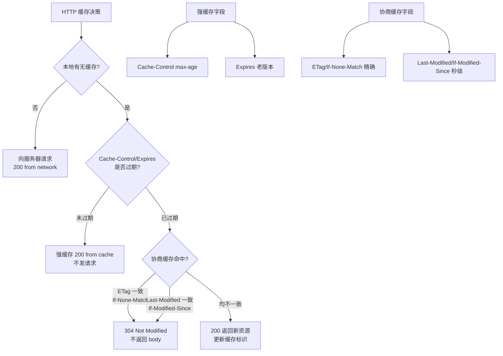

# 什么是HTTP缓存？

HTTP 缓存是一种用于优化 Web 性能、减少服务器负载和降低网络延迟的机制。浏览器或代理服务器会将已请求过的资源副本保存在本地，后续请求时优先使用副本。

HTTP 缓存主要分为两类：

**1. 强制缓存**
浏览器判断资源是否过期，若未过期则直接使用本地缓存，不与服务器通信，状态码为 200 (from disk cache / from memory cache)。
*   **Expires**（HTTP/1.0）：服务器返回的绝对过期时间（GMT 格式）。缺点是依赖客户端本地时间，若时间不准可能导致缓存失效。
*   **Cache-Control**（HTTP/1.1）：相对过期时间，优先级高于 Expires。常用指令：
    *   `max-age=<秒>`：缓存有效时长。
    *   `no-cache`：跳过强缓存，直接进入协商缓存。
    *   `no-store`：禁止任何缓存。
    *   `public/private`：指示是否可被代理服务器缓存。

**2. 协商缓存**
当强缓存失效（或设置了 `no-cache`）时，浏览器向服务器验证缓存资源是否有效。若未修改，服务器返回 304 状态码，浏览器继续使用本地缓存。
*   **Last-Modified / If-Modified-Since**：
    *   服务器响应 `Last-Modified`（最后修改时间）。
    *   浏览器请求携带 `If-Modified-Since`。服务器对比时间，若未变则返回 304。
    *   缺点：秒级以下修改无法感知，修改文件但内容不变仍会导致缓存失效。
*   **ETag / If-None-Match`（优先级高于 Last-Modified）：
    *   服务器响应 `ETag`（资源唯一指纹，通常基于内容哈希）。
    *   浏览器请求携带 `If-None-Match`。服务器对比指纹，若一致则返回 304。
    *   优点：能精确感知文件内容变化，感知频率高。
    *   缺点：服务器计算开销较大。

### 实战案例
在秒杀活动页面发布时，我们曾因 HTML 没有设置 `Cache-Control: no-cache`，导致用户在活动开始后刷新页面依然加载了旧的活动状态（静态化 HTML），通过将入口 HTML 设置为协商缓存，同时将静态资源配置长缓存（加 Hash 版本号）解决了此问题。

### 对比表格：强制缓存 vs 协商缓存

| 特性 | 强制缓存 | 协商缓存 |
| :--- | :--- | :--- |
| **触发时机** | 资源未过期 | 强制缓存失效或显式设置 no-cache |
| **通信状态** | 不与服务器通信 | 向服务器发送请求头验证 |
| **HTTP 状态码** | 200 (from disk/memory cache) | 304 Not Modified |
| **优势** | 节省带宽，响应最快 | 节省带宽，保证数据一致性 |
| **常用 Header** | Expires, Cache-Control | ETag/If-None-Match, Last-Modified/If-Modified-Since |

### 代码示例 (Nginx 配置)
```nginx
# 静态资源：强缓存 1 年，利用文件哈希名更新
location /static/ {
    expires 1y;
    add_header Cache-Control "public, immutable";
}

# HTML 文件：不缓存，总是向服务器验证
location ~ \.html$ {
    add_header Cache-Control "no-cache";
}
```

**HTTP 缓存决策流程图：**
```text
     浏览器请求资源
          |
          v
  +---------------+
  | 查找本地缓存  |
  +-------+-------+
          |
  不存在? |------> [向服务器请求资源]
          |              |
          v              v
   +------+------+   [存入缓存]
   | 检查强缓存   |
   +------+------+
          |
      过期? |-----> [检查协商缓存 (带验证头请求)]
          |              |
          |              v
   否     |      +-------+-------+
   (命中) |      | 服务器验证   |
   |      |      +-------+-------+
   v      |              |
[200 OK   |      未改变? |-----> [304 Not Modified] (使用旧缓存)
  使用缓存]|              |       (更新过期时间)
          |      改变?  |-------> [200 OK (新资源)] (更新缓存)
          |              |
          +--------------+
```

**## 常见考点**
1.  **Cache-Control 的其他指令**：`must-revalidate`（过期后必须向原服务器验证，即使有副本）、`s-maxage`（覆盖 max-age，仅对共享代理缓存有效）、`immutable`（资源永不改变，减少请求）。
2.  **为什么 ETag 优先级更高**：Last-Modified 只能精确到秒，且文件内容修改时间变了但内容没变时会导致无效传输，ETag 基于内容指纹更准确。
3.  **刷新缓存的操作**：强制刷新（Ctrl+F5）会跳过所有缓存并请求新数据（请求头带 `Pragma: no-cache` 和 `Cache-Control: no-cache`）；普通刷新（F5）会跳过强缓存但允许协商缓存。


## 核心架构图


## 记忆要点

- 两大缓存分级：强制缓存直接读取（返回200），协商缓存校验服务端（返回304）。
- 强制缓存关键字段：Cache-Control优先级高于Expires，max-age控制有效期。
- 协商缓存双字段：ETag/If-None-Match（唯一指纹，优先级高）对比 Last-Modified/If-Modified-Since。
- 记忆口诀：强缓不问只看过期，协商要问对比签名。

## 结构化回答

**30 秒电梯演讲：** 通过强制缓存直接读取本地或通过协商缓存验证资源更新，减少网络传输。打个比方，就像做作业：强缓存是直接抄上次的答案（没过期就不改）；协商缓存是先问老师“这题变了没”，没变就抄，变了就重做。

**展开框架：**
1. **两大缓存分级** — 强制缓存直接读取（返回200），协商缓存校验服务端（返回304）。
2. **强制缓存关键字段** — Cache-Control优先级高于Expires，max-age控制有效期。
3. **协商缓存双字段** — ETag/If-None-Match（唯一指纹，优先级高）对比 Last-Modified/If-Modified-Since。

**收尾：** 我在项目里踩过坑——在秒杀活动页面发布时，我们曾因 HTML 没有设置 `Cache-Control: no-cache`，导致用户在活动开始后刷新页面依然加载了旧的活动状态（静态化 HTML），通过将入口 HTML 设置为协商缓存，同时将静态资源配置长缓存（加 Hash 版本号）解决了此问题。您想深入聊哪一段：原理、避坑还是对比选型？

## 视频脚本

> 预计时长：3 分钟 | 由浅入深

| 时间 | 画面/字幕 | 口播台词 | 讲解要点 |
|------|----------|----------|----------|
| 0:00 | 标题卡：什么是HTTP缓存 | "什么是HTTP缓存？一句话——就像做作业：强缓存是直接抄上次的答案（没过期就不改）；协商缓存是先问老师“这题变了没”，没变就抄，变了就重做。" | 开场钩子 |
| 0:45 | 概念动画/示意图 | "通过强制缓存直接读取本地或通过协商缓存验证资源更新，减少网络传输——就像做作业：强缓存是直接抄上次的答案（没过期就不改）；协商缓存是先问老师“这题变了没”，没变就抄，变了就重做" | 核心定义 |
| 1:30 | 两大缓存分级示意 | "强制缓存直接读取（返回200），协商缓存校验服务端（返回304）。" | 要点1 |
| 2:15 | 强制缓存关键字段示意 | "Cache-Control优先级高于Expires，max-age控制有效期。" | 要点2 |
| 3:00 | 总结卡 | "记住这几条，面试不慌。下期讲进阶追问。" | 收尾 |

---

## 延伸：什么是强缓存和协商缓存？

> 合并自 `core-246`（相似度 65%）

### 强缓存和协商缓存

缓存主要解决减少网络传输、加快页面加载、减少服务器负载等问题。

#### 1. 强缓存

浏览器判断请求的目标资源是否有效命中强缓存，如果命中，则可以直接从内存中读取目标资源，无需与服务器做任何通讯（状态码通常表现为 `200 OK (from disk cache)` 或 `200 OK (from memory cache)`）。

*   **Expires** (HTTP 1.0)
    *   设置一个强缓存时间，此时间范围内，从内存中读取缓存。
    *   **缺点**：判断机制是获取本地时间戳与资源中的 Expires 时间比较。如果本地时间不准，会导致缓存失效，目前已被废弃。

*   **Cache-Control** (HTTP 1.1)
    *   `max-age=N`：决定客户端资源被缓存多久（单位秒）。
    *   `s-maxage=N`：决定代理服务器（如 CDN）缓存的时长，优先级高于 `max-age`。
    *   `no-cache`：强制进行协商缓存（跳过强缓存，直接发请求验证）。
    *   `no-store`：禁止任何缓存策略（内存和磁盘都不存）。
    *   `public`：资源既可以被浏览器缓存也可以被代理服务器缓存。
    *   `private`：资源只能被浏览器缓存，代理服务器不可缓存（默认值）。
    *   `must-revalidate`：一旦资源过期，必须在验证成功后才能使用。

#### 2. 协商缓存

**1. 基于 Last-Modified**
*   **流程**：
    1. 服务器读出文件修改时间，赋给响应头 `Last-Modified`。
    2. 客户端下次请求携带 `If-Modified-Since`（上次的时间）。
    3. 服务器比对时间，若未修改返回 304，否则返回 200 和新资源。
*   **缺点**：
    - 文件内容未变但修改时间改变（如改名后改回、保存文件未修改内容），会导致缓存失效。
    - 文件在秒级内快速修改，时间戳精度不够（只到秒），导致内容更新但不返回新文件。

**2. 基于 ETag**
*   **流程**：
    1. 服务器读取文件计算指纹（通常为文件内容的 Hash 值），放入响应头 `ETag`。
    2. 客户端下次请求携带 `If-None-Match`（上次的指纹）。
    3. 服务器比对指纹，若一致返回 304，否则返回 200 和新资源及新 ETag。
*   **缺点**：
    - 计算文件指纹消耗服务器计算资源，影响性能。

#### 完整缓存决策流程

```text
                  浏览器请求资源
                       │
           ┌───────────▼───────────┐
           │  是否存在 Cache       │──No──► 发送网络请求
           └───────────┬───────────┘
                       │ Yes
           ┌───────────▼───────────┐
           │ 检查 Cache-Control    │
           │ 或 Expires (强缓存)   │
           └───────────┬───────────┘
                       │
           ┌───────────▼───────────┐
           │   是否过期？          │
           └──┬────────────────┬───┘
              │ No            │ Yes
      ┌───────▼──────┐  ┌──────▼──────┐
      │ 命中强缓存   │  │发起协商缓存请求│
      │ (200 from   │  │(带 If-None-  │
      │ cache)      │  │ Match/Since)│
      └──────────────┘  └──────┬──────┘
                                │
                      ┌─────────▼─────────┐
                      │ 服务器验证资源    │
```

**实战案例**：
在发布静态资源（如 JS/CSS）时，为了强制用户更新缓存，通常采用“内容哈希”文件名策略，例如 `app.v1.js` 更新为 `app.v2.js`。配合 `Cache-Control: max-age=31536000`（一年），这样只要文件名不变，浏览器永远命中强缓存；一旦文件名变化，相当于请求了新资源，完美解决了强缓存无法及时更新的痛点。

**对比表格**：

| 特性 | 强缓存 | 协商缓存 |
| :--- | :--- | :--- |
| **状态码** | 200 (from disk/memory) | 304 (Not Modified) |
| **网络请求** | 无请求（直接读本地） | 有请求（传输 Header，不传 Body） |
| **优先级** | 高 | 低（强缓存失效时才触发） |
| **常见 Header** | Cache-Control, Expires | ETag / If-None-Match, Last-Modified / If-Modified-Since |
| **适用场景** | 静态资源 (JS, CSS, 图片) | HTML 文档或频繁变化的资源 |

## 记忆要点

- 强缓存：不请求服务器，状态码200(from cache)，优先查Cache-Control
- 协商缓存：发请求验证，命中返304不返报文，失效返200和新资源
- 核心Header：强用Cache-Control，协商用ETag/If-None-Match
- 触发顺序：强缓存优先级最高，一旦过期才会触发协商缓存
- 防坑策略：静态资源配合文件Hash命名，一年强缓存解决更新痛点

## 结构化回答

**30 秒电梯演讲：** 通过 HTTP 头控制资源是从本地取还是向服务器验证。打个比方，强缓存是“不过期不用问”，协商缓存是“带指纹去问有没有变”。

**展开框架：**
1. **强缓存** — 不请求服务器，状态码200(from cache)，优先查Cache-Control
2. **协商缓存** — 发请求验证，命中返304不返报文，失效返200和新资源
3. **核心Header** — 强用Cache-Control，协商用ETag/If-None-Match

**收尾：** 我在项目里踩过坑——在发布静态资源（如 JS/CSS）时，为了强制用户更新缓存，通常采用“内容哈希”文件名策略，例如 `app.v1.js` 更新为 `app.v2.js`。您想深入聊哪一段：原理、避坑还是对比选型？

## 视频脚本

> 预计时长：3 分钟 | 由浅入深

| 时间 | 画面/字幕 | 口播台词 | 讲解要点 |
|------|----------|----------|----------|
| 0:00 | 标题卡：什么是强缓存和协商缓存 | "什么是强缓存和协商缓存？一句话——强缓存是“不过期不用问”，协商缓存是“带指纹去问有没有变”。" | 开场钩子 |
| 0:45 | 概念动画/示意图 | "通过 HTTP 头控制资源是从本地取还是向服务器验证——强缓存是“不过期不用问”，协商缓存是“带指纹去问有没有变”" | 核心定义 |
| 1:30 | 强缓存示意 | "不请求服务器，状态码200(from cache)，优先查Cache-Control" | 要点1 |
| 2:15 | 协商缓存示意 | "发请求验证，命中返304不返报文，失效返200和新资源" | 要点2 |
| 3:00 | 总结卡 | "记住这几条，面试不慌。下期讲进阶追问。" | 收尾 |
