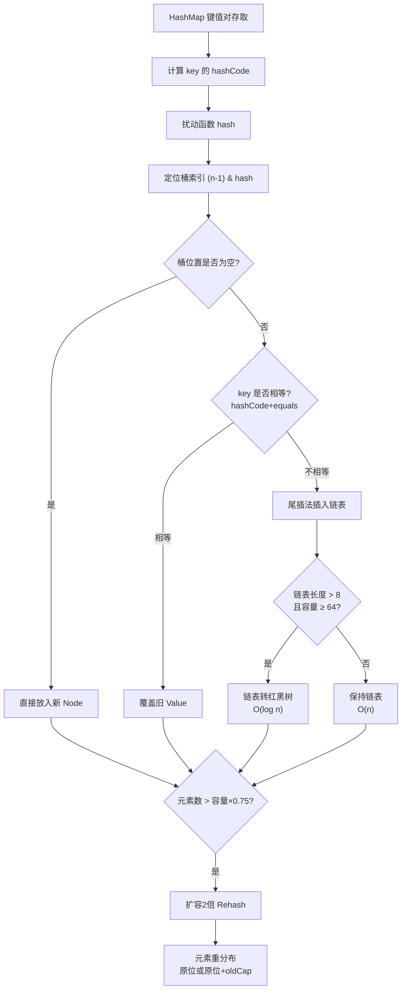

# 什么是HashMap？

HashMap 是 Java 中最常用的基于哈希表的 Map 接口实现，它存储键值对，并允许 null 键和 null 值。HashMap 不是线程安全的。

**核心原理：**
*   **数据结构**：JDK 1.8 中，HashMap 底层采用**数组 + 链表 + 红黑树**的结构。
*   **解决哈希冲突**：使用**链地址法**（拉链法）。当计算出的索引位置已有元素时，新元素以链表形式追加。
*   **红黑树优化**：为了防止链表过长导致查询效率降低（从 O(1) 退化为 O(n)），当链表长度超过 8 **且** 数组长度大于等于 64 时，链表会转化为**红黑树**；当节点数减少到 6 时，红黑树退化回链表。查询效率提升至 O(logn)。
*   **容量与扩容**：
    *   默认初始容量为 16，默认负载因子为 0.75。
    *   当元素个数 > 容量 × 负载因子时，触发扩容，容量扩大为原来的 2 倍。
    *   JDK 1.8 优化了扩容：通过 `(e.hash & oldCap) == 0` 判断元素位置，元素要么留在原位，要么移动到「原位置 + 原容量」的位置，无需像 JDK 1.7 那样重新计算 hash。
*   **插入方式**：JDK 1.8 采用**尾插法**（避免并发扩容时链表成环死循环），JDK 1.7 是头插法。

**HashMap 内部结构示意图（JDK 1.8）：**
```text
数组索引    (Node<K,V>[] table)
   0  --> [ Entry ]
   1  --> null
   2  --> [ Entry ] --> [ Entry ] --> [ Entry ] (链表)
   3  --> [ Entry ] --> [ Entry ] --> [ TreeNode ] (红黑树节点)
   ...      ...
   n-1 --> [ Entry ]
```

### 实战案例
在一个高并发统计服务中，我们使用 HashMap 统计频率，导致 CPU 飙升 100% 且响应极慢。排查发现在扩容期间，大量线程触发了 resize 操作，且因哈希冲突严重导致链表过长，最后改用 `ConcurrentHashMap` 并预估初始容量解决了性能抖动。

### 代码示例 (Java 避免扩容初始化)
```java
// 场景：预计存放 1000 个元素，避免频繁扩容
// 计算公式：expectedSize / 0.75 + 1
int initialCapacity = (int) (1000 / 0.75F) + 1;
Map<String, User> userMap = new HashMap<>(initialCapacity);
```

**## 常见考点**
1.  **为什么链表转红黑树的阈值是 8 且要求数组长度大于 64**：8 是根据泊松分布计算出的最佳平衡点。如果数组长度很小（如小于 64），即使链表很长，优先考虑扩容数组而不是转树，因为扩容能更有效地分散 hash 冲突。
2.  **线程安全问题**：HashMap 在并发扩容（JDK 1.7 的头插法死循环）或并发 put（数据覆盖）时会出现问题。替代方案有 `ConcurrentHashMap`（推荐）、`Collections.synchronizedMap` 或 `Hashtable`。
3.  **Hash 计算过程**：JDK 1.8 中，调用 `key.hashCode()` 得到 h，然后执行 `h ^ (h >>> 16)`（高低 16 位异或），目的是为了扰动 hash 值，让低 16 位也包含高位的特征，减少 hash 碰撞，再通过 `(n - 1) & hash` 计算索引（n 为数组长度，必须是 2 的幂）。

## 技术原理

**JDK1.8 引入红黑树解决链表过长**
JDK 1.7 的 HashMap 是数组+链表，哈希冲突严重时某个桶的链表可能很长，查询退化为 O(n)。JDK 1.8 引入红黑树：当链表长度超过 8 且数组长度 ≥ 64 时，链表转为红黑树，查询提升到 O(log n)；节点数降到 6 时退化回链表。阈值 8 是基于泊松分布算出的——在良好 hash 函数下，单个桶达到 8 的概率约为 0.00000006，属于极端情况。

**扩容阈值：默认容量 × 负载因子（0.75）**
默认初始容量 16，负载因子 0.75，即元素数达到 12 时触发扩容，容量翻倍为 32。0.75 是时间与空间的折中：太小浪费内存，太大冲突增多导致查询变慢。扩容时元素要么留在原位，要么移动到"原位置+原容量"的位置（依据 `e.hash & oldCap` 判断），无需重新计算 hash。

**线程不安全：并发扩容死链（1.7）或数据覆盖（1.8）**
JDK 1.7 采用头插法，并发扩容时可能形成环形链表，get 操作陷入死循环（CPU 100%）。JDK 1.8 改为尾插法解决了死循环，但并发 put 仍会出现数据覆盖（两个线程同时判断 hash 桶为空，后写的覆盖先写的）。生产环境并发场景必须使用 `ConcurrentHashMap`。

## 代码示例

```java
// 预设容量避免频繁扩容（典型避坑）
// 场景：已知要存 1000 个元素
// 公式：expectedSize / 0.75 + 1，向上取整
int cap = (int) (1000 / 0.75F) + 1;   // 1334
Map<String, User> userMap = new HashMap<>(cap);
// 否则 HashMap 会经历 16→32→64→...→2048 共 7 次扩容，每次都要 rehash
```

```java
// 红黑树转换条件的源码逻辑（简化）
final void treeifyBin(Node<K,V>[] tab, int hash) {
    if (tab == null || tab.length < MIN_TREEIFY_CAPACITY) // < 64
        resize();           // 容量不够先扩容，不转树
    else {
        // 链表长度 > 8 且容量 >= 64，才转红黑树
        TreeNode<K,V> td = replaceWithTree(...);
    }
}
```

## 注意事项

- 底层结构演进：JDK1.8 为数组+链表+红黑树（解决哈希冲突退化）。
- 关键阈值记忆：链表超 8 且数组满 64 转红黑树，退化为 6；初始 16，扩容 2 倍。
- 并发致命 Bug：因为 JDK1.7 头插法导致死循环，所以 JDK1.8 改为尾插法（但依然非线程安全）。
- 避坑指南：已知数据量时务必预设容量（expectedSize / 0.75 + 1）防止频繁扩容抖动。
- 作为 HashMap 的 key 必须正确重写 hashCode 和 equals，且 key 对象最好是不可变类，否则 put 后修改字段会导致 get 失败。


## 核心架构图


## 核心知识点图


## 记忆要点

- 底层结构演进：JDK1.8为数组+链表+红黑树（解决哈希冲突退化）。
- 关键阈值记忆：链表超8且数组满64转红黑树，退化为6；初始16，扩容2倍。
- 并发致命Bug：因为JDK1.7头插法导致死循环，所以JDK1.8改为尾插法（但依然非线程安全）。
- 避坑指南：已知数据量时务必预设容量（expectedSize / 0.75 + 1）防止频繁扩容抖动。

## 结构化回答

**30 秒电梯演讲：** 基于数组+链表+红黑树的哈希表，通过哈希定位快速存取键值对。打个比方，像一个大停车场（数组），车位停满后就在后面排队（链表），排队太长就变成多层结构（红黑树）管理。

**展开框架：**
1. **底层结构演进** — JDK1.8为数组+链表+红黑树（解决哈希冲突退化）。
2. **关键阈值记忆** — 链表超8且数组满64转红黑树，退化为6；初始16，扩容2倍。
3. **并发致命Bug** — 因为JDK1.7头插法导致死循环，所以JDK1.8改为尾插法（但依然非线程安全）。

**收尾：** 我在项目里踩过坑——在一个高并发统计服务中，我们使用 HashMap 统计频率，导致 CPU 飙升 100% 且响应极慢。您想深入聊哪一段：原理、避坑还是对比选型？

## 视频脚本

> 预计时长：3 分钟 | 由浅入深

| 时间 | 画面/字幕 | 口播台词 | 讲解要点 |
|------|----------|----------|----------|
| 0:00 | 标题卡：什么是HashMap | "什么是HashMap？一句话——像一个大停车场（数组），车位停满后就在后面排队（链表），排队太长就变成多层结构（红黑树）管理。" | 开场钩子 |
| 0:45 | 概念动画/示意图 | "基于数组+链表+红黑树的哈希表，通过哈希定位快速存取键值对——像一个大停车场（数组），车位停满后就在后面排队（链表），排队太长就变成多层结构（红黑树）管理" | 核心定义 |
| 1:30 | 底层结构演进示意 | "JDK1.8为数组+链表+红黑树（解决哈希冲突退化）。" | 要点1 |
| 2:15 | 关键阈值记忆示意 | "链表超8且数组满64转红黑树，退化为6；初始16，扩容2倍。" | 要点2 |
| 3:00 | 总结卡 | "记住这几条，面试不慌。下期讲进阶追问。" | 收尾 |
