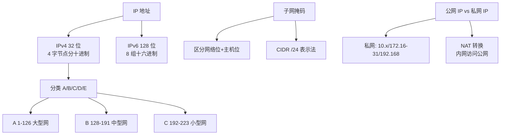

# 什么是IP基础？

IP（Internet Protocol，网际协议）位于 TCP/IP 模型的**网络层**，负责将数据包从源主机传输到目标主机。

**1. 核心作用**
*   **寻址与路由**：通过 IP 地址确定目标主机。路由器根据路由表决定数据包的转发路径。
*   **无连接**：IP 协议不维护连接状态，每个数据包独立路由（可能乱序、丢失）。
*   **不可靠**：不保证数据包一定送达，由上层（如 TCP）负责可靠性。
*   **尽力而为**：IP 协议不丢弃数据包，除非资源耗尽或传输错误。

**2. IP 地址基础**
IP 地址由**网络号**（标识网络段）和**主机号**（标识主机）组成。
*   **网络地址**：主机号全为 0，标识一个网段。
*   **广播地址**：主机号全为 1，用于向该网段所有主机发送数据。
*   **子网掩码**：用于区分 IP 地址中的网络号和主机号。

**3. IP 与 MAC 的关系**
*   **IP 地址**：工作在网络层，是逻辑地址，决定了**最终通信的终点**（端到端）。在传输过程中，源 IP 和目标 IP 通常保持不变（NAT 场景除外）。
*   **MAC 地址**：工作在数据链路层，是物理地址，决定了**下一跳的接收设备**（点到点）。在经过每个路由器时，源 MAC 和目标 MAC 都会变为新的链路两端的地址。

**4. 分片与重组**
当数据包大小超过链路的 MTU（最大传输单元）时，IP 层会对数据包进行**分片**。分片只在目标主机进行重组，中间路由器不负责重组。
*   **标识字段**：所有分片具有相同的标识，以便重组。
*   **标志位**：包含 DF（Don't Fragment，禁止分片）和 MF（More Fragments，更多分片）位。
*   **片偏移**：指出该分片在原数据报中的位置。

**5. IP 报头结构（关键字段）**
*   **版本**：IPv4 或 IPv6。
*   **TTL (Time To Live)**：生存时间，经过一个路由器减 1，为 0 时丢弃，防止数据包无限循环。
*   **协议**：指示上层协议（如 TCP=6, UDP=17, ICMP=1）。
*   **首部校验和**：只校验首部，不校验数据部分。

```text
+------------+              +------------+
|  源主机    |              |  目标主机  |
|  IP: S_IP  |              |  IP: D_IP  |
|  MAC: S_MAC|              |  MAC: D_MAC|
+-----+------+              +------+------+
      |                             |
      | 1. IP包封装 (Src=S_IP, Dst=D_IP) |
      v                             v
+-----+------+    2. 逐跳转发    +-----+------+
|  路由器 R1 | <-------------> |  路由器 R2 |
| MAC: R1_MAC|  Src=R1_MAC     | MAC: R2_MAC|
|      Dst:  |    Dst=R2_MAC   |      Dst:  |
|     R2_MAC |                |     D_MAC  |
+------------+                +------------+
```

### 实战案例
在某次接口联调中，发现通过 VPN 拨入内网后 Ping 不通服务器，但 Telnet 端口是通的。通过抓包分析发现，发出的 ICMP 包大小超过了 VPN 隧道的 MTU，导致分片被中间防火墙丢弃。解决方法是将 Ping 包大小调小或在防火墙上允许分片通过。

### 对比表格：网络层 IP vs 链路层 MAC

| 特性 | IP 地址 | MAC 地址 |
| :--- | :--- | :--- |
| **所在层级** | 网络层 (Layer 3) | 数据链路层 (Layer 2) |
| **地址性质** | 逻辑地址，可变 | 物理地址，通常固化 |
| **作用范围** | 端到端 (源主机到目的主机) | 跳到跳 (当前链路的两端设备) |
| **地址结构** | 层级式 (网络位+主机位) | 扁平式 (厂商ID+序列号) |
| **获取方式** | 静态配置/DHCP | 网卡烧录 |

**## 常见考点**
1. **TTL 的作用是什么？**
   防止数据包在网络中无限循环（路由环路），占用带宽资源。
2. **为什么中间路由器不进行分片重组？**
   为了提高路由器转发效率，且避免分片在传输路径中反复分片/重组导致性能下降。若设置了 DF 标志且超过 MTU，路由器会返回 ICMP 不可达消息。
3. **Ping 命令使用的是哪个协议？**
   Ping 使用的是 ICMP（Internet Control Message Protocol）协议，封装在 IP 层中。
4. **局域网内通信和跨网段通信的区别？**
   局域网内通过 ARP 获取对方 MAC 直接交付；跨网段通过 ARP 获取网关 MAC，交付给网关（路由器）进行路由。


## 核心架构图


## 记忆要点

- 核心特性：网络层无连接且不可靠，只提供尽力而为的寻址和路由。
- IP与MAC对比：IP是端到端不变的全局逻辑地址，MAC是逐跳变化的局部物理地址。
- 分片重组：因为中间路由器不重组以提高转发效率，所以仅在目标主机进行分片重组。
- 关键报头：TTL防环路（过路由器减1），Protocol标识上层协议（TCP=6, UDP=17）。

## 结构化回答

**30 秒电梯演讲：** 网络层核心协议，负责寻址和路由，提供无连接、不可靠的数据包传输服务。打个比方，IP像是寄件人的收件地址（全程不变），MAC像是中转站的转运标签（每段路都在变）。

**展开框架：**
1. **核心特性** — 网络层无连接且不可靠，只提供尽力而为的寻址和路由。
2. **IP与MAC对比** — IP是端到端不变的全局逻辑地址，MAC是逐跳变化的局部物理地址。
3. **分片重组** — 因为中间路由器不重组以提高转发效率，所以仅在目标主机进行分片重组。

**收尾：** 我在项目里踩过坑——在某次接口联调中，发现通过 VPN 拨入内网后 Ping 不通服务器，但 Telnet 端口是通的。您想深入聊哪一段：原理、避坑还是对比选型？

## 视频脚本

> 预计时长：3 分钟 | 由浅入深

| 时间 | 画面/字幕 | 口播台词 | 讲解要点 |
|------|----------|----------|----------|
| 0:00 | 标题卡：什么是IP基础 | "什么是IP基础？一句话——IP像是寄件人的收件地址（全程不变），MAC像是中转站的转运标签（每段路都在变）。" | 开场钩子 |
| 0:45 | 概念动画/示意图 | "网络层核心协议，负责寻址和路由，提供无连接、不可靠的数据包传输服务——IP像是寄件人的收件地址（全程不变），MAC像是中转站的转运标签（每段路都在变）" | 核心定义 |
| 1:30 | 核心特性示意 | "网络层无连接且不可靠，只提供尽力而为的寻址和路由。" | 要点1 |
| 2:15 | IP与MAC对比示意 | "IP是端到端不变的全局逻辑地址，MAC是逐跳变化的局部物理地址。" | 要点2 |
| 3:00 | 总结卡 | "记住这几条，面试不慌。下期讲进阶追问。" | 收尾 |
