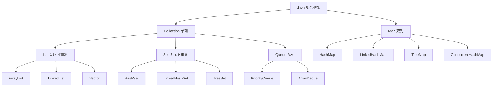

# 什么是Java集合类有哪些？

Java 集合框架主要用于存储和操作对象组。主要接口和实现类如下：

**1. 两大接口体系**
*   **Collection**：单列集合的根接口。
    *   **List**：有序、可重复。
        *   `ArrayList`：基于动态数组，查询快（O(1)），增删慢（需移动元素，平均 O(n)）。线程不安全。扩容机制为 newCapacity = oldCapacity + (oldCapacity >> 1)（即 1.5 倍）。
        *   `LinkedList`：基于双向链表，增删快（仅需修改指针，O(1)），查询慢（需遍历，O(n)）。线程不安全。
        *   `Vector`：类似 ArrayList，但线程安全（同步方法），性能较差。扩容默认为 2 倍。
    *   **Set**：无序、不可重复。
        *   `HashSet`：基于哈希表（HashMap 实例），存取速度快（O(1)），无序。允许一个 null 元素。
        *   `LinkedHashSet`：继承自 HashSet，内部维护了双向链表，维护了插入顺序。
        *   `TreeSet`：基于红黑树，可排序（自然排序或比较器排序）。
    *   **Queue**：队列，通常遵循 FIFO（先进先出）。
        *   `LinkedList`：实现了 Deque 接口，可作为双端队列。
        *   `PriorityQueue`：优先级队列，基于堆（小顶堆或大顶堆）结构，线程不安全。
        *   `ArrayBlockingQueue`：基于数组的有界阻塞队列，线程安全。
*   **Map**：双列集合，存储键值对。Key 不能重复，Value 可以重复。
    *   `HashMap`：最常用的哈希表实现，线程不安全，允许 null 键值。JDK 1.8 后由“数组+链表”变为“数组+链表+红黑树”，当链表长度超过 8 且数组长度超过 64 时，链表转为红黑树以提高查询效率。
    *   `TreeMap`：基于红黑树，Key 可排序，线程不安全。
    *   `LinkedHashMap`：继承 HashMap，维护了插入顺序或访问顺序（LRU 缓存可实现）。
    *   `Hashtable`：古老的实现，线程安全（所有方法 synchronized），不允许 null，性能较差（基本被淘汰）。
    *   `ConcurrentHashMap`：线程安全的 HashMap，JDK 1.7 使用分段锁，JDK 1.8 采用 CAS + synchronized 锁住链表/红黑树头节点，高并发场景下性能优于 Hashtable。

```text
      Iterable (接口)
          ^
          | extends
    +-----+-------+
    | Collection  |
    +-----+-------+
          ^
    +-----+-----+------------+
    |           |            |
  List       Set         Queue (接口)
    |           |            ^
ArrayList   HashSet   PriorityQueue
LinkedList  LinkedSet  LinkedList
Vector      TreeSet
```

## 常见考点
1. **HashMap 的扩容机制是怎样的？**
   当元素个数 > 数组长度 * 负载因子（默认 0.75）时触发扩容。JDK 1.7 需重新 hash，JDK 1.8 通过 (e.hash & oldCap) == 0 判断位置，索引要么不变，要么变为“原索引+oldCap”。
2. **ArrayList 和 LinkedList 的适用场景？**
   ArrayList 适用于读多写少、随机访问频繁的场景；LinkedList 适用于写多（尤其是头尾操作）、读少的场景。
3. **HashSet 是如何保证元素不重复的？**
   通过 hashCode() 计算位置，如果位置冲突则调用 equals() 比较。如果 hashCode 不同则直接存入；如果相同且 equals 返回 true 则视为重复，不存入。
4. **ConcurrentHashMap 在 JDK 1.8 中为何放弃分段锁？**
   分段锁（Segment）并发粒度是基于 Segment 的，而 JDK 1.8 锁的粒度降到了 Node（首节点），并发度更高。且在内存占用上，Segment 继承自 ReentrantLock，占用空间较大，1.8 的实现更为轻量。

### 实战案例
在高并发场景下（如秒杀系统库存扣减），若直接使用 `HashMap` 会导致 CPU 飙高（扩容死链）或数据覆盖。曾遇到生产环境使用 `Hashtable` 导致响应缓慢，替换为 `ConcurrentHashMap` 后吞吐量提升 3 倍以上。

### 代码示例
```java
// HashSet 去重原理演示：必须重写 hashCode 和 equals
public class User {
    private String name;
    // 重写 hashCode: 只要 name 相同，hash 值就相同
    @Override
    public int hashCode() { return name == null ? 0 : name.hashCode(); }
    // 重写 equals: 判断内容一致性
    @Override
    public boolean equals(Object obj) { return this.name.equals(((User)obj).name); }
}
Set<User> users = new HashSet<>();
users.add(new User("Alice")); // 存入
users.add(new User("Alice")); // 重复，不会存入
```

### 核心对比
| 特性 | HashMap | Hashtable | ConcurrentHashMap (JDK 1.8) |
| :--- | :--- | :--- | :--- |
| **线程安全** | 不安全 | 安全 (全表锁) | 安全 (CAS + synchronized) |
| **性能** | 高 | 低 | 高 (接近 HashMap) |
| **Null 键/值** | 允许 | 不允许 | 不允许 |
| **迭代器** | Fail-Fast | Fail-Safe | Weakly Consistent |


## 核心架构图


## 记忆要点

- 两大顶级接口：Collection存单列（List/Set/Queue），Map存双列KV键值对。
- List对比：ArrayList查快增删慢（数组1.5倍扩），LinkedList查慢增删快（双向链表）。
- Map演进：HashMap非线程安全（允null），高并发必选ConcurrentHashMap。
- HashSet去重原理：因为底层基于HashMap，所以必须正确重写对象的hashCode和equals。

## 结构化回答

**30 秒电梯演讲：** Java存储对象数据的容器框架，分为Collection单列和Map双列体系。打个比方，就像不同用途的容器：List是排队插队（有顺序），Set是点名册（不重复），Map是字典（按词查义）。

**展开框架：**
1. **两大顶级接口** — Collection存单列（List/Set/Queue），Map存双列KV键值对。
2. **List对比** — ArrayList查快增删慢（数组1.5倍扩），LinkedList查慢增删快（双向链表）。
3. **Map演进** — HashMap非线程安全（允null），高并发必选ConcurrentHashMap。

**收尾：** 我在项目里踩过坑——在高并发场景下（如秒杀系统库存扣减），若直接使用 `HashMap` 会导致 CPU 飙高（扩容死链）或数据覆盖。您想深入聊哪一段：原理、避坑还是对比选型？

## 视频脚本

> 预计时长：3 分钟 | 由浅入深

| 时间 | 画面/字幕 | 口播台词 | 讲解要点 |
|------|----------|----------|----------|
| 0:00 | 标题卡：什么是Java集合类有哪些 | "什么是Java集合类有哪些？一句话——就像不同用途的容器：List是排队插队（有顺序），Set是点名册（不重复），Map是字典（按词查义）。" | 开场钩子 |
| 0:45 | 概念动画/示意图 | "Java存储对象数据的容器框架，分为Collection单列和Map双列体系——就像不同用途的容器：List是排队插队（有顺序），Set是点名册（不重复），Map是字典（按词查义）" | 核心定义 |
| 1:30 | 两大顶级接口示意 | "Collection存单列（List/Set/Queue），Map存双列KV键值对。" | 要点1 |
| 2:15 | List对比示意 | "ArrayList查快增删慢（数组1.5倍扩），LinkedList查慢增删快（双向链表）。" | 要点2 |
| 3:00 | 总结卡 | "记住这几条，面试不慌。下期讲进阶追问。" | 收尾 |
