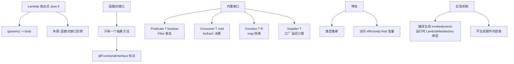

# 什么是Lambda 表达式？

Lambda 表达式是 Java 8 引入的一个重要特性，它允许我们将函数作为参数传递给方法，或者将代码看作数据，使代码更加简洁灵活。

**1. 核心概念**
Lambda 表达式实质上是**函数式接口**（Functional Interface，即只包含一个抽象方法的接口）的一个实例。

**2. 语法格式**
```java
(parameters) -> expression
或
(parameters) -> { statements; }
```
*   **参数列表**：对应接口中抽象方法的参数。参数类型可省略（编译器推断）。如果只有一个参数，括号可省略。
*   **箭头符号**：`->`，将参数列表与函数体分开。
*   **函数体**：可以是表达式或代码块。如果只有一条语句，大括号和 `return` 关键字可省略。

**3. 方法引用**
如果 Lambda 体中的内容仅仅是调用某个特定方法，可以使用方法引用进一步简化。
*   **对象::实例方法**：如 `System.out::println`
*   **类::静态方法**：如 `Math::max`
*   **类::实例方法**：如 `String::compareTo`

**4. 常用应用场景**
*   集合的遍历（`forEach`）
*   集合的排序（`sort`）
*   Stream API 流式操作（`filter`, `map` 等）

### 实战案例
在做日志打印时，为了防止字符串拼接造成的性能浪费，常利用 Lambda 的惰性求值特性。例如使用 SLF4J 的 `logger.isDebugEnabled()` 判断，或者使用 Lambda 版本的日志输出（如 `logger.info(() -> "expensive data: " + getData())`），仅在日志级别启用时才执行拼接。

### 代码示例
```java
// 传统方式 vs Lambda 方式实现线程启动
// 传统：new Thread(new Runnable() { @Override public void run() { System.out.println("Hello"); } }).start();

// Lambda：简洁明了
new Thread(() -> System.out.println("Hello")).start();

// List 排序实战
List<String> names = Arrays.asList("Charlie", "Alice", "Bob");
Collections.sort(names, (s1, s2) -> s1.compareTo(s2)); // 升序
// 更极致的方法引用
names.sort(String::compareToIgnoreCase);
```

### 核心对比
| 特性 | 匿名内部类 | Lambda 表达式 |
| :--- | :--- | :--- |
| **this 关键字** | 指向匿名内部类实例 | 指向外部类实例 |
| **编译产物** | 生成 `.class` 文件 | 不生成单独文件，调用 `invokedynamic` |
| **作用域** | 可覆盖外部类的变量 | 局部变量必须隐式 final (Effectively Final) |
| **适用范围** | 接口或抽象类 | 仅限函数式接口 |


## 核心架构图


## 核心知识点图


## 记忆要点

- 本质是函数式接口的实例，实现函数作参数传递，使代码更简洁灵活。
- 标准语法：(参数) -> 函数体；单参数可省括号，单语句可省大括号和return。
- 极致简写是方法引用（如类::静态方法），常配合Stream API或集合遍历使用。
- 对比内部类：Lambda无独立class文件且this指向外部类，仅限函数式接口。
- 实战亮点：利用其惰性求值特性，可完美避免日志打印中的字符串拼接浪费。

## 结构化回答

**30 秒电梯演讲：** 匿名函数的简写形式，支持将代码块作为参数传递，实现函数式编程风格。打个比方，像是把“要做的事”写在纸条上递给别人，而不用专门为此写一份完整的说明书。

**展开框架：**
1. **本质是函数式接口的实例** — 实现函数作参数传递，使代码更简洁灵活。
2. **标准语法** — (参数) -> 函数体；单参数可省括号，单语句可省大括号和return。
3. **极致简写是方法引用** — :静态方法），常配合Stream API或集合遍历使用。

**收尾：** 我在项目里踩过坑——在做日志打印时，为了防止字符串拼接造成的性能浪费，常利用 Lambda 的惰性求值特性。您想深入聊哪一段：原理、避坑还是对比选型？

## 视频脚本

> 预计时长：3 分钟 | 由浅入深

| 时间 | 画面/字幕 | 口播台词 | 讲解要点 |
|------|----------|----------|----------|
| 0:00 | 标题卡：什么是Lambda 表达式 | "什么是Lambda 表达式？一句话——像是把“要做的事”写在纸条上递给别人，而不用专门为此写一份完整的说明书。" | 开场钩子 |
| 0:45 | 概念动画/示意图 | "匿名函数的简写形式，支持将代码块作为参数传递，实现函数式编程风格——像是把“要做的事”写在纸条上递给别人，而不用专门为此写一份完整的说明书" | 核心定义 |
| 1:30 | 本质是函数式接口的实例示意 | "实现函数作参数传递，使代码更简洁灵活。" | 要点1 |
| 2:15 | 标准语法示意 | "(参数) -> 函数体；单参数可省括号，单语句可省大括号和return。" | 要点2 |
| 3:00 | 总结卡 | "记住这几条，面试不慌。下期讲进阶追问。" | 收尾 |
