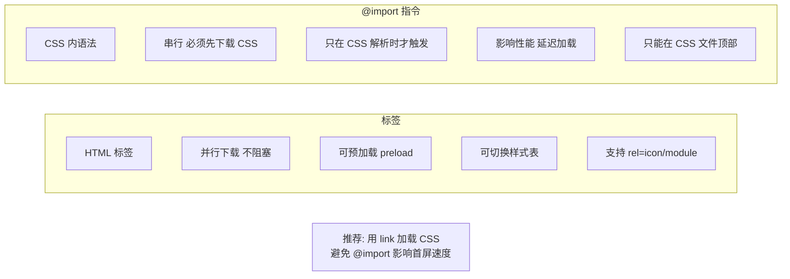

# 什么是LinkList（链表）？

LinkedList 是 Java List 接口的一种实现，底层基于**双向链表**结构。

**1. 数据结构**
*   内部维护了 `first` 和 `last` 两个指针，分别指向头节点和尾节点。
*   每个节点（Node）包含三个部分：数据项、前驱节点的引用、后继节点的引用。

**2. 性能特点**
*   **增删快**：在链表头部或尾部插入/删除元素时，时间复杂度为 O(1)。在指定位置插入/删除，只需修改指针引用，不需要像 ArrayList 那样移动大量元素，但需要遍历找到位置，整体复杂度为 O(n)。
*   **查询慢**：访问特定索引的元素时，需要从头或尾开始遍历，时间复杂度为 O(n)。

**3. 其他特性**
*   **实现了 Deque 接口**：LinkedList 除了作为 List 使用，还可以作为**双端队列**（Deque）、**栈**（Stack）使用。它提供了 `push`、`pop`（栈操作）、`offer`、`poll`（队列操作）等方法。
*   **线程不安全**：与 ArrayList 一样，LinkedList 不是线程安全的。

```text
  +------+   prev   +------+   prev   +------+   prev   +------+
  | NULL | <------- | item | <------- | item | <------- | item | <------- | NULL |
  +------+   next   +------+   next   +------+   next   +------+
   ^ first                                                  ^ last
```

## 常见考点
1. **LinkedList 为什么不建议作为队列的首选？**
   虽然它实现了 Deque 接口，但每个节点都需要维护额外的 prev/next 指针，内存开销比 ArrayDeque（基于数组循环实现）大，且数组在 CPU 缓存命中率上通常优于链表节点。
2. **LinkedList 插入数据时一定比 ArrayList 快吗？**
   不一定。如果是在指定索引（如 list.add(100, element)）插入，两者都需要先遍历到第 100 个位置（LinkedList O(n)，ArrayList O(1) 到达位置），此时 ArrayList 的数据移动可能比 LinkedList 的节点创建和指针修改更高效。
3. **LinkedList 是如何实现双向遍历的？**
   内部 Node 类包含 prev 和 next 指针，ListIterator 通过维护当前节点的引用和 cursor 索引，利用 next() 和 previous() 在指针间移动。

### 实战案例
在实现一个简单的“最近取消的订单”撤销栈功能时，可以使用 LinkedList。每次取消订单调用 `push(order)`，用户点击撤销时调用 `pop()`。但要注意，由于 LinkedList 内存占用较高，如果订单数据量极大（如十万级），容易引发频繁 Young GC，此时需改用基于数组的结构。

### 代码示例
```java
LinkedList<Integer> stack = new LinkedList<>();
// 栈操作：压入
stack.push(1); 
stack.push(2);
// 栈操作：弹出 (LIFO)
System.out.println(stack.pop()); // 输出 2

// 队列操作：FIFO
stack.offer(3);
System.out.println(stack.poll()); // 输出 1 (因为是链表，先来后到，1还在头部)
```

### 核心对比
| 操作 | ArrayList | LinkedList | ArrayDeque (JDK推荐) |
| :--- | :--- | :--- | :--- |
| **底层结构** | 动态数组 | 双向链表 | 循环数组 |
| **随机访问** | O(1) **快** | O(n) 慢 | O(1) **快** |
| **头尾插入** | O(1) (需扩容) | O(1) | O(1) **快** |
| **内存开销** | 较小 (仅数据) | 较大 (含前后指针) | 较小 |
| **CPU 缓存** | 高 (连续内存) | 低 (离散内存) | 高 |


## 核心架构图


## 核心知识点图


## 记忆要点

- 底层结构：双向链表，首尾指针相连，首尾增删极快O(1)，但指定索引查询极慢O(n)。
- 多面手特性：实现Deque接口，既可作队列(FIFO)使用，又可作栈(LIFO)使用。
- 场景对比：因为内存开销大且CPU缓存不友好，所以作队列/栈时首选ArrayDeque而非LinkedList。

## 结构化回答

**30 秒电梯演讲：** 基于双向链表实现的List，增删快查询慢，可用作栈或队列。打个比方，像一列火车，每节车厢（节点）连在一起。加车厢只需挂两头（增删快），但找第5节车厢得一节节数（查询慢）。

**展开框架：**
1. **底层结构** — 双向链表，首尾指针相连，首尾增删极快O(1)，但指定索引查询极慢O(n)。
2. **多面手特性** — 实现Deque接口，既可作队列(FIFO)使用，又可作栈(LIFO)使用。
3. **场景对比** — 因为内存开销大且CPU缓存不友好，所以作队列/栈时首选ArrayDeque而非LinkedList。

**收尾：** 我在项目里踩过坑——在实现一个简单的“最近取消的订单”撤销栈功能时，可以使用 LinkedList。您想深入聊哪一段：原理、避坑还是对比选型？

## 视频脚本

> 预计时长：3 分钟 | 由浅入深

| 时间 | 画面/字幕 | 口播台词 | 讲解要点 |
|------|----------|----------|----------|
| 0:00 | 标题卡：什么是LinkList（链表） | "什么是LinkList（链表）？一句话——像一列火车，每节车厢（节点）连在一起。加车厢只需挂两头（增删快），但找第5节车厢得一节节数（查询慢）。" | 开场钩子 |
| 0:45 | 概念动画/示意图 | "基于双向链表实现的List，增删快查询慢，可用作栈或队列——像一列火车，每节车厢（节点）连在一起。加车厢只需挂两头（增删快），但找第5节车厢得一节节数（查询慢）" | 核心定义 |
| 1:30 | 底层结构示意 | "双向链表，首尾指针相连，首尾增删极快O(1)，但指定索引查询极慢O(n)。" | 要点1 |
| 2:15 | 多面手特性示意 | "实现Deque接口，既可作队列(FIFO)使用，又可作栈(LIFO)使用。" | 要点2 |
| 3:00 | 总结卡 | "记住这几条，面试不慌。下期讲进阶追问。" | 收尾 |
