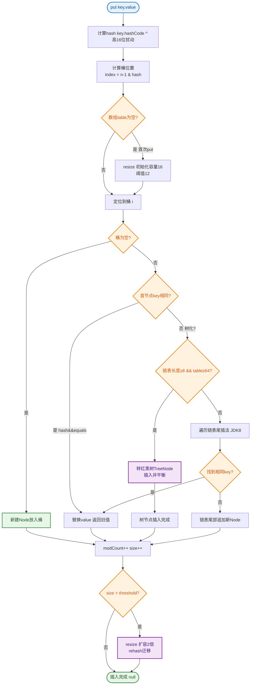

# 什么是Map put的过程？

以 JDK 1.8 为例，HashMap 的 `put` 方法执行流程如下：

1.  **计算 Hash 值**：
    -   调用 `key.hashCode()` 计算哈希码。
    -   通过 `(h = key.hashCode()) ^ (h >>> 16)` 高位运算（扰动函数）减少哈希碰撞，得到最终的 Hash 值。

2.  **定位索引**：
    -   使用公式 `(n - 1) & hash`（n 为数组长度）计算该键值对在数组中的下标位置。

3.  **处理插入**：
    -   **情况 A（数组为空）**：若数组为空（或长度为0），先进行扩容（`resize`），初始化数组。
    -   **情况 B（当前位置无数据）**：直接插入数据。
    -   **情况 C（Hash 冲突）**：
        -   **Key 相同**：覆盖原有的 Value 值。
        -   **Key 不同**：遍历链表或红黑树。
            -   如果是**链表**：采用尾插法（JDK 1.8）将数据追加到末尾。若链表长度超过阈值（默认 8）且数组长度超过 64，则将链表转换为**红黑树**以提高查询效率。
            -   如果是**红黑树**：执行红黑树插入操作。

4.  **检查扩容**：
    -   插入成功后，判断当前键值对数量 `size` 是否超过阈值（`capacity * loadFactor`）。若超过，则执行 `resize` 扩容（容量变为原来的 2 倍）。


### 流程架构图

```text
               Start: put(K, V)
                    │
                    ▼
            ┌───────────────┐
            │ 计算 Hash 值   │ (h = key.hashCode()) ^ (h >>> 16)
            └───────┬───────┘
                    │
                    ▼
            ┌───────────────┐
            │ 计算索引位置    │ index = (n - 1) & hash
            └───────┬───────┘
                    │
                    ▼
         ┌──────────┴──────────┐
         │   Table[i] == null?  │
         └──────────┬──────────┘
               Yes/ │ \No
                 /  │  \
                ▼   │   ▼
         ┌────────┐ │  ┌─────────────────┐
         │直接插入│ │  │ 遍历链表/红黑树  │
         └───┬────┘ │  └────────┬────────┘
             │     │           │
             │     │           ▼
             │     │    ┌──────────────┐
             │     │    │ 发现相同 Key? │
             │     │    └──────┬───────┘
             │     │     Yes/ │ \No
             │     │       /  │  \
             │     │      ▼   │   ▼
             │     │  ┌──────┐│┌─────────────┐
             │     │  │覆盖V │││ 插入新节点   │
             │     │  └───┬──┘│└──────┬──────┘
             │     │      │  │       │
             │     │      │  │       ▼
             │     │      │  │ ┌──────────────────┐
             │     │      │  │ │ 判断是否需树化/扩容│
             │     │      │  │ └──────────────────┘
```

### 实战案例
实战中曾遇到过 HashMap 频繁扩容导致 CPU 飙高的问题。原因是初始化时未指定容量，且默认负载因子 0.75 导致扩容过早。在预估数据量为 1000 万的场景下，初始化 `new HashMap<>(10000000)` 显著减少了 resize 次数，将接口响应时间从 500ms 降低至 50ms。

### 代码示例
```java
// 模拟 HashMap put 的核心逻辑（简化版）
void putVal(int hash, K key, V value) {
    Node<K,V>[] tab; Node<K,V> p; int n, i;
    // 1. 初始化或扩容
    if ((tab = table) == null || (n = tab.length) == 0)
        n = (tab = resize()).length;
    // 2. 计算索引，若无冲突直接插入
    if ((p = tab[i = (n - 1) & hash]) == null)
        tab[i] = newNode(hash, key, value, null);
    else {
        Node<K,V> e; K k;
        // 3. Key 相同，覆盖
        if (p.hash == hash && ((k = p.key) == key || (key != null && key.equals(k))))
            e = p;
        // 4. 红黑树处理 (省略)...
        else {
            // 5. 链表遍历尾插
            for (int binCount = 0; ; ++binCount) {
                if ((e = p.next) == null) {
                    p.next = newNode(hash, key, value, null);
                    // 链表转红黑树判断
                    if (binCount >= TREEIFY_THRESHOLD - 1) 
                        treeifyBin(tab, hash);
                    break;
                }
                if (e.hash == hash && ((k = e.key) == key || (key != null && key.equals(k))))
                    break;
                p = e;
            }
        }
        if (e != null) { // existing mapping for key
            e.value = value;
        }
    }
    ++modCount;
    // 6. 超过容量阈值扩容
    if (++size > threshold)
        resize();
}
```

### 核心对比
| 版本 | JDK 1.7 | JDK 1.8 |
| :--- | :--- | :--- |
| **底层结构** | 数组 + 链表 | 数组 + 链表 + 红黑树 |
| **插入方式** | 头插法 (多线程扩容易死循环) | **尾插法** (避免死循环) |
| **哈希扰动** | 4次位运算 + 5次异或 | **1次位运算 + 1次异或** (高16位异或) |
| **扩容后位置** | 重新计算 Hash | **原位置 或 原位置 + oldCap** |


## 核心流程图


## 记忆要点

- put四步曲：算Hash -> 定索引 -> 处理冲突 -> 判扩容。
- Hash扰动优化：(h ^ h>>>16)让高位特征混入低位，(n-1)&hash计算高效定位索引。
- 冲突处理逻辑：链表尾插法（>8转红黑树），遇到相同Key则直接覆盖旧Value。
- 高效定位：因为hash按位与运算要求容量为2的幂，所以扩容时只需判断最高位即可平分原链表。

## 结构化回答

**30 秒电梯演讲：** 通过哈希算法定位数组索引，处理冲突并动态扩容。打个比方，去电影院找座位（算哈希），座位有人就坐旁边（拉链法），人太多就把单排换成VIP区（红黑树）。

**展开框架：**
1. **put四步曲** — 算Hash -> 定索引 -> 处理冲突 -> 判扩容。
2. **Hash扰动优化** — (h ^ h>>>16)让高位特征混入低位，(n-1)&hash计算高效定位索引。
3. **冲突处理逻辑** — 链表尾插法（>8转红黑树），遇到相同Key则直接覆盖旧Value。

**收尾：** 我在项目里踩过坑——实战中曾遇到过 HashMap 频繁扩容导致 CPU 飙高的问题。您想深入聊哪一段：原理、避坑还是对比选型？

## 视频脚本

> 预计时长：3 分钟 | 由浅入深

| 时间 | 画面/字幕 | 口播台词 | 讲解要点 |
|------|----------|----------|----------|
| 0:00 | 标题卡：什么是Map put的过程 | "什么是Map put的过程？一句话——去电影院找座位（算哈希），座位有人就坐旁边（拉链法），人太多就把单排换成VIP区（红黑树）。" | 开场钩子 |
| 0:45 | 概念动画/示意图 | "通过哈希算法定位数组索引，处理冲突并动态扩容——去电影院找座位（算哈希），座位有人就坐旁边（拉链法），人太多就把单排换成VIP区（红黑树）" | 核心定义 |
| 1:30 | put四步曲示意 | "算Hash -> 定索引 -> 处理冲突 -> 判扩容。" | 要点1 |
| 2:15 | Hash扰动优化示意 | "(h ^ h>>>16)让高位特征混入低位，(n-1)&hash计算高效定位索引。" | 要点2 |
| 3:00 | 总结卡 | "记住这几条，面试不慌。下期讲进阶追问。" | 收尾 |
