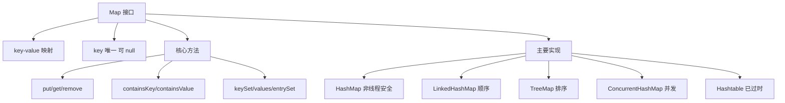

# 什么是Map接口？

**Map 接口**是 Java 集合框架中独立于 Collection 体系的接口，用于存储键值对（Key-Value）映射。

## 核心特点

- 每个元素包含一个 Key 和一个 Value
- **Key 不允许重复**（重复则覆盖旧值）
- Key 和 Value 都可以为 null（HashMap 允许，ConcurrentHashMap 不允许）
- 不继承 Collection 接口

### 💡 实战案例
> 在缓存本地计算结果时（如 `Map<Request, Response>`），若 Key 为自定义对象且未重写 `hashCode`，会导致内存泄漏（对象重复创建无法命中旧缓存）。

## 常用方法

```java
Map<String, Integer> map = new HashMap<>();
map.put("Java", 1);         // 添加/更新
map.get("Java");             // 获取 → 1
map.containsKey("Java");     // 是否包含key → true
map.containsValue(1);        // 是否包含value → true
map.remove("Java");          // 删除
map.size();                  // 大小
map.keySet();                // 所有key的Set
map.values();                // 所有value的Collection
map.entrySet();              // 所有键值对的Set
```

## 常见实现类

| 实现类 | 数据结构 | 特点 | 线程安全 |
|--------|----------|------|----------|
| **HashMap** | 数组+链表+红黑树 | 无序，O(1)查找 | ❌ |
| **LinkedHashMap** | HashMap+双向链表 | 保持插入顺序或访问顺序 | ❌ |
| **TreeMap** | 红黑树 | 按Key排序 | ❌ |
| **Hashtable** | 数组+链表 | 遗留类，全锁，不允许 null | ✅ |
| **ConcurrentHashMap** | CAS + Sync/Node | 高并发，分段锁（JDK1.7）或CAS+Sync（JDK1.8） | ✅ |

## 遍历方式

```java
// 方式1: entrySet（推荐，避免二次查找）
for (Map.Entry<String, Integer> entry : map.entrySet()) {
    System.out.println(entry.getKey() + ":" + entry.getValue());
}

// 方式2: keySet
for (String key : map.keySet()) {
    System.out.println(key + ":" + map.get(key));
}

// 方式3: forEach (Java 8+)
map.forEach((k, v) -> System.out.println(k + ":" + v));
```

### 常见考点
1. **HashMap 为什么不是线程安全的？**
   - 在并发扩容或 put 操作时，可能导致数据覆盖（丢失）或 JDK 1.7 的死循环（链表环）。
2. **HashMap 中如果 Key 是自定义对象，需要注意什么？**
   - 必须正确重写 `hashCode()` 和 `equals()` 方法，确保相同的 Key 对象计算出相同的 Hash 值且判定相等。
3. **LinkedHashMap 如何实现 LRU 缓存？**
   - 通过设置 `accessOrder=true`，将访问顺序改为最近最少使用（LRU）顺序，每次访问（get/put）都会将节点移至链表尾部。


## 核心架构图


## 记忆要点

- 核心特征：独立于Collection体系，存储键值对映射，Key绝不允许重复。
- 自定义Key铁律：必须重写hashCode()和equals()，否则会导致内存泄漏或缓存失效。
- 遍历最优解：推荐使用entrySet，一次取出KV，避免keySet的二次get查找开销。

## 结构化回答

**30 秒电梯演讲：** 存储键值对映射，Key不可重复的独立体系。打个比方，像字典查单词，通过唯一的词条快速找到对应的解释。

**展开框架：**
1. **核心特征** — 独立于Collection体系，存储键值对映射，Key绝不允许重复。
2. **自定义Key铁律** — 必须重写hashCode()和equals()，否则会导致内存泄漏或缓存失效。
3. **遍历最优解** — 推荐使用entrySet，一次取出KV，避免keySet的二次get查找开销。

**收尾：** 我在项目里踩过坑——> 在缓存本地计算结果时（如 `Map<Request, Response>`），若 Key 为自定义对象且未重写 `hashCode`，会导致内存泄漏（对象重复创建无法命中旧缓存）。您想深入聊哪一段：原理、避坑还是对比选型？

## 视频脚本

> 预计时长：2 分钟 | 由浅入深

| 时间 | 画面/字幕 | 口播台词 | 讲解要点 |
|------|----------|----------|----------|
| 0:00 | 标题卡：什么是Map接口 | "什么是Map接口？一句话——像字典查单词，通过唯一的词条快速找到对应的解释。" | 开场钩子 |
| 0:40 | 概念动画/示意图 | "存储键值对映射，Key不可重复的独立体系——像字典查单词，通过唯一的词条快速找到对应的解释" | 核心定义 |
| 1:20 | 核心特征示意 | "独立于Collection体系，存储键值对映射，Key绝不允许重复。" | 要点1 |
| 2:00 | 总结卡 | "记住这几条，面试不慌。下期讲进阶追问。" | 收尾 |
