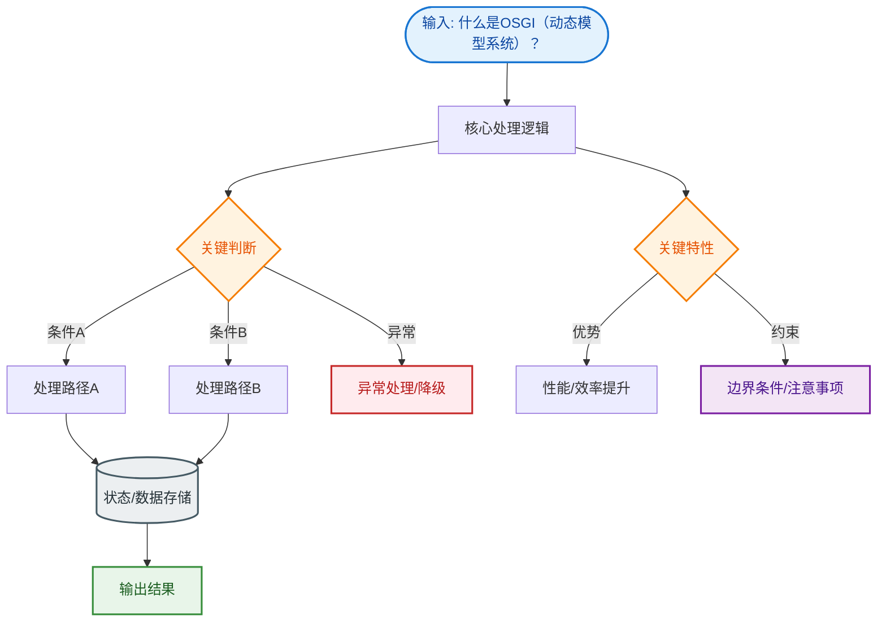

# 什么是OSGI（动态模型系统）？

**OSGi**（Open Services Gateway initiative）是 Java 平台上的一套模块化系统和面向服务的架构规范。

## 核心概念

1.  **模块化**：
    -   OSGi 将应用程序划分为多个模块，称为 Bundle。
    -   每个 Bundle 都有独立的 ClassPath，实现了逻辑和物理上的高内聚、低耦合。
    -   通过 `MANIFEST.MF` 文件定义 Bundle 的依赖关系和导出/导入包。

2.  **动态化**：
    -   **热插拔**：支持在运行时安装、启动、停止、更新和卸载 Bundle，而无需重启 JVM。
    -   这使得企业级应用可以在线升级，极大地提高了系统的可维护性和可用性。

3.  **服务注册与发现**：
    -   OSGi 提供了一个服务注册中心，Bundle 可以将服务对象注册到其中，其他 Bundle 通过接口动态查找和调用服务。
    -   面向服务的编程模型进一步降低了模块间的依赖。

### 💡 实战案例
> 在大型电信网关中，需在不中断业务的情况下升级某个协议解析模块。利用 OSGi 的 Stop/Update/Start 生命周期，单个 Bundle 更新时流量自动切换至旧版本，新版本就绪后再切换。

## 底层机制

-   **类加载机制**：OSGi 实现了网状类加载模型，打破了 Java 双亲委派模型。每个 Bundle 都有独立的类加载器，按需加载，能够同时加载同一个类的不同版本。

## 应用场景

-   IDE 插件开发（如 Eclipse 基于 OSGi）。
-   智能家居网关。
-   大型企业级应用的模块化部署和微服务化（早期方案）。

> 注意：虽然 OSGi 功能强大，但也引入了额外的复杂度和调试难度，适用于对模块化和动态性要求极高的场景。

---

### OSGi 架构与类加载模型

```text
      [Bundle A]              [Bundle B]
    ┌─────────────┐        ┌─────────────┐
    │ Export: PkgX│        │ Import: PkgX│
    │ Import: PkgY│        │ Export: PkgY│
    └──────┬──────┘        └──────┬──────┘
           │                      │
           │ ClassLoader A        │ ClassLoader B
           │                      │
           └──────────┬───────────┘
                      │
              ┌───────▼────────┐
              │  OSGi Framework│
              │  (Service Reg.)│
              └────────────────┘

   加载流程 (网状):
   A 加载 PkgX.class (自检) -> Delegate to B (如果B导出)
   A 加载 PkgY.class (自检) -> Delegate to Parent (Java SE)
```

### OSGi vs JPMS (Java 9 Modules)

| 特性 | OSGi | JPMS (Java Platform Module System) |
| :--- | :--- | :--- |
| **模块化粒度** | 运行时模块 | 编译/启动时模块 |
| **热部署** | ✅ 支持（热插拔） | ❌ 不支持（需重启 JVM） |
| **封装性** | 强（包级别可见性控制） | 强（Module 访问控制） |
| **主要用途** | 应用服务器、IDE、动态更新系统 | JDK 自身模块化、大型单体应用解耦 |

### 常见考点
1. **OSGi 如何解决 Jar 包冲突？**
   - 通过每个 Bundle 拥有独立的 ClassLoader，不同的 Bundle 可以加载不同版本的同一个类，实现物理隔离。
2. **OSGi 与 Java 9 JPMS (模块化系统) 的区别？**
   - JPMS 是语言层面的静态模块化（启动时确定），OSGi 是运行时动态模块化（支持热插拔）。OSGi 更侧重动态服务治理，JPMS 侧重 JVM 内部的封装与性能。
3. **什么是 Bundle 的生命周期状态？**
   - INSTALLED -> RESOLVED -> STARTING -> ACTIVE -> STOPPING -> UNINSTALLED。RESOLVED 表示依赖满足但未启动。


## 核心流程图


## 记忆要点

- 核心定义：Java 平台的模块化规范，核心单元叫 Bundle，实现物理隔离与高内聚低耦合
- 核心特性：支持运行时热插拔，无需重启 JVM 即可安装、更新或卸载 Bundle 解决在线升级
- 底层机制：网状类加载模型，打破双亲委派。每个 Bundle 独立 ClassLoader 解决 Jar 包冲突
- 服务机制：提供注册中心，Bundle 动态注册和发现服务，实现面向服务的编程模型
- 高频对比：OSGi 是运行时动态模块化（支持热部署），而 Java 9 JPMS 是静态编译时模块化

## 结构化回答

**30 秒电梯演讲：** Java动态模块化系统，支持热插拔。打个比方，像电脑的USB接口，随时插拔不同的设备（模块）而不需要关机重启。

**展开框架：**
1. **核心定义** — Java 平台的模块化规范，核心单元叫 Bundle，实现物理隔离与高内聚低耦合
2. **核心特性** — 支持运行时热插拔，无需重启 JVM 即可安装、更新或卸载 Bundle 解决在线升级
3. **底层机制** — 网状类加载模型，打破双亲委派。每个 Bundle 独立 ClassLoader 解决 Jar 包冲突

**收尾：** 我在项目里踩过坑——> 在大型电信网关中，需在不中断业务的情况下升级某个协议解析模块。您想深入聊哪一段：原理、避坑还是对比选型？

## 视频脚本

> 预计时长：3 分钟 | 由浅入深

| 时间 | 画面/字幕 | 口播台词 | 讲解要点 |
|------|----------|----------|----------|
| 0:00 | 标题卡：什么是OSGI（动态模型系统） | "什么是OSGI（动态模型系统）？一句话——像电脑的USB接口，随时插拔不同的设备（模块）而不需要关机重启。" | 开场钩子 |
| 0:45 | 概念动画/示意图 | "Java动态模块化系统，支持热插拔——像电脑的USB接口，随时插拔不同的设备（模块）而不需要关机重启" | 核心定义 |
| 1:30 | 核心定义示意 | "Java 平台的模块化规范，核心单元叫 Bundle，实现物理隔离与高内聚低耦合" | 要点1 |
| 2:15 | 核心特性示意 | "支持运行时热插拔，无需重启 JVM 即可安装、更新或卸载 Bundle 解决在线升级" | 要点2 |
| 3:00 | 总结卡 | "记住这几条，面试不慌。下期讲进阶追问。" | 收尾 |
