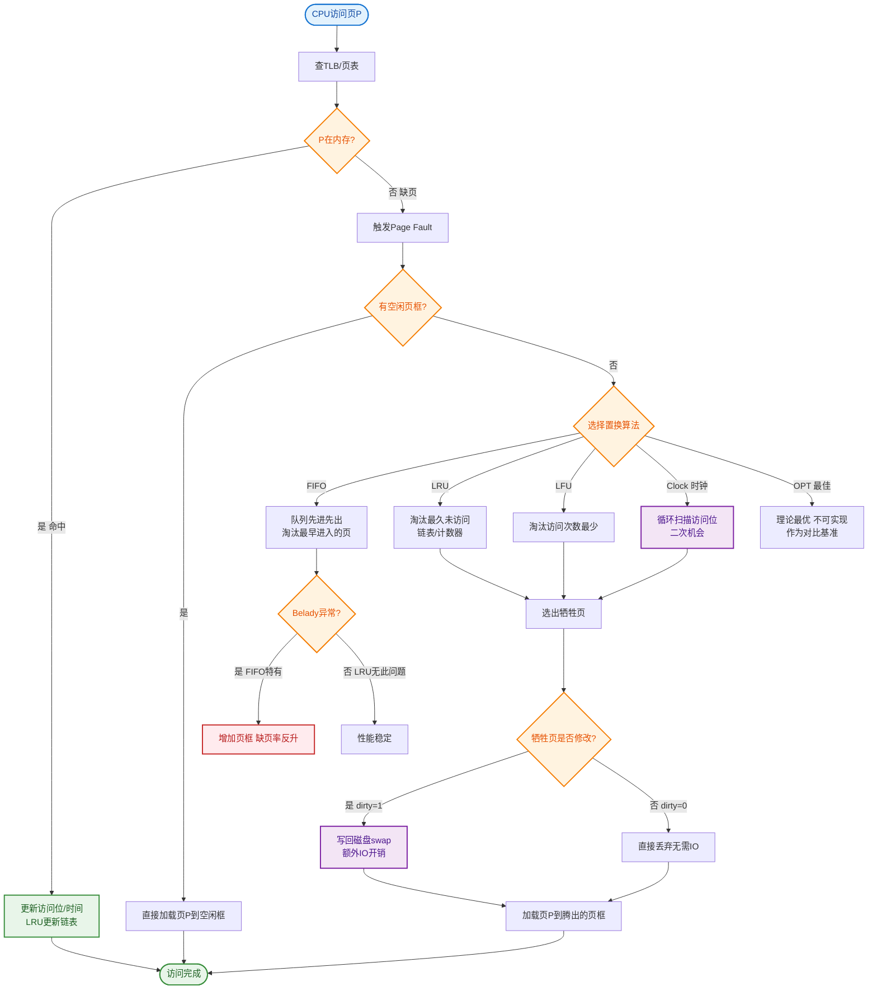

# 什么是 Java 的 Queue 接口？有哪些常见实现？

Queue 是 Java 集合框架中表示队列的接口，继承自 Collection，遵循 FIFO（先进先出，单向队列）或双端语义。

**核心方法（分两组）：**
- **抛异常：** add/remove/element（失败抛异常）。
- **返回特殊值：** offer/poll/peek（失败返回 null/false），推荐用于有界队列。

### 💡 实战案例
> 在生产者-消费者模型中，若使用 `add()` 向已满的 `ArrayBlockingQueue` 添加元素会抛出 `IllegalStateException`，导致生产者线程异常终止；应使用 `offer()` 或 `put()` 进行优雅阻塞或失败处理。

**常见实现：**

**1. ArrayDeque：** 基于数组的双端队列，非线程安全，作为栈/队列都比 LinkedList 快（推荐）。

**2. LinkedList：** 基于链表，实现了 List 和 Deque，可作为队列/栈/双端队列，非线程安全。

**3. PriorityQueue：** 基于数组的优先级队列（最小堆），出队按优先级（自然顺序或 Comparator），非 FIFO。

**4. 并发队列：**
- ArrayBlockingQueue：有界数组阻塞队列。
- LinkedBlockingQueue：可选有界链表阻塞队列（默认容量 Integer.MAX_VALUE）。
- SynchronousQueue：无容量，直接交接（每个 put 必须等 take）。
- PriorityBlockingQueue：无界优先级阻塞队列。
- DelayQueue：延时队列（元素到期才能取）。
- LinkedTransferQueue：高性能无界传输队列。

**Deque 接口：** 双端队列，两端都可增删，ArrayDeque/LinkedList 实现。

### 核心阻塞队列对比

| 实现类 | 有界性 | 锁机制 | 应用场景 |
| :--- | :--- | :--- | :--- |
| **ArrayBlockingQueue** | 有界（必须指定） | 单锁（ReentrantLock） | 固定大小的任务缓冲，防止内存溢出 |
| **LinkedBlockingQueue** | 可选有界（默认无界） | 双锁（Take/Put分离） | 高吞吐量，但需注意默认无界导致的OOM风险 |
| **SynchronousQueue** | 无界（不存储） | CAS/锁 | 线程直接握手，如 `CachedThreadPool` |
| **PriorityBlockingQueue** | 无界 | 单锁 + 堆结构 | 优先级任务调度 |

---

### 阻塞队列操作流程

```text
   Producer Thread           Consumer Thread
         │                          │
         │  put(e)                  │  take()
         │   (如果满则等待)           │   (如果空则等待)
         │                          │
         ▼                          ▼
    ┌───────────────────────────────────────┐
    │           BlockingQueue               │
    │  ┌─────┐ ┌─────┐ ┌─────┐ ┌─────┐     │
    │  │Elem │ │Elem │ │Elem │ │Elem │ ... │
    │  └─────┘ └─────┘ └─────┘ └─────┘     │
    └───────────────────────────────────────┘
          │          ▲
          │          │ Lock / Condition
          │          │ (notFull / notEmpty)
          └──────────┘
```

### 常见考点
1. **ArrayDeque 与 LinkedList 的性能差异？**
   - ArrayDeque 基于数组，内存占用小，无指针开销，利用复用数组头尾指针，插入删除速度极快。LinkedList 基于链表，每个节点需要维护前后指针，内存开销大，且在 CPU 缓存友好性上不如数组。
2. **ArrayBlockingQueue 和 LinkedBlockingQueue 的区别？**
   - ArrayBlockingQueue 必须指定容量且基于锁数组实现；LinkedBlockingQueue 默认无界（可指定），且基于锁链表实现，其 take 和 put 操作使用的是不同的 Lock（两把锁），生产消费并发度通常更高。
3. **SynchronousQueue 的应用场景？**
   - 它不存储元素，直接传递。常用于 `Executors.newCachedThreadPool` 中，任务提交后直接交给线程执行，若无空闲线程则创建新线程，起到“握手”传递的作用。


## 核心流程图


## 记忆要点

- 核心接口：继承 Collection，遵循 FIFO（先进先出），分普通队列与双端队列 Deque
- API 分组：抛异常（add/remove）与返回特殊值（offer/poll/peek），有界队列推荐后者
- 非线程安全：ArrayDeque 基于数组作栈/队列最快，LinkedList 基于链表，PriorityQueue 基于堆出队按优先级
- 阻塞队列对比：ArrayBlockingQueue 有界单锁；LinkedBlockingQueue 默认无界（易OOM）双锁并发高
- 特殊阻塞：SynchronousQueue 不存数据直接握手传递，常用于 CachedThreadPool

## 结构化回答

**30 秒电梯演讲：** 先进先出(FIFO)的数据结构，支持阻塞。打个比方，像排队买票，先来的人先买，后来的人排队尾。

**展开框架：**
1. **核心接口** — 继承 Collection，遵循 FIFO（先进先出），分普通队列与双端队列 Deque
2. **API 分组** — 抛异常（add/remove）与返回特殊值（offer/poll/peek），有界队列推荐后者
3. **非线程安全** — ArrayDeque 基于数组作栈/队列最快，LinkedList 基于链表，PriorityQueue 基于堆出队按优先级

**收尾：** 我在项目里踩过坑——> 在生产者-消费者模型中，若使用 `add()` 向已满的 `ArrayBlockingQueue` 添加元素会抛出 `IllegalStateException`，导致生产者线程异常终止；应使用 `offer()` 或 `put()` 进行优雅阻塞或失败处理。您想深入聊哪一段：原理、避坑还是对比选型？

## 视频脚本

> 预计时长：3 分钟 | 由浅入深

| 时间 | 画面/字幕 | 口播台词 | 讲解要点 |
|------|----------|----------|----------|
| 0:00 | 标题卡：什么是 Java 的 Queue 接… | "什么是 Java 的 Queue 接口？有哪些常见实现？一句话——像排队买票，先来的人先买，后来的人排队尾。" | 开场钩子 |
| 0:45 | 概念动画/示意图 | "先进先出(FIFO)的数据结构，支持阻塞——像排队买票，先来的人先买，后来的人排队尾" | 核心定义 |
| 1:30 | 核心接口示意 | "继承 Collection，遵循 FIFO（先进先出），分普通队列与双端队列 Deque" | 要点1 |
| 2:15 | API 分组示意 | "抛异常（add/remove）与返回特殊值（offer/poll/peek），有界队列推荐后者" | 要点2 |
| 3:00 | 总结卡 | "记住这几条，面试不慌。下期讲进阶追问。" | 收尾 |
