# 什么是Redis底层数据结构？

Redis 有 5 种基础数据类型和 4 种特殊数据类型，其底层主要使用了 6 种基础数据结构。

## 一、Redis 基础数据结构（底层实现）

1.  **SDS (Simple Dynamic String)**
    -   **用途**：实现 String 类型，也是 Hash、List 等类型的底层组成部分之一。
    -   **特点**：
        -   **O(1) 获取长度**：SDS 结构体中直接存储了字符串长度，不需要像 C 语言那样遍历。
        -   **二进制安全**：可以存储任意二进制数据（包括空字符），不仅仅是文本。
        -   **动态扩容**：当字符串长度增加时，SDS 会自动进行内存空间预分配和惰性释放，减少内存重分配次数。

2.  **双向链表**
    -   **用途**：早起版本的 List 实现之一。
    -   **特点**：
        -   节点包含 prev 和 next 指针，支持双向遍历。
        -   **缺点**：内存开销大（每个节点包含额外指针），内存不连续，容易产生内存碎片。

3.  **压缩列表 / Listpack**
    -   **用途**：早期用于实现 List、Hash、ZSet 当元素数量少且值小时。Redis 7.0 后主要被 **listpack** 替代。
    -   **特点**：
        -   一块连续内存空间，紧凑存储，节省内存。
        -   **缺点**：**连锁更新**问题。当数据发生扩容或缩容导致相邻节点空间变化时，可能引发一系列的内存重分配，性能较差。Listpack 对此进行了优化，去除了 previous length 字段。

4.  **哈希表**
    -   **用途**：Hash、Set、ZSet 的底层核心结构。
    -   **特点**：采用链地址法解决冲突，使用**渐进式 Rehash** 进行扩容。

5.  **跳表**
    -   **用途**：ZSet 的底层实现之一。
    -   **特点**：
        -   典型的“以空间换时间”结构，支持平均 O(log N) 的查找。
        -   与红黑树相比，实现简单，支持范围查询更高效。

6.  **整数集合**
    -   **用途**：Set 类型的底层实现之一（当集合中只包含整数且数量较少时）。
    -   **特点**：
        -   不会出现重复元素。
        -   根据数值大小自动升级编码（如 int16 -> int32），但降级不支持。

### 💡 实战案例
> 在存储百万级粉丝列表（List）时，若大量元素是小字符串，Redis 会自动使用 QuickList（压缩列表+链表）以减少内存占用约 50%；一旦元素变大或数量超过阈值，会自动转换为双向链表，开发者需监控内存碎片率。

## 二、应用场景与数据类型映射

| 数据类型 | 底层结构 | 典型应用场景 |
| :--- | :--- | :--- |
| **String** | SDS (int/embstr/raw) | 缓存、计数器、分布式锁 |
| **Hash** | Ziplist/Listpack / Hashtable | 存储对象（如用户信息） |
| **List** | QuickList (Linked List + Ziplist) | 消息队列、最新列表 |
| **Set** | Intset / Hashtable | 标签、共同关注（交集） |
| **ZSet** | Ziplist / Skiplist + Dict | 排行榜、延迟队列 |

## 三、特殊类型结构

-   **BitMap**：基于 String 的位操作，用于签到、在线用户统计。
-   **HyperLogLog**：基于概率算法的基数统计，用于海量数据 UV 统计（内存占用极小）。
-   **GEO**：底层使用 ZSet，GeoHash 编码将经纬度转换为 Score，用于地理位置存储和计算（附近的人）。
-   **Stream**：专门用于消息队列，支持消费者组，消息持久化。

---

### Redis Skiplist (跳表) 结构示意图

```text
         Level 3    +----------->  NULL
                     |
         Level 2    +-----------> +----------->  NULL
                     |            |
         Level 1    +-----------> +-----------> +----------->  NULL


## 核心架构图

```mermaid
flowchart TD
    classDef start fill:#4CAF50,color:#fff
    classDef process fill:#2196F3,color:#fff
    classDef decision fill:#FF9800,color:#fff
    classDef special fill:#9C27B0,color:#fff
    classDef error fill:#f44336,color:#fff
    classDef info fill:#607D8B,color:#fff
    class A start
    class B process
    class C decision
    class D special
    class E error
    class F info
    class G start
    class H process
    class Hash decision
    class I special
    class J error
    class K info
    class L start
    class List process
    class M decision
    class N special
    class O error
    class P info
    class Q start
    class R process
    class Redis decision
    class SDS special
    class Set error
    class String info
    class ZSet start
    class br process
    class dict decision
    class hashtable special
    class intset error
    class listpack info
    class log start
    class quicklist process
    class skiplist decision
    class ziplist special
    A[Redis 底层数据结构] --> B[SDS 动态字符串]
    A --> C[dict 字典 哈希表]
    A --> D[ziplist/listpack 压缩列表]
    A --> E[quicklist 快速列表]
    A --> F[skiplist 跳表]
    A --> G[intset 整数集合]
    H[与类型映射] --> I["String → SDS"]
    H --> J["Hash → listpack/hashtable"]
    H --> K["List → quicklist"]
    H --> L["Set → intset/hashtable"]
    H --> M["ZSet → listpack/skiplist+dict"]
    N[Redis 7] --> O[ziplist 替换为 listpack<br/>解决连锁更新问题]
    P[跳表特性] --> Q[多层链表 O log N]
    P --> R[实现简单 范围查询友好]
```



## 记忆要点

- SDS 动态字符串：O(1)获取长度且二进制安全，预分配与惰性释放机制，String底层
- SkipList 跳表：ZSet底层之一，空间换时间实现 O(logN) 查找，比红黑树更易实现且支持高效范围查询
- ZipList/Listpack 压缩列表：连续内存极省空间，原 Ziplist 有连锁更新缺陷，Redis 7.0 后被 Listpack 替代
- HashTable 哈希表：Hash/Set/ZSet 核心结构，采用链地址法解决冲突，通过渐进式 Rehash 扩容
- 类型映射：List 用 QuickList，Set 用 Intset/Hashtable，ZSet 用 Skiplist+Dict 组合实现

## 结构化回答

**30 秒电梯演讲：** 基于SDS、链表、哈希、跳表等结构的高效存储。打个比方，像瑞士军刀，针对不同数据形状（列表、排行、图）用不同刀刃处理。

**展开框架：**
1. **SDS 动态字符串** — O(1)获取长度且二进制安全，预分配与惰性释放机制，String底层
2. **SkipList 跳表** — ZSet底层之一，空间换时间实现 O(logN) 查找，比红黑树更易实现且支持高效范围查询
3. **ZipList/Listpack 压缩列表** — 连续内存极省空间，原 Ziplist 有连锁更新缺陷，Redis 7.0 后被 Listpack 替代

**收尾：** 我在项目里踩过坑——> 在存储百万级粉丝列表（List）时，若大量元素是小字符串，Redis 会自动使用 QuickList（压缩列表+链表）以减少内存占用约 50%；一旦元素变大或数量超过阈值，会自动转换为双向链表，开发者需监控内存碎片率。您想深入聊哪一段：原理、避坑还是对比选型？

## 视频脚本

> 预计时长：3 分钟 | 由浅入深

| 时间 | 画面/字幕 | 口播台词 | 讲解要点 |
|------|----------|----------|----------|
| 0:00 | 标题卡：什么是Redis底层数据结构 | "什么是Redis底层数据结构？一句话——像瑞士军刀，针对不同数据形状（列表、排行、图）用不同刀刃处理。" | 开场钩子 |
| 0:45 | 概念动画/示意图 | "基于SDS、链表、哈希、跳表等结构的高效存储——像瑞士军刀，针对不同数据形状（列表、排行、图）用不同刀刃处理" | 核心定义 |
| 1:30 | SDS 动态字符串示意 | "O(1)获取长度且二进制安全，预分配与惰性释放机制，String底层" | 要点1 |
| 2:15 | SkipList 跳表示意 | "ZSet底层之一，空间换时间实现 O(logN) 查找，比红黑树更易实现且支持高效范围查询" | 要点2 |
| 3:00 | 总结卡 | "记住这几条，面试不慌。下期讲进阶追问。" | 收尾 |
