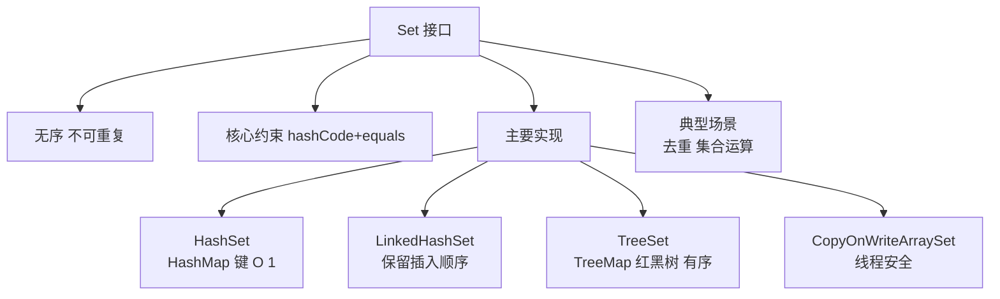

# 什么是Set接口？

**Set 接口**继承自 Collection，是一个不允许重复元素的集合。

## 核心特点

- **不允许重复元素**（equals() 判断）
- 最多包含一个 null（HashSet/LinkedHashSet）
- 没有索引（不能用 get(i) 访问）
- 继承 Collection 接口

### 💡 实战案例
> 在做日志去重统计时，直接使用 `HashSet` 存储日志 ID 能自动过滤重复数据。但需注意，若 ID 字符串过长且数量巨大（亿级），建议改用 `BitSet` 或 Redis HyperLogLog 以节省内存。

## 常见实现类

| 实现类 | 底层结构 | 特点 | 性能 |
|--------|----------|------|------|
| **HashSet** | HashMap | 无序，允许null | add/remove/contains O(1) |
| **LinkedHashSet** | LinkedHashMap+双向链表 | 保持插入顺序 | O(1) + 链表维护开销 |
| **TreeSet** | 红黑树（TreeMap） | 自然排序或定制排序 | O(log n) |

## 常用方法

```java
Set<String> set = new HashSet<>();
set.add("Java");          // 添加，返回true
set.add("Java");          // 重复添加，返回false
set.contains("Java");     // true
set.remove("Java");       // 删除
set.size();               // 大小
set.isEmpty();            // 是否为空

// 集合运算
Set<String> s1 = new HashSet<>(Arrays.asList("A", "B", "C"));
Set<String> s2 = new HashSet<>(Arrays.asList("B", "C", "D"));

s1.retainAll(s2);  // 交集 → [B, C]
s1.addAll(s2);     // 并集 → [A, B, C, D]
s1.removeAll(s2);  // 差集 → [A]
```

## 去重原理

```java
// HashSet.add() 内部调用 HashMap.put()
// key = 元素, value = 固定的PRESENT对象
// 先计算 hashCode → 找桶 → equals 比较 → 无重复才添加
// 因此正确去重要求：重写 hashCode() 和 equals()
```

## HashSet 底层架构流程图

```text
                  ┌─────────────────────────────────────────┐
│              调用 HashSet.add(E e)               │
                  └───────────────────┬─────────────────────┘
                                      ▼
                  ┌─────────────────────────────────────────┐
│         内部调用 map.put(e, PRESENT)          │
│         (PRESETN 是一个 static final Object) │
                  └───────────────────┬─────────────────────┘
                                      ▼
              ┌───────────────────────────────────┐
│       1. 计算 hash(e.hashCode())          │
│       2. 定位数组索引 (n - 1) & hash       │
              └───────────┬───────────────────────┘
                          ▼
              ┌───────────────────────────────────┐
│       遍历该位置的链表/红黑树              │
│       hash冲突？ → equals()比较？          │
              └───────────┬───────────────────────┘


## 核心架构图



## 记忆要点

- 核心特性：继承 Collection，元素不可重复（靠 equals 判断），无索引，最多允许一个 null
- 去重原理：HashSet 底层是 HashMap，元素作 Key，Value 固定为 PRESENT。需重写 hashCode 和 equals
- 三大实现：HashSet 无序 O(1)，LinkedHashSet 维护插入顺序，TreeSet 基于红黑树自动排序 O(logN)
- 高频考点：因为 HashMap 允许 null 键，所以 HashSet 最多允许存入一个 null 元素
- 集合运算：retainAll 求交集，addAll 求并集，removeAll 求差集

## 结构化回答

**30 秒电梯演讲：** 不允许重复元素的集合，用于去重。打个比方，像放身份证的盒子，里面每张卡片必须独一无二，不能重复。

**展开框架：**
1. **核心特性** — 继承 Collection，元素不可重复（靠 equals 判断），无索引，最多允许一个 null
2. **去重原理** — HashSet 底层是 HashMap，元素作 Key，Value 固定为 PRESENT。需重写 hashCode 和 equals
3. **三大实现** — HashSet 无序 O(1)，LinkedHashSet 维护插入顺序，TreeSet 基于红黑树自动排序 O(logN)

**收尾：** 我在项目里踩过坑——> 在做日志去重统计时，直接使用 `HashSet` 存储日志 ID 能自动过滤重复数据。您想深入聊哪一段：原理、避坑还是对比选型？

## 视频脚本

> 预计时长：2 分钟 | 由浅入深

| 时间 | 画面/字幕 | 口播台词 | 讲解要点 |
|------|----------|----------|----------|
| 0:00 | 标题卡：什么是Set接口 | "什么是Set接口？一句话——像放身份证的盒子，里面每张卡片必须独一无二，不能重复。" | 开场钩子 |
| 0:40 | 概念动画/示意图 | "不允许重复元素的集合，用于去重——像放身份证的盒子，里面每张卡片必须独一无二，不能重复" | 核心定义 |
| 1:20 | 核心特性示意 | "继承 Collection，元素不可重复（靠 equals 判断），无索引，最多允许一个 null" | 要点1 |
| 2:00 | 总结卡 | "记住这几条，面试不慌。下期讲进阶追问。" | 收尾 |
