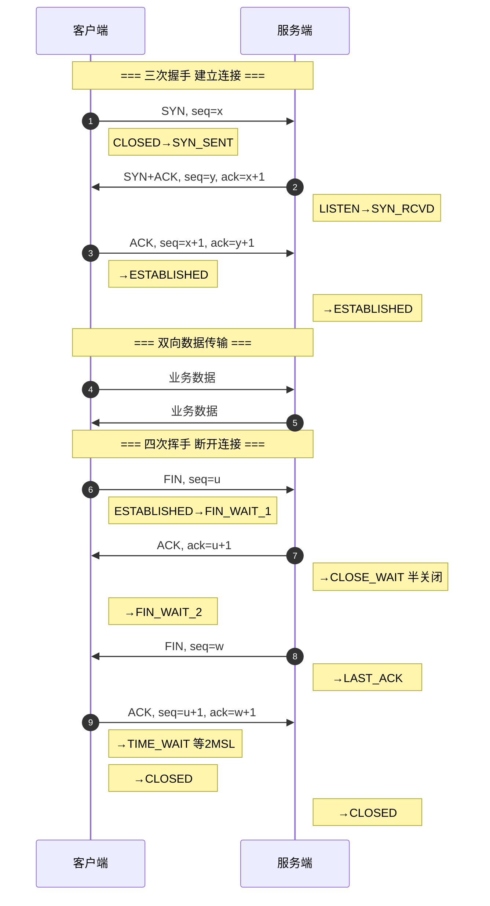

# 什么是TCP三次握手/四次挥手？

TCP 是一种面向连接的、可靠的传输层协议。连接的建立与释放分别通过“三次握手”和“四次挥手”完成。

## 一、TCP 三次握手（建立连接）

目的是同步双方的序列号和确认号，并交换 TCP 窗口大小信息。

1. **第一次握手（客户端发送 SYN）**：
   - 客户端发送 `SYN=1`，`seq=x`。
   - 客户端进入 `SYN_SENT` 状态。
   - **含义**：请求建立连接，并告诉客户端自己的初始序列号。

2. **第二次握手（服务端回复 SYN+ACK）**：
   - 服务端收到 SYN，回复 `SYN=1`，`ACK=1`，`ack=x+1`，`seq=y`。
   - 服务端进入 `SYN_RCVD` 状态。
   - **含义**：确认收到客户端的请求（ACK），同时也向客户端发送连接请求（SYN）。

3. **第三次握手（客户端发送 ACK）**：
   - 客户端收到 SYN+ACK，回复 `ACK=1`，`ack=y+1`，`seq=x+1`。
   - 双方进入 `ESTABLISHED` 状态。
   - **含义**：确认收到服务端的连接请求，连接建立完成。

> **为什么是三次？** 防止已失效的连接请求报文段突然又传送到了服务端，导致服务端错误开启连接，浪费资源。

## 二、TCP 四次挥手（断开连接）

由于 TCP 是全双工协议，每个方向都必须单独关闭。

1. **第一次挥手（客户端发送 FIN）**：
   - 客户端发送 `FIN=1`，`seq=u`。
   - 客户端进入 `FIN_WAIT_1` 状态。
   - **含义**：客户端无数据发送了，请求关闭连接。

2. **第二次挥手（服务端回复 ACK）**：
   - 服务端收到 FIN，回复 `ACK=1`，`ack=u+1`，`seq=v`。
   - 服务端进入 `CLOSE_WAIT` 状态；客户端收到后进入 `FIN_WAIT_2` 状态。
   - **含义**：服务端知道客户端要关闭了，但服务端可能还有数据要传。

3. **第三次挥手（服务端发送 FIN）**：
   - 服务端数据发送完毕，发送 `FIN=1`，`ACK=1`，`ack=u+1`，`seq=w`。
   - 服务端进入 `LAST_ACK` 状态。
   - **含义**：服务端也没数据了，请求关闭连接。

4. **第四次挥手（客户端回复 ACK）**：
   - 客户端收到 FIN，回复 `ACK=1`，`ack=w+1`，`seq=u+1`。
   - 客户端进入 `TIME_WAIT` 状态，等待 2MSL 后关闭；服务端收到 ACK 后关闭。
   - **含义**：确认收到服务端的关闭请求。

> **为什么客户端要等待 2MSL？** 
> 1. 保证最后一个 ACK 能到达服务端（若丢失，服务端会重传 FIN）。
> 2. 等待网络中所有旧的报文段消失，避免影响新连接。

## 三次握手流程图

```text
    Client                                      Server

  CLOSED                                      CLOSED

    ───── SYN=1, seq=x ──────────────────────►
                          (SYN_SENT)

                                               SYN_RCVD

    ◄────── SYN=1, ACK=1, ack=x+1, seq=y ──────

    ───── ACK=1, ack=y+1, seq=x+1 ────────────►
                          (ESTABLISHED)

                                               ESTABLISHED
```

## 四次挥手流程图

```text
    Client                                      Server

  ESTABLISHED                                 ESTABLISHED

    ───── FIN=1, seq=u ───────────────────────►
               (FIN_WAIT_1)                     CLOSE_WAIT

    ◄────── ACK=1, ack=u+1, seq=v ─────────────
               (FIN_WAIT_2)                   (等待数据处理)

                                               LAST_ACK
    ◄────── FIN=1, ACK=1, ack=u+1, seq=w ──────

    ───── ACK=1, ack=w+1, seq=u+1 ────────────►
               (TIME_WAIT)                       CLOSED
               (等待 2MSL)
               CLOSED
```

### 实战案例
在高并发短连接场景（如 Nginx 反向代理）下，服务端大量处于 `TIME_WAIT` 状态会导致端口资源耗尽。实战中可通过开启 `net.ipv4.tcp_tw_reuse` 允许将 `TIME_WAIT` sockets 重新用于新的 TCP 连接，有效缓解端口压力。

### 关键配置示例 (Linux Sysctl)
```bash
# /etc/sysctl.conf
# 允许将 TIME-WAIT sockets 重新用于新的 TCP 连接
net.ipv4.tcp_tw_reuse = 1
# 快速回收 TIME-WAIT sockets（NAT环境需谨慎开启）
net.ipv4.tcp_tw_recycle = 0 
# 保持系统-wide 的最大 TIME-WAIT 数量
net.ipv4.tcp_max_tw_buckets = 5000
```


## 核心流程图


## 记忆要点

- 三次握手：C发SYN，S回SYN+ACK，C发ACK。为防历史失效连接浪费服务端资源，必须是三次
- 四次挥手原因：TCP 是全双工，被动方收到 FIN 后需发 ACK，等自身数据发完才能发 FIN
- TIME_WAIT：主动关闭方最后等待 2MSL。为保证最后 ACK 可靠到达并让旧报文消失
- 核心状态：握手 SYN_RCVD，通信 ESTABLISHED，挥手 CLOSE_WAIT 与 TIME_WAIT 最为核心
- 实战考点：高并发短连接场景，服务端会积累大量 TIME_WAIT 耗尽端口

## 结构化回答

**30 秒电梯演讲：** 三次握手建立连接，四次挥手断开连接。打个比方，打电话（握手）：A问“能听到吗”，B回“能听到，你能听到吗”，A回“能听到”。挂电话（挥手）：A说“我说完了”，B回“知道了（但我还有两句）”，B说“我也说完了”，A回“收到，拜拜”。

**展开框架：**
1. **三次握手** — C发SYN，S回SYN+ACK，C发ACK。为防历史失效连接浪费服务端资源，必须是三次
2. **四次挥手原因** — TCP 是全双工，被动方收到 FIN 后需发 ACK，等自身数据发完才能发 FIN
3. **TIME_WAIT** — 主动关闭方最后等待 2MSL。为保证最后 ACK 可靠到达并让旧报文消失

**收尾：** 我在项目里踩过坑——在高并发短连接场景（如 Nginx 反向代理）下，服务端大量处于 `TIME_WAIT` 状态会导致端口资源耗尽。您想深入聊哪一段：原理、避坑还是对比选型？

## 视频脚本

> 预计时长：3 分钟 | 由浅入深

| 时间 | 画面/字幕 | 口播台词 | 讲解要点 |
|------|----------|----------|----------|
| 0:00 | 标题卡：什么是TCP三次握手/四次挥手 | "什么是TCP三次握手/四次挥手？一句话——打电话（握手）：A问“能听到吗”，B回“能听到，你能听到吗”，A回“能听到”。挂电话（挥手）：A说“我说完了”，B回“知道了（但我还有两句）”，B说“我也说完了”，A回“收到，拜拜”。" | 开场钩子 |
| 0:45 | 概念动画/示意图 | "三次握手建立连接，四次挥手断开连接——打电话（握手）：A问“能听到吗”，B回“能听到，你能听到吗”，A回“能听到”。挂电话（挥手）：A说“我说完了”，B回“知道了（但我还有两句）”，B说“我也说完了”，A回“收到，拜拜”" | 核心定义 |
| 1:30 | 三次握手示意 | "C发SYN，S回SYN+ACK，C发ACK。为防历史失效连接浪费服务端资源，必须是三次" | 要点1 |
| 2:15 | 四次挥手原因示意 | "TCP 是全双工，被动方收到 FIN 后需发 ACK，等自身数据发完才能发 FIN" | 要点2 |
| 3:00 | 总结卡 | "记住这几条，面试不慌。下期讲进阶追问。" | 收尾 |

---

## 延伸：什么是三次握手的过程？

> 合并自 `core-084`（相似度 71%）

### TCP 三次握手

TCP 是面向连接的协议，使用 TCP 传输数据前必须先建立连接，建立连接是通过**三次握手**来进行的。

#### 为什么需要三次握手？
1. **防止历史连接初始化**：避免因网络滞留的失效 SYN 报文突然传到服务端，导致服务端错误建立连接。
2. **同步初始序列号 (ISN)**：TCP 连接的双方都需要维护自己的序列号，用于保证可靠传输。三次握手是确认双方序列号同步的最小可靠次数。
3. **避免资源浪费**：只有双方确认了连接建立，才会分配资源。防止服务端盲目响应大量无效请求导致资源耗尽。

#### 过程简述
1. **第一次握手 (Client -> Server)**：客户端发送 `SYN=1` 和初始序列号 `seq=x`，请求建立连接。客户端进入 `SYN_SENT` 状态。
2. **第二次握手 (Server -> Client)**：服务端收到 SYN，回复 `SYN=1`，`ACK=1`，确认号 `ack=x+1`，并携带自己的初始序列号 `seq=y`。服务端进入 `SYN_RCVD` 状态。
3. **第三次握手 (Client -> Server)**：客户端收到 SYN+ACK 包，检查确认号是否正确。正确后发送 `ACK=1`，确认号 `ack=y+1`，序列号 `seq=x+1`。服务端收到后进入 `ESTABLISHED` 状态。

#### 状态流转图
```text
   Client                               Server
     │                                    │
     │ ─── SYN, seq=x ───────────────────> │ CLOSED
     │                                    │ (收到 SYN，分配资源)
     │ SYN_SENT                           │ LISTEN -> SYN_RCVD
     │                                    │
     │ <── SYN, ACK, seq=y, ack=x+1 ───── │
     │ (收到 SYN+ACK，分配资源)            │
     │                                    │
     │ ─── ACK, seq=x+1, ack=y+1 ───────> │
     │ ESTABLISHED                        │ (收到 ACK)
     │                                    │ ESTABLISHED
     │                                    │
```

#### 实战案例
在容器化环境（如 Kubernetes）中，若 Pod 的 `readinessProbe` 配置不当，导致 LB 在服务端还未完全启动时就转发流量，可能会因为半连接队列未初始化完成而丢包。或者在公网环境下，第一次握手延迟较高，会导致连接建立时间翻倍，影响首屏加载。

#### 代码示例 (Go - Server 优化)
```go
// 设置 TCP 监听器时调整全连接队列长度，防止突发流量导致队列溢出
lc := net.ListenConfig{
    Control: func(network, address string, c syscall.RawConn) error {
        return c.Control(func(fd uintptr) {
            syscall.SetsockoptInt(int(fd), syscall.SOL_SOCKET, syscall.SO_REUSEADDR, 1)
            // 可根据负载调整 somaxconn
            syscall.SetsockoptInt(int(fd), syscall.SOL_SOCKET, syscall.SO_REUSEPORT, 1)
        })
    },
}
ln, _ := lc.Listen(context.Background(), "tcp", ":8080")
```

#### ## 常见考点
1. **ISN (Initial Sequence Number)**：为什么是动态生成的？（为了防止被攻击者猜到序列号从而伪造 TCP 报文）。
2. **SYN Flood 攻击**：攻击者大量发送 SYN 包，不回第三次握手，耗尽服务端资源。防御手段有哪些？（SYN Cookies, 增大半连接队列）。
3. **连接耗时**：三次握手带来的 RTT（往返时间）延迟，以及如何在 HTTP/1.1 持久连接或 HTTP/2 中减少握手开销。

## 记忆要点

- 原因口诀：防旧连、同步号、省资源，所以最少需要三次握手
- 握手流程：C发SYN(seq=x)，S回SYN+ACK(seq=y,ack=x+1)，C再发ACK(ack=y+1)
- 状态流转：客户端SYN_SENT，服务端SYN_RCVD，最终双方都进ESTABLISHED
- 常见考点：ISN动态生成防伪造，SYN Flood攻击导致半连接耗尽

## 结构化回答

**30 秒电梯演讲：** TCP建立连接时的三次确认过程。打个比方，A问B“在吗？”，B回“在，你呢？”，A回“我也在”，确保双方都能听清。

**展开框架：**
1. **原因口诀** — 防旧连、同步号、省资源，所以最少需要三次握手
2. **握手流程** — C发SYN(seq=x)，S回SYN+ACK(seq=y,ack=x+1)，C再发ACK(ack=y+1)
3. **状态流转** — 客户端SYN_SENT，服务端SYN_RCVD，最终双方都进ESTABLISHED

**收尾：** 我在项目里踩过坑——在容器化环境（如 Kubernetes）中，若 Pod 的 `readinessProbe` 配置不当，导致 LB 在服务端还未完全启动时就转发流量，可能会因为半连接队列未初始化完成而丢包。您想深入聊哪一段：原理、避坑还是对比选型？

## 视频脚本

> 预计时长：2 分钟 | 由浅入深

| 时间 | 画面/字幕 | 口播台词 | 讲解要点 |
|------|----------|----------|----------|
| 0:00 | 标题卡：什么是三次握手的过程 | "什么是三次握手的过程？一句话——A问B“在吗？”，B回“在，你呢？”，A回“我也在”，确保双方都能听清。" | 开场钩子 |
| 0:40 | 概念动画/示意图 | "TCP建立连接时的三次确认过程——A问B“在吗？”，B回“在，你呢？”，A回“我也在”，确保双方都能听清" | 核心定义 |
| 1:20 | 原因口诀示意 | "防旧连、同步号、省资源，所以最少需要三次握手" | 要点1 |
| 2:00 | 总结卡 | "记住这几条，面试不慌。下期讲进阶追问。" | 收尾 |

---

## 延伸：什么是TCP连接与断开优化？如何减少TCP握手/挥手延迟？

> 合并自 `core-010`（相似度 70%）

## TCP连接与断开优化全景：

### 一、数据传输优化：避免延迟

**问题场景**：Nagle 算法（发送方攒包）与延迟 ACK（接收方攒 ACK）冲突导致约 200ms 延迟。

**解决方案**：应用层开启 `TCP_NODELAY`（关闭 Nagle），数据立即发送。适用于 HTTP、数据库连接、RPC。

### 二、连接建立优化（三次握手）

**优化参数对比**：

| 参数 | 作用 | 推荐值 | 备注 |
|------|------|--------|------|
| **tcp_fastopen (TFO)** | 首次握手拿 Cookie，后续 SYN 携数据 | 3 | 节省 1 RTT，Linux 3.7+ 支持 |
| **tcp_syn_retries** | 客户端 SYN 重传次数 | 2 (默认6) | 减少 RTT 等待时间，防止雪崩 |
| **tcp_max_syn_backlog** | 服务端半连接队列长度 | 8192 | 防止 SYN 洪泛导致丢包 |
| **somaxconn** | 服务端全连接队列长度 | 8192 | 默认128，太小会导致丢包 |
| **tcp_syncookies** | SYN 攻击保护 | 1 | 紧急启用，牺牲部分性能 |

### 三、连接断开优化（四次挥手）

**TIME_WAIT 优化方案对比**：

| 方案 | 参数 | 风险/说明 |
|------|------|----------|
| **复用端口 (客户端)** | `net.ipv4.tcp_tw_reuse` | **推荐**。允许新的连接复用 TIME_WAIT 套接字，作为客户端安全 |
| **快速回收 (旧版)** | `net.ipv4.tcp_tw_recycle` | **严禁**。NAT 环境下会导致时间戳错乱，连接被丢弃 |
| **缩短超时** | `net.ipv4.tcp_fin_timeout` | 默认 60s，可适当调低（如 30s），但不能过小 |

**实战案例**：
在压测高并发短连接服务时，发现客户端端口耗尽报错 "Cannot assign requested address"。原因是 `TIME_WAIT` 状态堆积占用大量端口。通过开启 `net.ipv4.tcp_tw_reuse` 并调大 `ip_local_port_range`（如 `10000 65535`）解决了问题。另一次排查 Nginx 502 错误，发现是因为 upstream 服务器全连接队列（backlog）溢出，需同步调大 Nginx 的 `proxy_connect_timeout` 和服务器的 `somaxconn`。

**代码示例（Linux 调优参数 /etc/sysctl.conf）**：
```bash
# 开启 TIME_WAIT 复用，适用于高频请求的客户端
net.ipv4.tcp_tw_reuse = 1
# 扩大全连接队列，防止握手阶段丢包
net.core.somaxconn = 8192
# 扩大半连接队列，抵御轻微 SYN 洪泛
net.ipv4.tcp_max_syn_backlog = 8192
# 开启 SYN Cookies（防止严重 SYN 攻击）
net.ipv4.tcp_syncookies = 1
# 缩短 FIN 超时时间（可选）
net.ipv4.tcp_fin_timeout = 30
```

## 记忆要点

- 传输优化：开启TCP_NODELAY关闭Nagle算法，避免其与延迟ACK引发的200ms延迟。
- 建连优化：开启tcp_fastopen(TFO)携带数据，减少1个RTT建连延迟。
- 挥手优化：复用端口选tcp_tw_reuse，严禁用tcp_tw_recycle(会引发NAT丢包)。
- 队列调优：调大somaxconn全连接队列与syn_backlog半连接队列防握手丢包。

## 结构化回答

**30 秒电梯演讲：** 通过调整参数和连接策略降低握手挥手开销。打个比方，打电话不闲聊（小包合并），挂机后不复读（快速回收），常开热线（长连接池）。

**展开框架：**
1. **传输优化** — 开启TCP_NODELAY关闭Nagle算法，避免其与延迟ACK引发的200ms延迟。
2. **建连优化** — 开启tcp_fastopen(TFO)携带数据，减少1个RTT建连延迟。
3. **挥手优化** — 复用端口选tcp_tw_reuse，严禁用tcp_tw_recycle(会引发NAT丢包)。

**收尾：** 这三点都能配合实战聊。您想深入聊原理、对比还是避坑？

## 视频脚本

> 预计时长：3 分钟 | 由浅入深

| 时间 | 画面/字幕 | 口播台词 | 讲解要点 |
|------|----------|----------|----------|
| 0:00 | 标题卡：什么是TCP连接与断开优化？如何减少… | "什么是TCP连接与断开优化？如何减少TCP握手/挥手延迟？一句话——打电话不闲聊（小包合并），挂机后不复读（快速回收），常开热线（长连接池）。" | 开场钩子 |
| 0:45 | 概念动画/示意图 | "通过调整参数和连接策略降低握手挥手开销——打电话不闲聊（小包合并），挂机后不复读（快速回收），常开热线（长连接池）" | 核心定义 |
| 1:30 | 传输优化示意 | "开启TCP_NODELAY关闭Nagle算法，避免其与延迟ACK引发的200ms延迟。" | 要点1 |
| 2:15 | 建连优化示意 | "开启tcp_fastopen(TFO)携带数据，减少1个RTT建连延迟。" | 要点2 |
| 3:00 | 总结卡 | "记住这几条，面试不慌。下期讲进阶追问。" | 收尾 |
